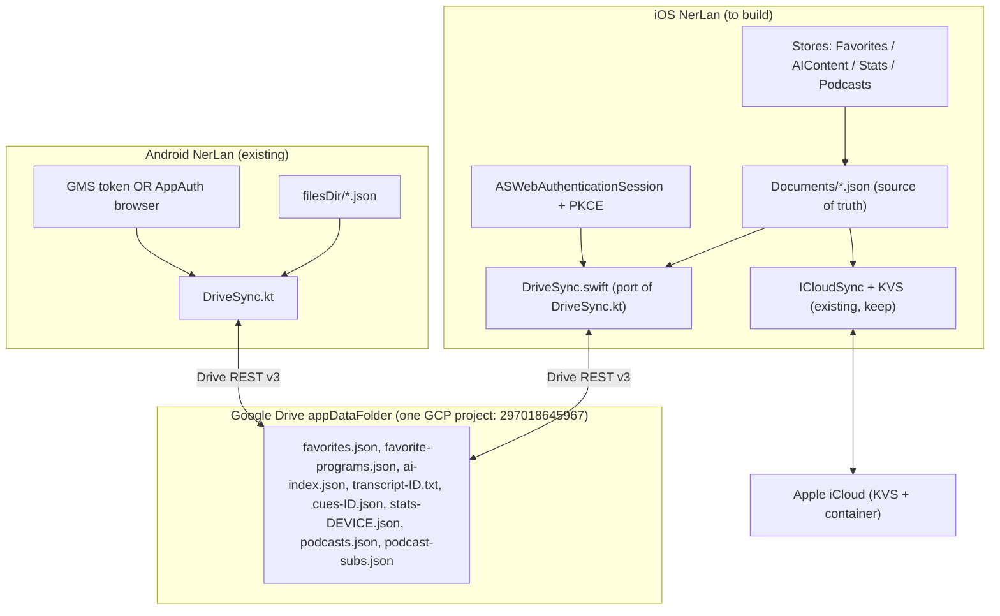

# NerLan iOS — Google Drive sync (proposal)

> Status: **Proposal, not yet decided.** Captures whether the iOS app can sync to
> Google Drive to interoperate with the Android app (which already syncs there),
> and the recommended approach. Written so the decision to proceed can be made later.

## Architecture

## Short answer

The Android app syncs into Google Drive's **`appDataFolder`** (the hidden, app-private space), using OAuth client `297018645967-…` in GCP project **297018645967**. The `appDataFolder` is shared by **all OAuth clients in the same Cloud project**, per user. So if iOS authenticates with an OAuth client in that *same* project, it reads and writes the *exact same hidden folder* Android already populates. No server, no bridge — the two apps become peers in one folder. That's the whole enabler.

## The recommended "better way"

Don't pull in Google's iOS SDKs. Mirror Android's **browser-OAuth half** natively, which also honors this app's no-external-dependencies rule:

1. **Auth — `ASWebAuthenticationSession` + PKCE.** This is Apple's native equivalent of Android's AppAuth fallback path. Since iOS has no Google Play Services, you skip Android's dual-path complexity entirely and only build the browser path — which is exactly the "browser way to login" the user already likes. No client secret (PKCE public client), refresh token in Keychain. Likely you can **reuse the existing client ID** as-is, since its redirect is already the reversed-client-ID scheme `com.googleusercontent.apps.297018645967-…` (the iOS convention); worst case you add an iOS-type client to the same project.

2. **Transport — `URLSession` against Drive REST v3.** Direct HTTPS to `googleapis.com/drive/v3`, scope `drive.appdata` only. A 1:1 port of Android's OkHttp calls (`listFiles`, multipart `upsert` for create, `PATCH uploadType=media` for update). About 150 lines.

3. **Schema — reuse Android's exact file names + JSON.** `favorites.json`, `favorite-programs.json`, `ai-index.json`, `transcript-{id}.txt`, `cues-{id}.json`, `translation-{id}.json`, `stats-{deviceId}.json`, `podcasts.json`, `podcast-subs.json`. The iOS data model is already nearly wire-identical (`EpisodeRecord` matches field-for-field).

4. **Merge engine — port `DriveSync.kt` to Swift.** Its conflict resolution is deliberately platform-agnostic and ports verbatim: change detection via `(remoteModifiedTime, localSHA256)` in a local `drive-sync-state.json`; union-merge for metadata lists; write-once for AI content; **G-counter** for stats (per-device blob, sum on read); last-writer-wins ledger for podcast subs.

## The one real decision: iCloud coexistence

iOS already syncs via iCloud (KVS + Documents container), which Android can't see, and which is zero-friction for Apple-only users. Drive is the *only* way to bridge to Android, but it requires a Google login. So I'd **keep iCloud and add Drive as an opt-in second backend** (a Settings toggle, like Android's `syncToDrive`), not a replacement. Both write from the same local JSON source-of-truth, so they're independent mirrors. The alternative — Drive-only on iOS — is simpler but regresses Apple-to-Apple sync and forces every iOS user to have a Google account. I'd recommend coexistence.

## Concrete gotchas I found

- **`coverURL` vs `coverUrl`.** iOS `EpisodeRecord` has no `CodingKeys`, so Swift serializes the key as `coverURL`; Android emits `coverUrl`. The iOS local `favorites.json` is therefore **not** byte-compatible with Android's today. Fix with a dedicated Drive wire-DTO (or `CodingKeys`) mapping `coverURL ↔ coverUrl`. Every other field already matches. Worth a quick parity check on `Attachment` (`originalName`/`fileType`/`attachmentKey`) too.
- **Stats need a stable `deviceId`.** The G-counter keys each device's blob by a persisted UUID (`stats-{deviceId}.json`). iOS needs its own persisted device UUID so it doesn't collide with Android devices' blobs.
- **Layout differs from iCloud's.** Drive uses Android's *flat* `appDataFolder` files; iCloud uses iOS's human-readable folders in Files. Drive sync is a separate mirroring path from `ICloudSync`, not a reuse of it.
- **Verify the `appDataFolder`-per-project assumption** before committing — it's the load-bearing claim. Quickest check: add an iOS client to the project, list files with `spaces=appDataFolder`, and confirm Android's files appear.

## Rough scope

A new `DriveAuth.swift` (about 120 lines, `ASWebAuthenticationSession`) + `DriveSync.swift` (about 400 lines, ported engine), a Settings toggle, and a Keychain entry for the refresh token. No changes to the stores beyond having them call `requestSync()` on local change (they already do for iCloud). It slots in beside `ICloudSync` as a sibling.
