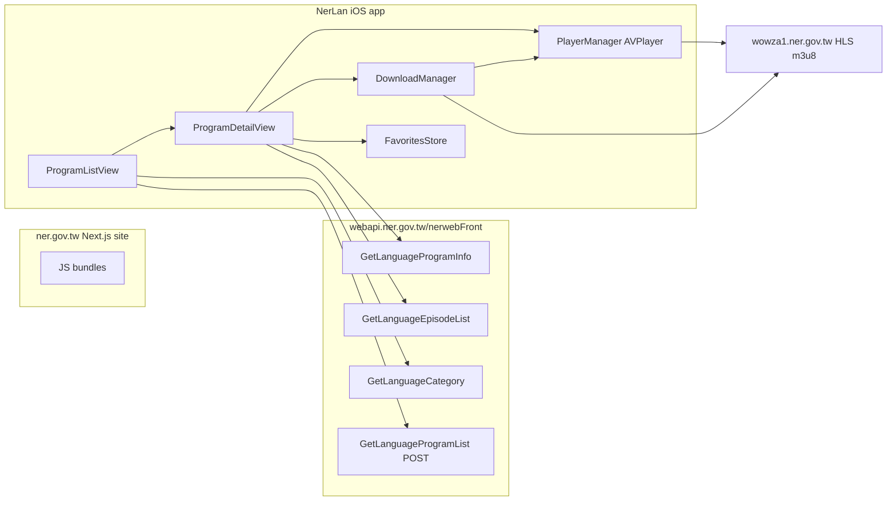

# NerLan — iOS app for NER language-learning programs

## Summary

A SwiftUI iOS app (iOS 17+) for browsing and listening to 國立教育廣播電台 (National Education Radio) language-learning programs from https://www.ner.gov.tw/LearnLanguage/. Features: program list grouped by language with category filter chips, per-program episode lists with month navigation, HLS streaming playback (mini player + full player sheet, lock-screen/Control Center controls, background audio), offline downloads grouped by program or language, and locally persisted favorites.

## Approach

**API discovery.** The site is a Next.js app with no public API docs. The endpoints were recovered from the production JS bundles: chunk `2745-*.js` contains the fetch wrappers, and chunk `3464-*.js` carries the axios base URL `https://webapi.ner.gov.tw/nerwebFront`. The endpoints used:

- `GET /api/LanguageProgram/GetLanguageCategory` — languages (印尼語, 法語, 西班牙語, …)
- `POST /api/LanguageProgram/GetLanguageProgramList` — body `{keyWords, languageId, levelId, pageindex, pagesize}`; returns programs **grouped by language**, paginated
- `GET /api/LanguageEpisode/GetLanguageProgramInfo?languageProgramId=` — program detail (HTML introduction, hosts, schedule)
- `GET /api/LanguageEpisode/GetLanguageEpisodeList?languageProgramId=&year=&month=&pagesize=` — episodes are published per calendar month; `pagesize` must cover the days in the month

All responses share an envelope `{success, errorcode, message, currentPage, totalPage, retData}`.

**Audio is HLS, not progressive MP3.** Episode `audio` URLs point at a Wowza server (`https://wowza1.ner.gov.tw/vod/mp3:….mp3/playlist.m3u8`); the raw MP3 is not directly fetchable. This drove two choices:

- Playback uses `AVPlayer` directly (HLS is native).
- Downloads use `AVAssetDownloadURLSession` / `AVAssetDownloadTask`, the iOS-sanctioned way to persist an HLS stream for offline playback. The downloaded `.movpkg` location is stored as a **home-relative path** (absolute container paths change between launches). Caveat: asset downloads only work on a real device, not the simulator.

**POST bodies must be multipart/form-data.** ~~The server-side filter seemed unreliable~~ — this turned out to be a request-encoding bug, not an API quirk; see [nerlan-program-list-form-data-fix](nerlan-program-list-form-data-fix.md). The server ignores JSON bodies entirely; all POST parameters must be sent as form-data fields, after which filtering and pagination work correctly.

**Local state.** Favorites and download records are stored as JSON files in Documents via a shared `EpisodeRecord` snapshot type (episode + program name + language + cover), so the 收藏/下載 tabs render with zero network. `PlayerManager` is a singleton `ObservableObject` owning the `AVPlayer`, the play queue (the episode list the user tapped in), and `MPNowPlayingInfoCenter`/`MPRemoteCommandCenter` wiring.

## Trade-offs

- **Unofficial API.** The endpoints are reverse-engineered from the site's frontend; NER could change them without notice. The envelope decoding is defensive (`retData` optional, errors surface as `ContentUnavailableView`).
- **XcodeGen over a checked-in .xcodeproj.** `project.yml` is the source of truth; the generated project is gitignored. Regenerate with `xcodegen generate`.
- **No member features.** The site has subscription/membership endpoints (`MemberShipSubscriptions/...`); skipped — favorites are local-only, which avoids any auth flow.
- **Queue = visible list.** Next/previous navigate the episode list the playing item was started from (a program month, favorites group, or downloads group), not a global queue. Simple and predictable, but starting playback elsewhere replaces the queue.
- **Free-profile signing.** Installed on device with a personal development certificate (team 3WD42GF27D); the install expires and needs re-deployment periodically.

## Key Files

- `project.yml` — XcodeGen spec (iOS 17, background-audio `UIBackgroundModes`)
- `NerLan/Sources/NERAPI.swift` — API client; base URL + the four endpoints
- `NerLan/Sources/Models.swift` — API models + `EpisodeRecord` local snapshot
- `NerLan/Sources/PlayerManager.swift` — AVPlayer, queue, lock-screen controls
- `NerLan/Sources/DownloadManager.swift` — HLS offline downloads, progress, persistence
- `NerLan/Sources/FavoritesStore.swift` — JSON-persisted favorites
- `NerLan/Sources/Views/` — `ProgramListView`, `ProgramDetailView`, `PlayerView`, `DownloadsView`, `FavoritesView`, `ContentView` (tabs + mini player)
