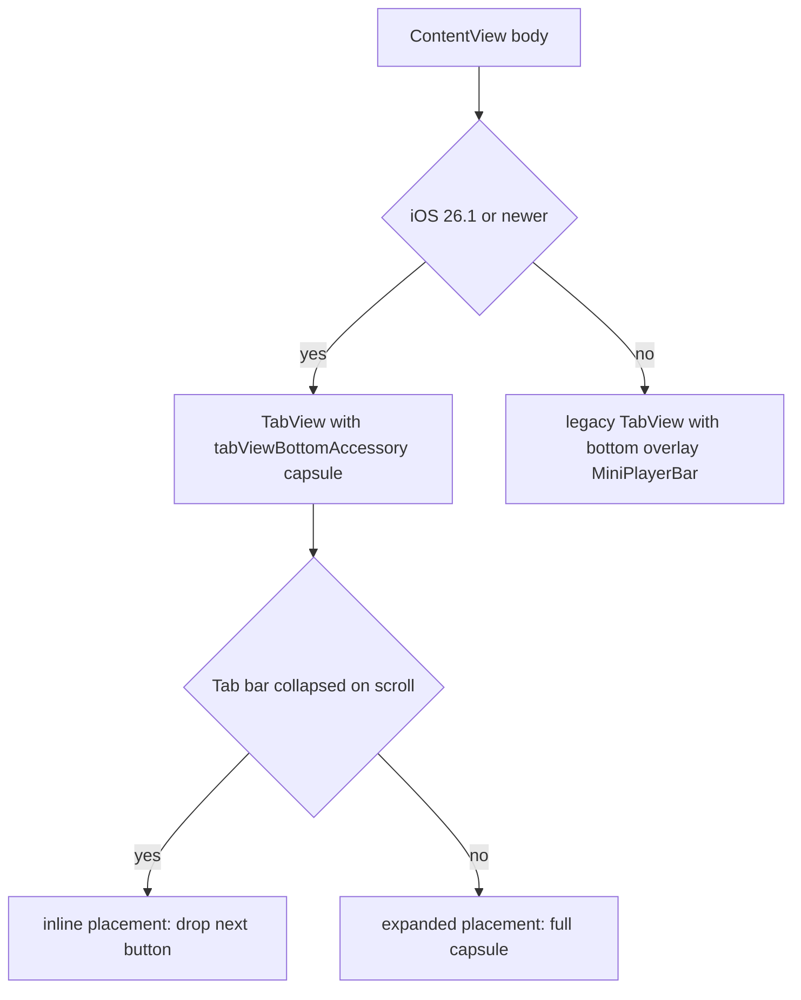

2026-06-13

# NerLan iOS — Liquid Glass mini player on iOS 26, overlay fallback below

## Summary

The now-playing mini player on iOS (`plateaukao/nerlan`) now uses the native
iOS 26.1 **Liquid Glass** bottom accessory (Apple Music style) when available,
and falls back to the existing hand-rolled bottom overlay on earlier OSes.

On iOS 26.1+, `TabView` gets a `tabViewBottomAccessory` capsule that the system
floats above the tab bar and — with `tabBarMinimizeBehavior(.onScrollDown)` —
collapses inline as the user scrolls, sliding the now-playing chip into the tab
bar. Below 26.1, the app keeps the `MiniPlayerBar` floated as a bottom
`.overlay`, now restyled onto rounded `regularMaterial` with a soft shadow.

## Approach

`ContentView` splits into `modernTabs` (gated `@available(iOS 26.1, *)`) and
`legacyTabs`, chosen with `if #available`. Both present the same `PlayerView`
sheet on tap.

- **modernTabs** uses the new `Tab(...)` builder and
  `tabViewBottomAccessory(isEnabled: player.current != nil) { MiniPlayerAccessory }`.
  Gating with `isEnabled` (a 26.1 addition) hides the capsule when nothing is
  playing — a conditional inside the accessory's content closure would instead
  leave an empty capsule on screen.
- **MiniPlayerAccessory** reads `\.tabViewBottomAccessoryPlacement`. When the tab
  bar collapses the placement becomes `.inline`, and the view drops the skip-next
  button and shrinks the artwork, mirroring Apple Music's collapsed chip.
- **legacyTabs** keeps the pre-existing `.overlay(alignment: .bottom)` approach —
  chosen originally because `safeAreaInset` over a `List` doesn't receive touches
  reliably. The bar moved from `.background(.bar)` to rounded `regularMaterial`
  with a shadow and a small bottom gap so it reads as a floating capsule too.

## Trade-offs

- **Two code paths for one element.** The native accessory can't be back-deployed,
  so the overlay stays for older iOS. The duplication is contained to
  `ContentView` and both share `PlayerManager` state and the `PlayerView` sheet.
- **System-owned layout on 26.1+.** The capsule's exact position, glass material,
  and collapse animation are the system's to decide; the app only supplies
  content and reacts to the placement. Less pixel control, but it matches the OS
  and tracks future changes for free.
- **Overlay padding is a constant.** The fallback bar offsets by a hard-coded
  tab-bar height (`49 + 8`); fine for the standard portrait-only tab bar this app
  uses, but it is not derived from a real safe-area measurement.

## Key Files

- `NerLan/Sources/Views/ContentView.swift` — `modernTabs` / `legacyTabs` split,
  `MiniPlayerAccessory`, restyled `MiniPlayerBar`.
