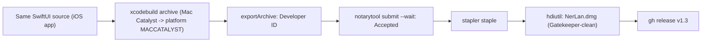

# NerLan iOS — Mac Catalyst (native macOS app + notarized DMG)

> Status: **Shipped.** Merged to `main` (PR #2). A native macOS build runs from the
> same source, and a Developer ID-signed + notarized `NerLan.dmg` is published as
> GitHub release **v1.3**. Verified running on-device (Mac) and Gatekeeper-clean.

## Summary

NerLan now builds as a real macOS app via Mac Catalyst — a `platform MACCATALYST`
binary that launches directly with `open` (no iOS-on-Mac wrapper), shares the same
iCloud container as the iOS app, and can be notarized for distribution to any Mac.
This is the proper-distribution counterpart to the earlier "Designed for iPad"
local-run path (see `nerlan-ios-run-on-mac-designed-for-ipad.md`): Designed-for-iPad
is great for running locally but can't be notarized outside the Mac App Store;
Catalyst can.

## Approach

**Enablement was three small settings**, applied in `project.yml` (the XcodeGen
source of truth):
- `SUPPORTS_MACCATALYST = YES` — adds the "Mac Catalyst" destination.
- `DERIVE_MACCATALYST_PRODUCT_BUNDLE_IDENTIFIER = NO` — keep the bundle id
  `com.danielkao.NerLan` instead of the derived `maccatalyst.…`, so the Mac app
  uses the **same iCloud container** as iPhone/iPad (sync is one account, one
  container across all three).
- `MACOSX_DEPLOYMENT_TARGET = 14.0` — the macOS floor mapped from iOS 17.

**Signing provisioned itself.** The estimate had flagged iCloud-capability
provisioning for the macOS app ID as the likely friction point. In practice,
`xcodebuild -allowProvisioningUpdates` generated a "Mac Catalyst Team Provisioning
Profile" carrying the iCloud entitlements automatically — no manual portal step.

**One code touch-up.** `StudyPanel.usesSidePanel` keyed the two-pane layout on
`userInterfaceIdiom == .pad`. Catalyst's "Optimize for Mac" idiom reports `.mac`
(the "Scaled to match iPad" idiom already reports `.pad`), so the check now accepts
both — the two-pane browser/study layout reads well in a desktop window either way.
No other source changed: the API audit (AVAudioSession, MediaPlayer, PDFKit,
WebKit, AuthenticationServices, the `UIApplication`/`UIDevice` touch points) was
entirely Catalyst-supported, and the sheet `@EnvironmentObject` fix already on
`main` (from the Designed-for-iPad work) also covers Catalyst's
`UIHostingController` sheet bridging.

**Release pipeline.** `Scripts/release_mac.sh` mirrors `../whisperASR/Scripts/release.sh`,
adapted for a Catalyst archive: archive → Developer ID export (`exportArchive`,
`method=developer-id`) → `notarytool submit --wait` → `stapler staple` → `hdiutil`
DMG. The first run notarized cleanly (status **Accepted**) and the app validates as
`source=Notarized Developer ID`. The artifact ships as `NerLan-v1.3-macOS.dmg` on
the GitHub release.

## Trade-offs

- **Catalyst vs. Designed-for-iPad.** Designed-for-iPad needs zero project changes
  and is perfect for local runs, but its app can't be notarized for distribution
  outside the Mac App Store. Catalyst costs a few build settings + a one-line idiom
  tweak and yields a notarizable, hand-to-any-Mac app. Both now coexist: developers
  can `Scripts/run_mac.sh` (Designed for iPad, quick local) or
  `Scripts/release_mac.sh` (Catalyst, distributable).
- **A real second platform.** Catalyst is now part of the surface area to keep
  green each release (smoke-test playback, downloads, iCloud + Drive sync, PDF, AI).
  Low ongoing cost given how clean the API audit was, but non-zero.
- **Idiom choice.** Accepting both `.pad` and `.mac` means the side panel shows
  regardless of the Catalyst interface mode, rather than tuning a distinct Mac
  layout. Simplest correct behavior; a bespoke Mac UI is possible later.
- **Versioning.** Released as `v1.3` with the macOS DMG as the asset; the iOS `.ipa`
  is not attached to this release (can be added if a combined release is wanted).

## Key Files

- `project.yml` — the three Catalyst build settings.
- `NerLan/Sources/StudyPanel.swift` — accept the `.mac` idiom for the side panel.
- `Scripts/release_mac.sh` — archive → Developer ID → notarize → staple → DMG.
- `Scripts/run_mac.sh`, `Scripts/build_mac_dmg.sh` — the lighter Designed-for-iPad
  local-run / local-DMG path (sibling ADR).
