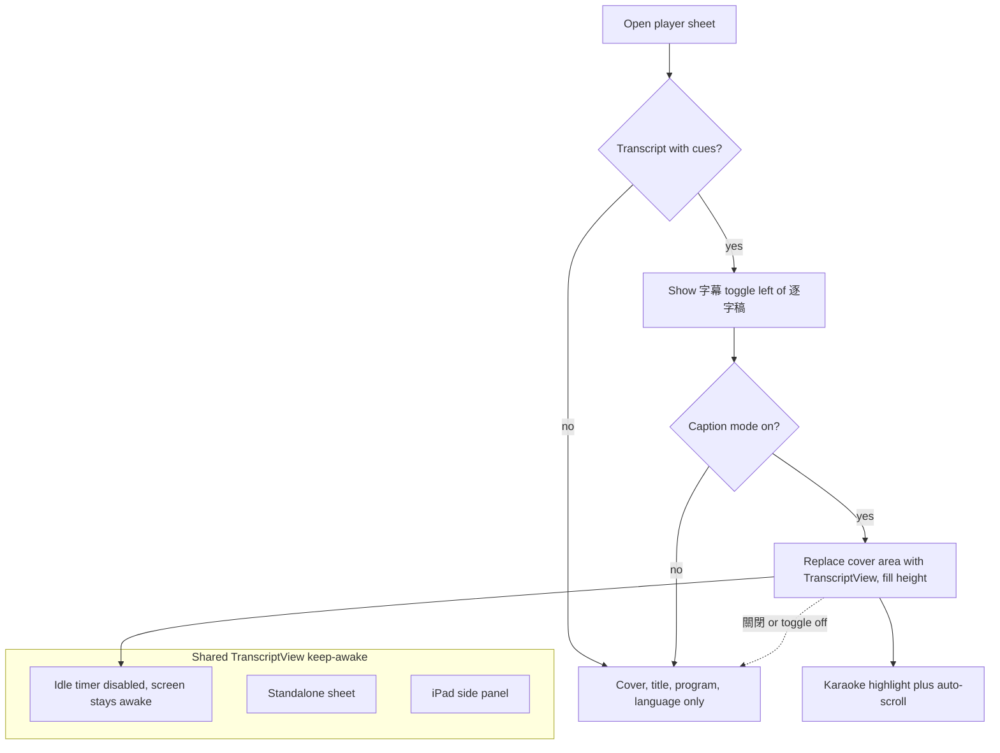

# NerLan iOS — Player caption mode + keep the transcript screen awake

## Summary

Two transcript-reading improvements, ported from the Android app to the iOS
(SwiftUI) version:

1. **Caption mode in the player.** When the playing episode has a transcript
   **with timestamp cues**, a 字幕 toggle appears to the left of the 逐字稿 button
   in the player's AI-tools row. Toggling it on hides the cover image, title,
   program name, and language label, and shows the synced transcript in that area
   — the same karaoke-style follow-along (active sentence highlighted and kept
   centered) used elsewhere. Tapping 字幕 again, or the transcript's 關閉 button,
   returns to the cover.
2. **Keep the screen awake while reading.** The display no longer dims/locks on
   the idle timeout while the transcript is on screen — in caption mode, the
   standalone sheet, or the iPad side panel.

## Approach

The transcript view already existed as one shared SwiftUI view, `TranscriptView`,
used by the standalone sheet (`AIActionButton`) and the iPad side panel
(`StudyDetailView`). Caption mode reuses it a third time, embedded directly in the
player's cover area with `.frame(maxHeight: .infinity)` so it takes the vertical
slack above the transport controls (the top/bottom spacers are dropped while
captions show). Its own toolbar (close / font-size / translate / copy) comes along
for free, and wiring its `onClose` to clear caption mode gives a natural exit.

Because `PlayerView` re-renders on every scrubber tick (it observes the playback
clock), the cue lookup — which decodes a JSON sidecar — must not run in `body`.
Instead a cheap `transcriptToken` (`episodeId | hasTranscript`, both O(1) file
checks) is read each render, and `.onChange(of: transcriptToken)` triggers the
actual cue decode into `@State` only when the episode or transcript-existence
changes. Caption mode is reset on `player.current?.id` change so each episode
opens on its cover.

Keep-awake is a single `.onAppear { UIApplication.shared.isIdleTimerDisabled =
true }` / `.onDisappear { … = false }` on `TranscriptView`. Putting it on the
shared view means all three contexts are covered from one place, and tying it to
the view's lifecycle makes it self-clearing — dismiss the sheet, toggle 字幕 off,
or switch the panel and the idle timer is restored automatically.

## Trade-offs

- **Reuse `TranscriptView` whole, nav bar and all.** Embedding the entire shared
  view (with its toolbar) keeps zero duplicated highlight/scroll/translate logic
  and stays consistent with Android's reuse of `TranscriptContent`, at the cost of
  a thin extra navigation bar inside the player sheet. The follow-along behavior is
  exactly what a caption view wants, so the reuse pays off.
- **Awake while shown, not only while playing.** The screen stays awake whenever
  the transcript is visible (even paused), matching the request; closing it
  restores the normal timeout. `isIdleTimerDisabled` is a single global flag, so in
  the rare case two transcript views overlap (e.g. opening the standalone sheet
  over caption mode) the first dismissal could re-enable it early — not a flow this
  app actually produces, so kept simple over reference-counting.
- **Per-episode reset.** Caption mode resets on track change so a new episode
  always opens on its cover; an episode without cues hides the toggle and falls
  back to the cover automatically.

## Key Files

- `NerLan/Sources/Views/PlayerView.swift` — adds the `ai` environment object, the
  `captionMode` / `captionCues` state, the `transcriptToken` change-signal and
  `refreshCaptionCues()`, the cover-vs-transcript swap, the conditional bottom
  spacer, and the 字幕 toggle in the AI-tools row.
- `NerLan/Sources/Views/TranscriptView.swift` — adds the
  `onAppear`/`onDisappear` idle-timer toggle. Unchanged otherwise; still the shared
  body for the sheet, the panel, and now caption mode.
- `NerLan/Sources/Views/StudyDetailView.swift` — unchanged; confirmed it renders
  `TranscriptView`, so the iPad panel inherits keep-awake.
