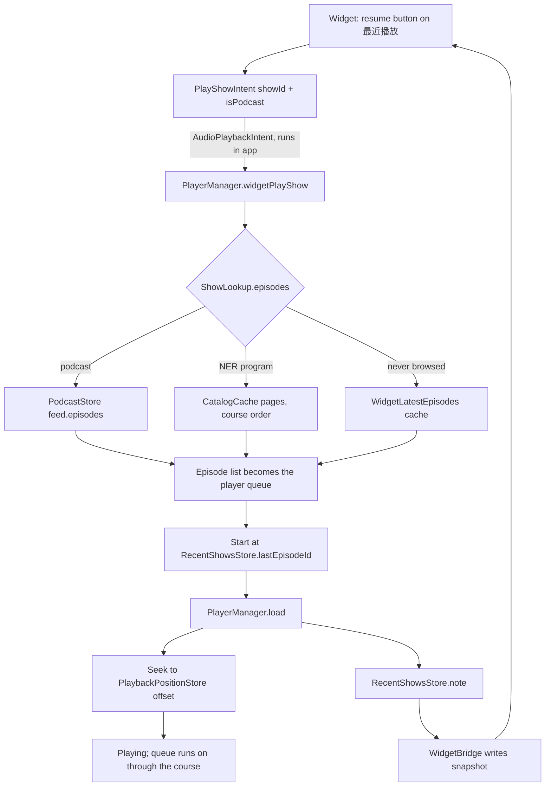

2026-07-25

# NerLan iOS: resume positions, recent shows, and a configurable shows widget

Follow-up to [nerlan-ios-widgets](nerlan-ios-widgets.md), closing the two gaps
that surfaced as soon as the widgets were on a real Home Screen: with more
favorited shows than fit in 我的節目, there was no way to choose which four
appeared; and nothing anywhere remembered what you had been listening to, so a
widget could not offer "put me back where I was".

## Choosing which shows appear

Two answers, and they compose rather than compete.

**By default, rank by listening time.** `ListeningStatsStore` already tallied
seconds per `programId` for the 使用統計 screen, and podcast records use their
feed URL as `programId`, so a single sort covers programs and podcasts alike.
Extracting `secondsByProgram()` (which `topPrograms` now builds on) and sorting
`WidgetBridge.shows` by it means the shows actually being studied float to the
top with no UI at all — the same behaviour Apple Podcasts' Top Shows has.
Never-played shows fall back to name order so the grid does not shuffle.

**When that is not enough, pin an explicit set.** 我的節目 became an
`AppIntentConfiguration` with a multi-select `@Parameter var shows: [ShowEntity]?`,
so the edit sheet lets you tick shows in the order you want them laid out.
`ShowEntity` and its query moved out of the Latest Episode widget into
`WidgetSupport.swift`, since two widgets now share them, and the query offers
recently-played shows alongside favorited ones. Several copies of the widget can
be placed, each pinned to different shows.

Pinned entries that have since left the library are dropped rather than left as
holes in the grid.

## Resume positions — an app-wide gap, not a widget one

Checking what "continue where I left off" would need turned up something worse
than a missing widget feature: the app never persisted a playback position at
all. `PlaybackClock.currentTime` lived only in memory, so stopping halfway
through a 25-minute lesson and coming back later started it over.

`PlaybackPositionStore` fixes that: `playback-positions.json` in Documents (plain
JSON, like every other store here), episode id to `{position, duration,
updatedAt}`. Written on pause, on episode change, and on a 5-second throttle
during playback — the same shape as the listening-stats throttle, since saving
on every 0.5s tick would be pointless churn. `PlayerManager.load` seeks to it.

Two rules keep the data honest rather than merely complete:

- Positions within 15 seconds of either edge are **cleared, not stored**. An
  episode barely started is not worth resuming, and one at the very end would
  make "play" replay its last breath.
- Finishing an episode clears its entry outright, so replaying starts from the
  top.

It is deliberately not synced. A resume offset is a per-device, per-moment thing
that goes stale the instant you press play somewhere else, so mirroring it
through the shared KVS budget would buy nothing.

## Recent shows, and playing a show as a playlist

Playing a show as a playlist already worked — `play(record, in: queue)` has
always taken a queue, and `ProgramDetailView` passes the program's full episode
list, so tapping lesson 12 continues into 13. What was missing was any memory of
*which* show, so nothing could offer it as a one-tap entry point.

`RecentShowsStore` records one entry per show (id, name, cover, `lastEpisodeId`,
timestamp) from `PlayerManager.load` — the chokepoint every playback path funnels
through, so nothing can start playing without being recorded. It is kept separate
from `FavoritesStore.programs` on purpose: a course can be worked through for
weeks without its heart ever being tapped, and the useful list is what you have
been *doing*, not what you bookmarked.

The new 最近播放 widget (S/M/L) lists those shows with a resume bar and a play
button:

`ShowLookup` is the interesting part. For a podcast the feed is already local.
For a NER program the browse cache is exactly right *because* it pages ascending
from episode 1 — the same property that made it useless for 最新單集 makes it the
correct playlist here, already in course order. A program never browsed on this
device falls back to the widget's own newest-episodes cache, which is at least
enough to start.

The bare play button (`widgetTogglePlayPause` with nothing loaded) now prefers
continuing the last-played show over offering an arbitrary download, resolving
through `ShowLookup` when the episode is not in downloads or favorites.

## Snapshot changes

`WidgetShow` gained `lastEpisodeId` / `lastEpisodeTitle` / `lastPlayedAt` /
`resumeProgress`, all optional, and `WidgetSnapshot` gained `recents` — a list of
its own rather than an ordering of `shows`, precisely because recents include
shows that were never favorited. `recents` is optional with a `recentShows`
accessor so a snapshot written by the previous build still decodes.

The write-gating signature buckets resume progress into twentieths, so a resume
bar nudges forward at most every 5% of an episode rather than spending a widget
reload per tick.
