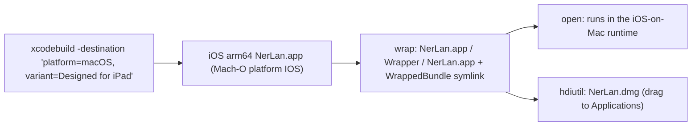

# NerLan iOS — run natively on Mac via "Designed for iPad"

> Status: **Working.** The iPhone/iPad app now runs natively on Apple Silicon Macs
> through "Designed for iPad", with a one-step build/run script and a DMG packager.
> Verified running on-device (Mac). iCloud and Google Drive sync both function in
> this runtime.

## Summary

NerLan is an iOS app with no Mac target, but Apple Silicon Macs can run the
unmodified iPad binary via "Designed for iPad" (the Mac and iPad share arm64 and
macOS ships the iOS frameworks). Two things were needed to make it actually work:
a SwiftUI fix so it stops crashing on launch, and tooling to build/wrap/launch it
(a raw iOS `.app` can't just be `open`ed on macOS). The result is a native Mac
window plus an optional drag-to-Applications DMG for local install.

## Approach

**The crash.** Launching the "Designed for iPad" build crashed immediately. The
crash report was decisive — it was *not* a signing/notarization/Gatekeeper issue
(the code signature validated fine and the app reached SwiftUI rendering). It was
SwiftUI's `EnvironmentObject.error()` assertion ("No ObservableObject of type
PlayerManager found") from `PlayerView`. Cause: on iPadOS, environment objects flow
automatically from an ancestor into `.sheet` content; the macOS "Designed for iPad"
presentation bridge (`SheetBridge` → `PresentationHostingController`) does **not**
propagate them, so each sheet root renders with an empty environment and traps.

**The fix.** An idempotent `appEnvironment()` `View` modifier that injects all
shared singletons, applied at the window root and at every sheet root (player,
settings, add-podcast, attachment, AI). Re-injecting the same `.shared` instances
is a no-op on iPhone/iPad, so device behavior is unchanged — this is purely
additive hardening.

**Launching an iOS binary on macOS.** A "Designed for iPad" build is a
`platform IOS` Mach-O; `open` rejects it ("incorrect executable format"). macOS
runs iOS apps only through a wrapper bundle — the same shape the App Store uses for
"iPhone & iPad apps on Mac":

    NerLan.app/
        Wrapper/NerLan.app/   (the iOS app)
        WrappedBundle -> Wrapper/NerLan.app

`Scripts/run_mac.sh` builds for the `platform=macOS,variant=Designed for iPad`
destination, resolves the product via `-showBuildSettings`, assembles that wrapper
under `.build/mac/`, and `open`s it. `Scripts/build_mac_dmg.sh` reuses that wrapper
and packages it into a `.dmg` (with an `/Applications` symlink), optionally
Developer ID-signing it when `CODESIGN_IDENTITY` is set.

## Trade-offs

- **DMG is for personal/local install, not broad distribution.** Apple supports
  "iPhone & iPad apps on Mac" only through the Mac App Store — there is no
  notarization path for a Designed-for-iPad app distributed outside it. The DMG
  runs on this Mac and Macs that trust the developer cert. For a notarized,
  freely-distributable Mac app, the route is **Mac Catalyst** (a native macOS
  binary), which can then follow the Developer ID + `notarytool` + `stapler` flow
  (cf. `../whisperASR/Scripts/release.sh`).
- **Designed for iPad over Catalyst** was chosen deliberately: zero code changes
  (same binary as the iPad app, including the iPad two-pane layout), versus
  Catalyst's recompile + signing/provisioning setup. The only price was the
  sheet-environment fix above — which is a correct improvement regardless.
- **Sync works.** Both iCloud (KVS + container) and the Google Drive backend
  function in this runtime, so the Mac build is a real second client, not a
  read-only viewer.
- The wrapper/DMG live under `.build/` (gitignored); only the scripts are tracked.

## Key Files

- `NerLan/Sources/NerLanApp.swift` — the `appEnvironment()` modifier + window root.
- `NerLan/Sources/Views/{ContentView,PlayerView,DownloadsView,ProgramListView,AIActions}.swift`
  — apply `appEnvironment()` at each sheet root.
- `Scripts/run_mac.sh` — build → wrap → launch on Mac.
- `Scripts/build_mac_dmg.sh` — build → wrap → `.dmg` for local install.
