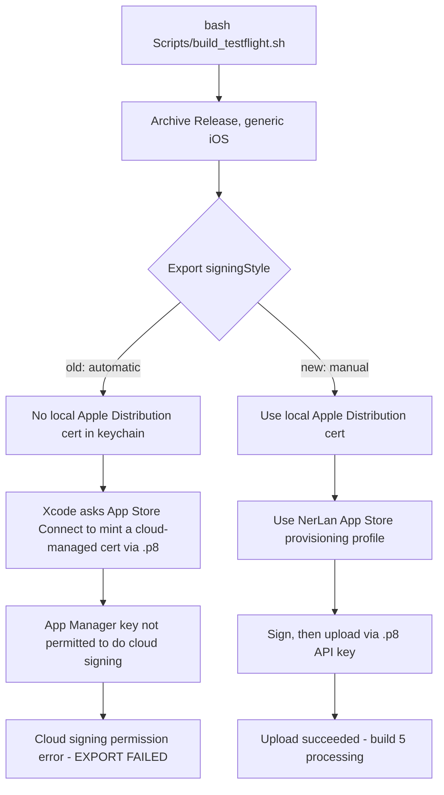

# NerLan iOS — TestFlight upload broke on cloud signing; switched export to manual signing

## Problem

A routine TestFlight upload of NerLan (`bash Scripts/build_testflight.sh`, bumping
to v1.4 build 5) failed at the **export** step — the archive built fine, but
`xcodebuild -exportArchive` died with:

```
error: exportArchive Cloud signing permission error
error: exportArchive No signing certificate "iOS Distribution" found
```

The first TestFlight upload (v1.3 build 4, 2026-06-19) had succeeded with the
*same* script and the *same* App Store Connect API key (`.p8`), so nothing obvious
had changed on our side.

## Root Cause

The script exported with `signingStyle: automatic`. Automatic signing for an
App Store distribution needs an **Apple Distribution** certificate. There was
**none in the local keychain** (only `Apple Development` and `Developer ID
Application`, neither of which can sign for the App Store). With no local
distribution identity, Xcode falls back to **cloud signing**: it asks App Store
Connect — via the `.p8` API key — to mint a *cloud-managed* distribution
certificate. That request was refused, hence "Cloud signing permission error."

Two facts pinned it down:

- The `.p8` itself was fine. A read-only `GET /v1/certificates` with it returned
  HTTP 200, proving the key authenticates and has read access.
- That same call showed the account had **zero** distribution certificates —
  only 2× `DEVELOPER_ID_APPLICATION` and 1× `DEVELOPMENT`. The cloud-managed
  distribution cert that the 6/19 export had created was **gone from the account**.

So the chain is: the cloud cert from the first upload vanished → this run had no
local *and* no account distribution cert → automatic signing tried to recreate a
cloud-managed one → the API key's **App Manager** role is not permitted to mint a
cloud-managed distribution certificate → permission error → export failed.

Apple lets an App Manager key *read* certs and create a **user-managed** cert
(where you generate the private key and submit a CSR), but not a **cloud-managed**
one (where Apple holds the key). Automatic signing only ever attempts the latter.



## Solution

Stop relying on cloud signing. Create a **user-managed** distribution identity
and a matching App Store profile (both via the App Store Connect API, which the
App Manager key *is* allowed to do), then export with **manual** signing.

One-time setup performed:

1. **Distribution certificate** — generate a keypair + CSR locally
   (`openssl req -new -newkey rsa:2048 -nodes`), then `POST /v1/certificates`
   with `certificateType: DISTRIBUTION` and the CSR. Apple returns the cert;
   bundle it with the private key into a `.p12` and `security import` it into the
   login keychain. Result: `Apple Distribution: MAO YUAN KAO (3WD42GF27D)`
   (cert id `XRP3T4TN7B`, valid to 2027-06-20).
2. **Provisioning profile** — `POST /v1/profiles` with `profileType:
   IOS_APP_STORE`, binding bundle id `com.danielkao.NerLan` (`4LXGP43SU6`) to the
   new cert. Install the returned `.mobileprovision` into
   `~/Library/MobileDevice/Provisioning Profiles/`. Result: profile
   `NerLan App Store` (uuid `13f757ad-…`).
3. **Manual export** — an ExportOptions plist with `signingStyle: manual`,
   `signingCertificate: Apple Distribution`, and `provisioningProfiles:
   { com.danielkao.NerLan: NerLan App Store }`. Run `xcodebuild -exportArchive`
   with the three `-authenticationKey*` flags (still needed for the *upload*),
   but **without** `-allowProvisioningUpdates` — that flag nudges Xcode back onto
   the cloud-signing path.

`build_testflight.sh` was updated to emit the manual ExportOptions and drop
`-allowProvisioningUpdates`, so future one-shot runs work as long as the local
cert + profile exist. The header documents those prerequisites and how to
recreate them.

The re-export then printed `Upload succeeded` / `** EXPORT SUCCEEDED **`; build 5
went to App Store Connect processing.

A couple of `openssl`/keychain traps cost time and are worth recording:

- This Mac's `openssl` is **1.1.1q**, so the `-legacy` flag (an OpenSSL-3 thing
  for keychain-compatible `.p12`s) is unrecognized — and not needed here.
- `security import` of a `.p12` made with an **empty** password fails with
  "MAC verification failed (wrong password?)". Use a real password.

## Key Files

- `Scripts/build_testflight.sh` — now writes a **manual**-signing ExportOptions
  (`signingStyle: manual`, `signingCertificate: Apple Distribution`,
  `provisioningProfiles: { com.danielkao.NerLan: NerLan App Store }`) and exports
  without `-allowProvisioningUpdates`. Header lists the cert/profile prerequisites.
- `project.yml` / `NerLan/Resources/Info.plist` — bumped to v1.4, `CFBundleVersion`
  5 for this upload.
- (Account-side, not in the repo) `Apple Distribution` cert `XRP3T4TN7B` and
  `IOS_APP_STORE` profile `NerLan App Store`, created via the ASC API.

## Lessons Learned

- **A valid `.p8` is not a signing certificate.** The API key authenticates and
  authorizes uploads/profile management; the binary still needs an Apple
  Distribution certificate with its private key in the keychain.
- **Automatic signing == cloud signing when no local dist cert exists**, and an
  **App Manager** ASC key cannot create a cloud-managed distribution cert. For
  headless/scripted App Store exports, prefer a **user-managed** cert + **manual**
  signing; it removes the cloud dependency and is reproducible.
- **Cloud-managed certs can disappear.** Don't assume "it worked last time" means
  the certificate still exists — verify with `GET /v1/certificates`.
- A read-only API probe (`GET /v1/certificates`) is the fastest way to separate
  "bad/expired key" from "missing certificate" — it isolated the cause in one call.
