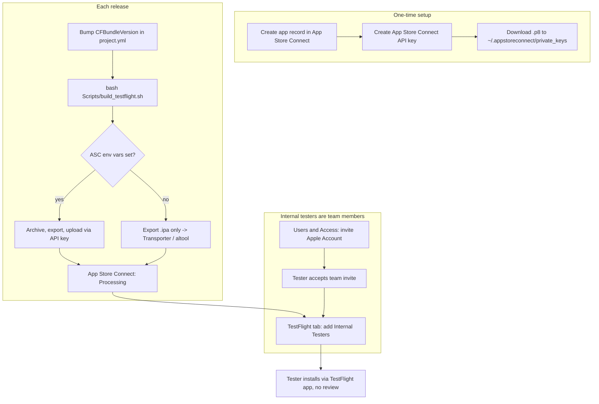

# NerLan iOS — TestFlight (internal testing): setup & step-by-step tutorial

## Summary

NerLan iOS can now be distributed to **TestFlight for internal testing** — builds
install over the air on your own (and your invited testers') devices, don't expire
the way cabled development builds do, and need **no Beta App Review**. This ADR
documents the one-time setup, the repeatable build/upload flow added in
`Scripts/build_testflight.sh`, and how to manage testers. It doubles as a runbook:
follow it top to bottom for the first release, then jump to "Each subsequent
release" thereafter.

The first build (v1.3, build 4) was uploaded successfully on 2026-06-19.

## Approach

The existing `Scripts/build_release.sh` produced a *development-signed* `.ipa`
(`method: debugging`) that only runs on devices registered to the team. TestFlight
needs a *distribution-signed* archive exported with `method: app-store-connect` and
uploaded to App Store Connect. Rather than fold that into the dev script, a separate
`Scripts/build_testflight.sh` was added so the two distribution paths stay distinct.

The script auto-detects whether to upload: if the three App Store Connect API-key
env vars are present it archives → exports → uploads in one shot; otherwise it
stops at a local `.ipa` for manual upload (Transporter or `altool`). No secrets are
baked into the repo — the key is referenced only by path via env var, and the
`.p8` lives outside the repo in `~/.appstoreconnect/private_keys/`.

Two `project.yml` tweaks make uploads frictionless: `ITSAppUsesNonExemptEncryption:
false` (the app uses only HTTPS + Keychain, which are export-compliance exempt) so
TestFlight never prompts about encryption per build, and a bumped
`CFBundleVersion` (App Store Connect rejects a duplicate build number).



## Tutorial

### Prerequisites
- A **paid Apple Developer Program** membership (team `3WD42GF27D`). Confirmed —
  the app uses iCloud/KVS entitlements, which a free team can't sign.
- **Xcode + XcodeGen** installed; you can already build/run the app.
- You are the **Account Holder or Admin** (needed for app records, API keys, users).

### One-time setup

**1. Create the app record** (App Store Connect → **Apps → ➕ → New App**)
- Platform **iOS**; Name `NerLan` (must be unique across the App Store — pick a
  variant if taken; it's only a label for internal testing).
- Bundle ID: pick **`com.danielkao.NerLan`** from the dropdown — it's already
  registered to the team because dev builds use it. Owning the domain
  `danielkao.com` is **not** required; bundle IDs are just globally-unique strings.
- SKU: any unique string, e.g. `nerlan-ios`. User Access: Full Access. **Create.**
- You do *not* need screenshots / description / pricing for internal TestFlight.

**2. Create an App Store Connect API key** (for non-interactive uploads)
- **Users and Access → Integrations → App Store Connect API → Team Keys → ➕**
  (first time: accept the API terms as Account Holder).
- Name it, **Access: App Manager**, Generate.
- **Download the `.p8` (one time only)**. Record the **Key ID** (the key's row) and
  the **Issuer ID** (UUID at the top of the page).
- Store it in a standard `altool` search path so it's found automatically:
  ```bash
  mkdir -p ~/.appstoreconnect/private_keys
  mv ~/Downloads/AuthKey_*.p8 ~/.appstoreconnect/private_keys/
  ```
  Treat the `.p8` like a password; never commit it. If lost, revoke and reissue.

### Build & upload

**3. Bump the build number** in `project.yml` (`CFBundleVersion`) — every upload
needs a unique number. Optionally bump `CFBundleShortVersionString` for a new
marketing version.

**4. Run the script** from the project root (`~/src/nerlan`):
```bash
export ASC_KEY_ID=<Key ID>
export ASC_ISSUER_ID=<Issuer ID>
export ASC_KEY_PATH=~/.appstoreconnect/private_keys/AuthKey_<KEYID>.p8
bash Scripts/build_testflight.sh      # archives, exports, AND uploads
```
With no env vars set it instead stops at `.build/testflight/NerLan.ipa`; upload
that by dragging it into **Transporter.app**, or:
```bash
xcrun altool --upload-app -f .build/testflight/NerLan.ipa \
    --type ios --apiKey <Key ID> --apiIssuer <Issuer ID>
```
(`altool` finds the `.p8` automatically in `~/.appstoreconnect/private_keys/`.)
A successful run prints `UPLOAD SUCCEEDED with no errors` and a Delivery UUID.

**5. Wait for processing** — a few minutes after upload the build moves from
"Processing" to ready (you get an email). The `ITSAppUsesNonExemptEncryption` key
means no compliance prompt.

### Manage internal testers

Internal testers must be **members of your App Store Connect team** (up to 100).

**6. Invite the person to the team** — **Users and Access → Users → ➕**: enter
their name + Apple Account email, assign a least-privilege role (Developer / App
Manager, or Marketing for a non-technical tester), optionally limit app access to
NerLan. They must **accept** the email invite before the next step.

**7. Add them to the internal group** — **NerLan → TestFlight → Internal Testing**
→ open/create a group → **➕ Testers** → tick the team member → **Add**.

**8. Install** — the tester installs the **TestFlight** app, signs in with the
invited Apple ID, and installs NerLan. Internal builds are available immediately
with **no review** and no per-build expiry.

> External testing (up to 10,000 by email/public link, no team membership) is the
> alternative, but it requires **Beta App Review** — risky for this unofficial NER
> client (reverse-engineered government API + third-party copyrighted audio). Keep
> distribution **internal**.

### Each subsequent release
1. Make code changes; bump `CFBundleVersion` in `project.yml`.
2. `bash Scripts/build_testflight.sh` (with the three env vars exported).
3. Wait for processing; existing internal testers get the build automatically.

## Trade-offs

- **Separate script over extending `build_release.sh`.** Keeping dev-signed and
  App Store-distribution exports in distinct scripts avoids a mode flag and makes
  each path obvious, at the cost of some duplicated archive boilerplate.
- **API key vs. interactive sign-in.** An App Store Connect API key makes uploads
  scriptable and headless; the trade-off is guarding a long-lived `.p8` credential
  (kept outside the repo, referenced by path). Transporter remains a zero-key
  fallback for one-off uploads.
- **Internal-only by design.** Sidesteps Beta App Review entirely, but caps the
  audience at 100 team-member testers — acceptable given the app's unofficial
  nature.
- **Manual build-number bump.** `CFBundleVersion` is bumped by hand in
  `project.yml` each release; simple and explicit, but easy to forget — a duplicate
  number is rejected at upload, which is the safety net.

## Key Files

- `Scripts/build_testflight.sh` — archive → export (`app-store-connect`, automatic
  signing, team `3WD42GF27D`) → conditional upload via the
  `ASC_KEY_ID`/`ASC_ISSUER_ID`/`ASC_KEY_PATH` env vars; else export-only `.ipa`.
- `project.yml` — version source of truth (`GENERATE_INFOPLIST_FILE: NO`):
  `CFBundleShortVersionString` / `CFBundleVersion`, plus
  `ITSAppUsesNonExemptEncryption: false`. Run `xcodegen generate` after editing.
- `NerLan/Resources/Info.plist` — generated from `project.yml`; tracked in git, so
  commit it alongside `project.yml`.
- `Scripts/build_release.sh` — unchanged; the older development-signed `.ipa` path
  for GitHub releases / direct device installs.
