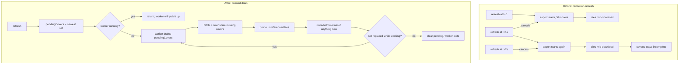

2026-07-26

# NerLan iOS: three widget bugs that only showed up on a real Home Screen

Follow-up to [nerlan-ios-widgets](nerlan-ios-widgets.md) and
[nerlan-ios-resume-and-recent-shows](nerlan-ios-resume-and-recent-shows.md).
Everything built and installed cleanly, but with the widgets on an actual Home
Screen — and against a real library of 19 subscribed podcasts and ~16 favorited
programs — three separate faults surfaced. Shipped as **v1.8 build 10**.

An aside that cost time: `devicectl device info files --domain-type
appGroupDataContainer` reports only `Library` for this container even when the
app has demonstrably just written to it. That false negative sent the first
investigation chasing a phantom "the snapshot is never written" bug. `NSLog` plus
`devicectl device process launch --console` turned out to be the reliable way to
see what the app actually does on device.

## 1. Picking any show crashed the widget extension

**Symptom:** add the 我的節目 widget, choose shows in the edit sheet, and the
covers never appear — the grid keeps showing placeholder artwork.

**Cause:** `ShowsProvider.entry` built its id lookup with
`Dictionary(uniqueKeysWithValues:)` over `snapshot.shows + snapshot.recents`. Those
two lists overlap by design — a show you are working through is usually also
favorited — and a duplicate key makes that initializer trap. The device crash log
is unambiguous:

```
EXC_BREAKPOINT (SIGTRAP)
libswiftCore  _assertionFailure(_:_:file:line:flags:)
libswiftCore  specialized _NativeDictionary.merge<A>(trappingOnDuplicates:)
libswiftCore  Dictionary.init<A>(uniqueKeysWithValues:)
NerLanWidgets ShowsProvider.entry(for:preview:)
NerLanWidgets ShowsProvider.timeline(for:in:)
```

What made it look like a *rendering* bug rather than a crash is that only the
configured branch builds that dictionary. With no shows picked the provider
returns `snapshot.shows` directly and everything works; the instant a show is
picked the extension traps, and WidgetKit falls back to placeholder content —
whose `coverKey` is nil, hence "the covers don't update".

Fixed with `Dictionary(_:uniquingKeysWith:)`, preferring the `shows` entry since
it carries the latest-episode data that recents omit. The one other trapping
init in the codebase (`recentRank` in `WidgetBridge`) was made defensive too:
its keys are unique by construction, but a trap there would take the whole app
down, which is a bad trade for nothing.

**Lesson worth keeping:** `Dictionary(uniqueKeysWithValues:)` is a precondition,
not a convenience. Anywhere the input is two concatenated lists, it is a latent
crash.

## 2. Cover art rarely reached the shared container

Each `refresh()` cancelled the in-flight cover export before starting a new one.
That looked reasonable — newest set wins — but app launch alone fires several
refreshes a second or two apart (stores initialising, Drive sync landing,
playback starting), so in practice every export was killed part-way through
downloading 59 covers and `covers/` never filled in.

Exports are now *queued* rather than cancelled. The newest request replaces the
pending set; a single worker drains it to completion and re-checks whether a
different set arrived while it worked.



Verified on device: `covers wanted=59 onDisk=59`.

## 3. No podcast ever appeared in 我的節目

The previous change ranked shows by listening time, on the theory that the ones
being studied would float up. With a real library that buried every podcast:
there are more favorited programs, and they hold nearly all the accumulated
listening time, so a four-slot grid never reached one of the 19 subscribed
podcasts.

Two fixes, because there were two independent causes:

- **Ordering.** Pinning podcasts above programs — mirroring the 節目 tab — merely
  inverts the complaint. The order is now *recently played first, then listening
  time*, which mixes the two kinds on the signal that actually matters: what is
  being worked through right now. The show picker still overrides it outright.
- **Truncation.** The snapshot capped the combined list at 12. That list also
  populates the widget's own picker, so anything dropped could not even be
  *chosen* — a silent ceiling on a feature meant to give explicit control. Now
  each kind is capped separately (20 each), and trimming to what fits on screen
  is left to the widget, where it belongs.

## Release plumbing

Manual signing maps every embedded bundle id explicitly, so the new extension
needed its own App Store profile — `build_testflight.sh` now maps
`com.danielkao.NerLan.Widgets` alongside the app. Adding the App Groups
capability to the app's App ID had also invalidated the existing `NerLan App
Store` profile, so both were regenerated against the same distribution cert
(`XRP3T4TN7B`, valid to 2027-06-20).

Build 9 was uploaded before the crash was found; **build 10 supersedes it and
build 9 should not be installed.**
