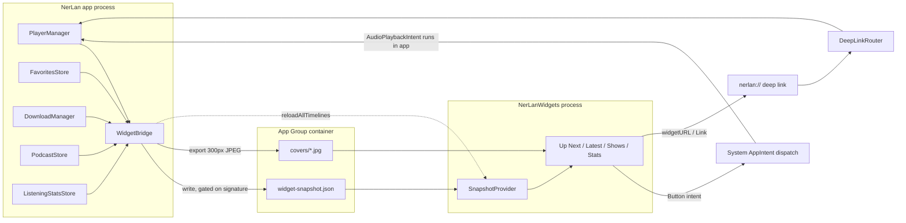

2026-07-25

# NerLan iOS: Home Screen and Lock Screen widgets

## What this adds

NerLan now ships a WidgetKit extension with four widgets, deliberately modelled
on the Apple Podcasts set so they read as familiar:

| Widget | Families | What it does |
| --- | --- | --- |
| 繼續收聽 (Up Next) | S / M / L, plus lock-screen rectangular, inline, circular | Now-playing cover, title, live progress bar, and working ⏮15 / play-pause / next buttons. Large adds the next three queue items, each with its own play button. |
| 最新單集 (Latest Episode) | S / M / L | Configurable: long-press to pick any favorited program or subscribed podcast. Large lists its three newest episodes. |
| 我的節目 (Top Shows) | S / M / L | Cover grid of favorited programs and subscribed podcasts (4 / 4 / 8). Each cover opens that show's episode list. |
| 學習紀錄 | S, plus lock-screen circular / rectangular / inline | Today's listening minutes against a 30-minute ring, the current streak, and the week's total. |

The last one has no Apple Podcasts counterpart, but NerLan already tracks all of
it for the 使用統計 screen, and a visible streak is the thing a language learner
most wants glanceable.

## Why it is built the way it is

A widget extension is a separate, short-lived, memory-capped process. It cannot
reach the app's `Documents` folder, cannot touch `PlayerManager`, and must not
hit the network. So the app flattens everything the widgets could draw into one
small JSON file plus a folder of pre-scaled cover JPEGs, in a new App Group
(`group.com.danielkao.NerLan`). `NerLan/Shared/` holds the snapshot model and
the playback intents, compiled verbatim into both targets — that directory is
the entire contract between the two processes.

### Keeping the progress bar alive without burning the reload budget

The obvious way to animate a playback progress bar is to rewrite the snapshot
and call `reloadAllTimelines()` as the position moves. That is also the fastest
way to exhaust WidgetKit's reload budget: a one-hour episode would spend sixty
reloads, and the listening-stats store already ticks twice a second during
playback.

Instead the snapshot records `position`, `positionAt`, and `rate`, and the
widget *extrapolates*: `position(at:)` adds elapsed wall-clock time scaled by
the playback rate, clamped to the episode length. `SnapshotProvider` then hands
WidgetKit thirty minute-spaced entries of the same snapshot while audio plays,
so the bar and the "剩 12 分鐘" label advance locally at zero cost.

That lets `WidgetBridge` gate writes on a *signature* that deliberately omits
the position entirely, and rounds listening minutes to the nearest five. Only
things a user would notice — a different episode, play/pause, a new favorite or
download, another five minutes listened — spend a reload. Pausing writes
naturally (it flips `isPlaying`), which is also what re-pins an accurate
position; backgrounding forces a write for the same reason.

One failure mode falls out of this: if the app is force-quit mid-episode it
never writes the pause, so the snapshot claims to be playing forever and the
timeline would re-arm every thirty minutes indefinitely. `snapshotTimeline`
treats a "playing" snapshot older than two hours as stopped.

### Play buttons that actually play

Widget buttons post AppIntents, and by default those are performed in the
extension's process — where there is no `AVPlayer`. Intents conforming to
`AudioPlaybackIntent` are the exception: the system performs them in the *app's*
process, launching it in the background if necessary. That is the only way a
widget button can start audio without opening the app, so all four intents
(`TogglePlaybackIntent`, `PlayEpisodeIntent`, `NextEpisodeIntent`, `SkipIntent`)
conform to it.

Because the intent types must exist in both targets, they live in
`NerLan/Shared/` and reach the player through a small `PlaybackBridge` handler
that the app registers in `application(_:didFinishLaunchingWithOptions:)` —
early enough that it is always in place before an intent can be delivered, even
on a background launch. Inside the extension the handler simply stays nil,
because `perform()` never runs there.

`PlayEpisodeIntent` carries an episode id rather than a record, so
`EpisodeLookup` resolves it against the queue, downloads, favorites, subscribed
feeds, and the latest-episode cache — the same sources the widgets drew from.

### Why the latest episode needs its own fetch

`CatalogCache` looked like the obvious source for 最新單集, but it cannot answer
the question. It stores episode pages *ascending* from episode 1, because a NER
language course is meant to be taken in order, so the tail of the cache is
wherever the user last scrolled to — not the newest episode. A new
`ChannelPlusAPI.latestEpisodes` asks the other end of the archive explicitly
(`sortOrder=DESC`, `size=3`), cached per program for six hours in
`WidgetLatestEpisodes`. Podcasts need no fetch; their feed is already local, and
only needed sorting by date since feed order isn't guaranteed.

### Navigation

The app had no navigation state object — each tab owns its own
`NavigationStack`. Rather than model the whole tree, `DeepLinkRouter` publishes
one-shot *requests* that the relevant view consumes and clears: a tab selection,
a program or feed id for `ProgramListView` to push, and a signal for
`ContentView` to present the full player. Both `TabView`s gained a selection
binding, and `ProgramListView` gained a `NavigationPath` used only by deep
links. A link can arrive before the catalog has loaded, so the push is retried
whenever either the request or the catalog changes.

### Mac Catalyst

The Catalyst build embeds the same extension, which forced one wrinkle: macOS
requires team-prefixed App Group ids (`TEAMID.group.…`) where iOS uses the bare
`group.…` form. Both targets therefore carry a macOS-only entitlements file
wired through `CODE_SIGN_ENTITLEMENTS[sdk=macosx*]`, and `WidgetShare` probes
both ids at runtime rather than branching on the platform and hard-coding the
team in source.

## Known limitations

- Widgets are blank until the app has been launched once — that first launch is
  what writes the snapshot.
- 我的節目 shows favorited programs first, then subscribed podcasts, capped at
  the family's slot count. There is no way yet to pick *which* shows appear when
  you have more than fit; the natural fix is to make it configurable the way
  最新單集 already is.
- Nothing tracks recently-played shows, so "resume the show I was last on" isn't
  expressible in a widget yet.
