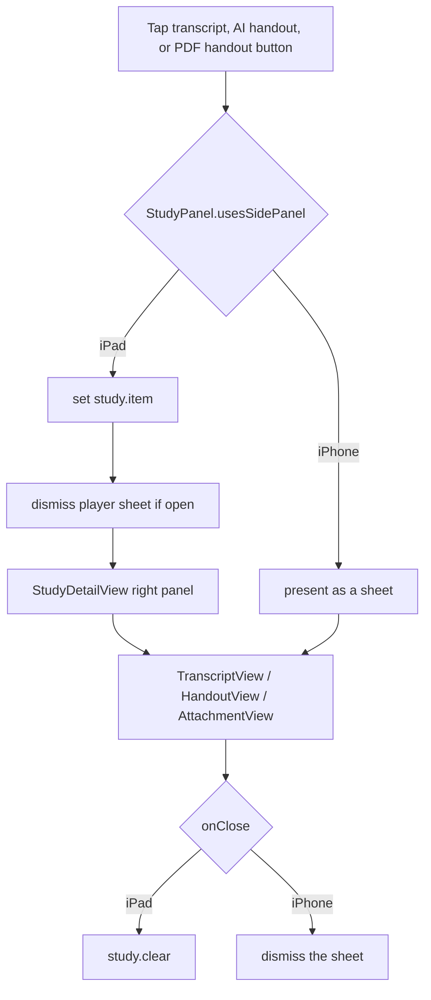

# NerLan — iPad support with a transcript/handout detail panel

## Summary

The app shipped iPhone-only. This change enables the iPad device family (all
orientations) and adapts the UI to a two-pane layout on iPad: the existing
browser (節目/收藏/下載 tabs + mini player) on the left, and a study **detail
panel** on the right. Tapping a transcript, AI handout, or PDF handout (講義) —
from the full player or a Downloads/Favorites row — shows it in the right panel
instead of a modal sheet. iPhone, which is portrait-locked, keeps the sheet
behavior unchanged.

## Approach

A single shared `StudyPanel` (`environmentObject`) holds what's open in the panel
(`.transcript` / `.handout` / `.attachment(EpisodeRecord)`). Every action button
routes through it; `StudyDetailView` renders the selection.

Two non-obvious constraints drove the design:

- **Route by device idiom, not size class.** The natural choice is
  `horizontalSizeClass == .regular`, but an iPad **form sheet** (which is how the
  player is presented) reports `.compact` to its contents. The AI buttons live
  *inside* the player, so a size-class check there saw "compact" and routed back
  to a sheet — a small popup over the panel. The layout decision (made at the
  root, where size class is `.regular`) and the button decision then disagreed.
  Deciding by `UIDevice.userInterfaceIdiom == .pad` (one flag,
  `StudyPanel.usesSidePanel`) makes every site agree regardless of presentation
  context. Acceptable because iPhone is portrait-locked, so the idiom check and a
  width check coincide there anyway.

- **The same views serve both presentations.** `TranscriptView`/`HandoutView`/
  `AttachmentView` previously called `@Environment(\.dismiss)` from their close
  button. They now take an `onClose` closure instead: the sheet call sites pass
  `{ showSheet = false }`, the panel passes `{ study.clear() }`. No view is
  duplicated. When a button inside the player routes to the panel, it also calls
  `dismiss()` to close the player form sheet so the panel is visible (a no-op for
  the list-row buttons, which aren't presented).

- **iPad mini player avoids the system accessory.** The split's left column uses
  the plain `MiniPlayerBar` overlay rather than the iOS 26
  `tabViewBottomAccessory`. The system accessory re-lays-out on every 0.5s
  playback tick (`currentTime` is `@Published`) inside the narrowed column, which
  reflashed its cover thumbnail. The overlay bar is a stable SwiftUI view.

## Trade-offs

- **iPad loses the Liquid Glass mini-player capsule**, getting the simpler rounded
  bar instead — the deliberate cost of eliminating the thumbnail flicker. iPhone
  keeps the capsule.
- **Idiom-based routing ignores iPad multitasking width.** In a narrow
  Slide Over / Split View, the app would still try the two-pane split. Fine for
  full-screen use (the target); a width gate could refine it later.
- **Player stays a form sheet on iPad** rather than living in the layout. It
  auto-dismisses when you open study content, so it doesn't fight the panel, but
  it's a centered card rather than a pane.

## Key Files

- `NerLan/Sources/StudyPanel.swift` — new; shared panel state + the
  `usesSidePanel` idiom flag.
- `NerLan/Sources/Views/StudyDetailView.swift` — new; the right-hand panel that
  renders the open artifact (or a placeholder).
- `NerLan/Sources/Views/ContentView.swift` — adaptive root: two-pane `splitLayout`
  on iPad (using `legacyTabs` for the stable mini player) vs. tabs on iPhone.
- `NerLan/Sources/Views/AIActions.swift`, `PlayerView.swift`, `DownloadsView.swift`
  — buttons route to the panel vs. a sheet.
- `NerLan/Sources/Views/{Transcript,Handout,Attachment}View.swift` — `onClose`
  closure replacing `@Environment(\.dismiss)`.
- `project.yml` — `TARGETED_DEVICE_FAMILY "1,2"`, iPad orientations.
