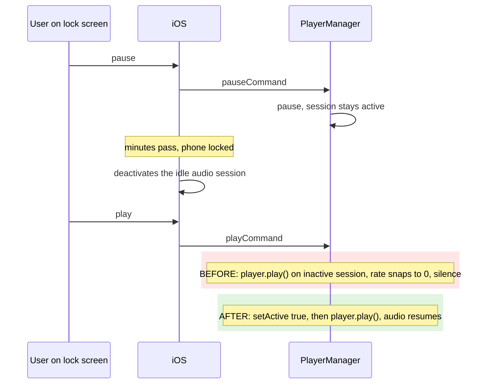

2026-08-06

# NerLan iOS: lock-screen resume always failed after a pause

Commit `d266750` on `plateaukao/nerlan`.

## What was broken

Pause an episode from Control Center or the lock screen, leave the phone locked for a while, then tap play on the lock screen: playback never resumed. The play button would flick and revert (or do nothing at all), every time, until the app was reopened in the foreground.

## Root cause

Two related holes in `PlayerManager`, both on the remote-command resume path:

**1. `play()` never reactivated the audio session.** The other two places that start playback — `load()` and `loopSegment()` — call `AVAudioSession.setActive(true)` before `player.play()`, but `play()`, the method the lock screen's play command actually invokes, did not. While the app sits paused in the background, iOS eventually deactivates its audio session (another app playing any sound, Siri, or plain reclamation of an idle session). A backgrounded app that calls `player.play()` on an inactive session fails silently: iOS refuses implicit reactivation in the background, and the playback rate snaps back to 0. The longer the pause, the more reliably it reproduced — hence "always fails".

**2. No `AVAudioSession.interruptionNotification` observer existed at all.** When an interruption (Siri, a call, another app taking audio) paused playback, AVPlayer's rate dropped to 0 but `isPlaying` stayed `true`. `play()` opens with `guard !isPlaying`, so with that stale state the next play command was swallowed entirely — tap, nothing, repeatably — until foregrounding the app resynced things.

## The fix

- `play()` now calls `AVAudioSession.setActive(true)` before `player.play()`, mirroring `load()`.
- An interruption observer marks the player paused on `.began` (also pinning the resume position and flushing listening stats, like a normal pause), and on `.ended` auto-resumes when the system passes the `.shouldResume` hint — so a short phone call no longer strands playback.
- A `mediaServicesWereResetNotification` observer re-applies the playback category after a mediaserverd crash, so audio recovers without an app restart.

One failure mode intentionally remains: if iOS kills the suspended app outright (memory pressure), the lingering lock-screen controls can't relaunch it — no in-app fix exists. That case is recognizable by the app cold-launching on next open; resume positions already restore state there.
