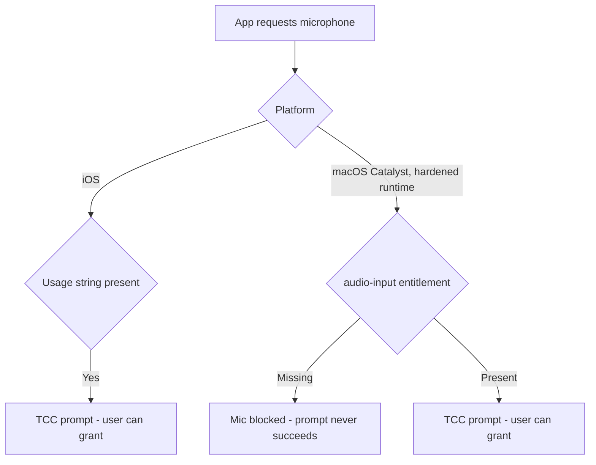

# NerLan Mac — microphone permission could never be granted

## Problem

On the Mac (Catalyst) build, shadowing's voice recording could not get
microphone permission — the consent prompt never succeeded, so recording was
unusable. The same code works on iPhone/iPad.

## Root Cause

The Catalyst app is signed with the **hardened runtime** enabled
(`codesign … flags=0x10000(runtime)`). Under the hardened runtime macOS blocks
microphone access unless the binary carries the
`com.apple.security.device.audio-input` entitlement — the `NSMicrophoneUsageDescription`
string alone is not enough. On iOS the usage string *is* enough (no such
entitlement exists there), so the iOS path worked and the gap only showed on Mac.
The app's entitlements had the iCloud keys but not `audio-input`.

## Solution

Add `com.apple.security.device.audio-input` to the Catalyst build's entitlements —
but **Catalyst only**: putting a macOS sandbox entitlement in the shared iOS
entitlements breaks iOS provisioning. So the macOS slice gets its own file:

- New `NerLan/Resources/NerLan-macOS.entitlements` — the same iCloud entitlements
  the generated iOS file has, plus `com.apple.security.device.audio-input`.
- `project.yml` wires it per-SDK: `CODE_SIGN_ENTITLEMENTS[sdk=macosx*]:
  NerLan/Resources/NerLan-macOS.entitlements`. iOS keeps the generated
  `NerLan.entitlements`.

Verified the rebuilt app embeds the entitlement (`codesign -d --entitlements`),
and reset stale consent with `tccutil reset Microphone com.danielkao.NerLan` so
the prompt reappears. For a *local* `/Applications` install this is enough; the
notarized distributable (`Scripts/release_mac.sh`) carries the same entitlement.

**Related change in the same commit:** on Mac, Settings now appears as the
standard app-menu item (⌘,) via `CommandGroup(replacing: .appSettings)` in
`NerLanApp.swift`, which posts a notification `ProgramListView` observes to open
the Settings sheet; the toolbar gear is hidden on Catalyst
(`#if !targetEnvironment(macCatalyst)`). iPhone/iPad keep the gear.

## Key Files

- `NerLan/Resources/NerLan-macOS.entitlements` (new) — Catalyst entitlements with `audio-input`.
- `project.yml` — `CODE_SIGN_ENTITLEMENTS[sdk=macosx*]` pointing at it.
- `NerLan/Sources/NerLanApp.swift` — Catalyst `設定…` app-menu command + `.openSettings` notification.
- `NerLan/Sources/Views/ProgramListView.swift` — observe the command; hide the gear on Catalyst.

## Lessons Learned

- macOS mic/camera under the hardened runtime needs the matching
  `com.apple.security.device.*` entitlement, not just the usage string that
  suffices on iOS — an easy gap to miss when a Catalyst app shares an iOS codebase.
- Platform-specific entitlements belong in an SDK-conditional
  (`CODE_SIGN_ENTITLEMENTS[sdk=macosx*]`) file, not the shared one, so each
  platform signs only what it can provision.
