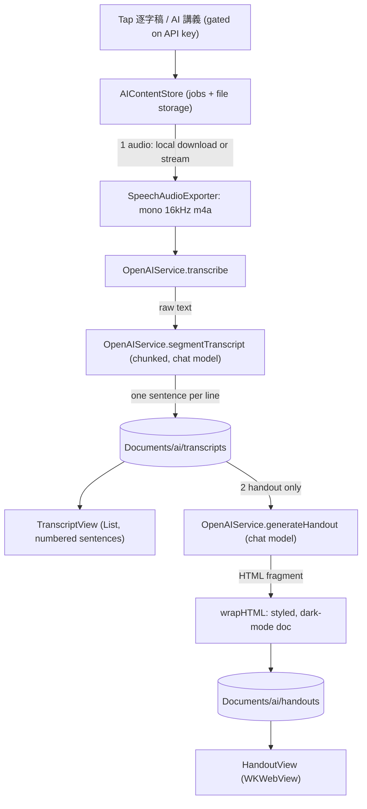

# NerLan: OpenAI transcripts & AI handouts

_iOS — commit `c3e0780` on `main` (plateaukao/nerlan)._

## Summary

NerLan plays spoken-word language-learning radio episodes; most have no PDF 講義. This feature lets the user turn any episode into study material with their own OpenAI account:

- **Settings** (gear in the 節目 tab) — store an OpenAI API key (Keychain) and two model names (transcription + handout).
- **逐字稿** — transcribe the episode audio and show it as a numbered, sentence-by-sentence list.
- **AI 講義** — generate a rich **HTML** study handout (文法重點 / 例句 / 單字) from the transcript, shown in a webview.

Both action icons appear in the full player and in the download/favorite rows, **only when an API key is set** — mirroring the existing PDF 講義 `info.circle` icon, and deliberately not on the long episode list.

## Approach

Followed the existing app patterns: a stateless service `enum` like `ChannelPlusAPI` (`OpenAIService`); singleton `ObservableObject`s injected as `environmentObject`s (`SettingsStore`, `AIContentStore`); plain files in Documents, no DB (`Documents/ai/{transcripts,handouts}/{episodeId}.{txt,html}`). Content is keyed by episode id so player, favorites, and downloads all resolve the same material.

Pipeline:

Design constraints discovered while building:

- **OpenAI's 25 MB upload cap.** A 30-min MP3 can exceed it, so audio is transcoded to mono 16 kHz AAC (`SpeechAudioExporter`, AVAssetReader→AVAssetWriter) before upload — ~7 MB for 30 min, and the ideal format for speech recognition. Falls back to the source file if transcoding fails.
- **Request timeouts.** Transcribing a 30-min episode takes minutes server-side; the default 60 s URLSession request timeout tripped. `OpenAIService` uses a dedicated session (300 s request / 1800 s resource); the audio fetch got a 300 s timeout too.
- **Raw ASR has no sentence breaks** (especially CJK). After transcription the raw text is re-segmented into one-sentence-per-line by the chat model with a strict "don't translate or reword, only punctuate and split" prompt. Long transcripts are chunked (~4000 chars, split at sentence boundaries) so no single response is truncated. Segmentation failure falls back to saving the raw transcript so a paid transcription is never lost.
- **Transcript scroll performance.** `ScrollView`+`LazyVStack` with `.textSelection(.enabled)` on every row stutters at hundreds of rows. Switched to `List` (UITableView cell reuse) and removed per-row `.textSelection` (the dominant cost) — copy is offered via a lazy long-press context menu plus a copy-all toolbar button.
- **Handout rendering.** The model returns an HTML *body fragment* only; the app wraps it in a styled, dark-mode-aware document (`AIContentStore.wrapHTML`) so it controls fonts/padding/viewport. `HandoutView` loads it once via a coordinator-guarded `WKWebView`.

Jobs run on the `AIContentStore` singleton (not the view), so they continue if the player sheet is dismissed; per-episode `jobs` state drives spinner / error / ready icons, and tapping auto-opens the result when processing finishes.

## Trade-offs

- **Cost/quota.** 逐字稿 now makes transcription + 1–N chat (segmentation) calls; AI 講義 adds another chat call. More OpenAI spend in exchange for clean, study-ready output. Acceptable since it's the user's own key, used on demand.
- **API key in Keychain**, not the app's usual plain-JSON store — the key is billing-sensitive. Small `Security.framework` wrapper, no dependency added.
- **Chunk-boundary segmentation** can occasionally split one sentence across two chunks; mitigated by backing up to a punctuation break, accepted over the truncation risk of a single huge response.
- **No `EpisodeRecord` field added** — AI content lives in its own files keyed by id, so old `favorites.json` / `downloads.json` still decode.

## Key Files

New: `Keychain.swift`, `SettingsStore.swift`, `OpenAIService.swift`, `SpeechAudioExporter.swift`, `AIContentStore.swift`; views `Views/AIActions.swift` (shared `AIActionButton`), `Views/SettingsView.swift`, `Views/TranscriptView.swift`, `Views/HandoutView.swift`.

Modified: `NerLanApp.swift` (inject singletons), `Views/ProgramListView.swift` (settings gear), `Views/PlayerView.swift` (AI tools row), `Views/DownloadsView.swift` (`RecordRow` icons, shared with Favorites).

Build: XcodeGen globs `NerLan/Sources`, so `xcodegen generate` then build — no `project.yml` change needed.
