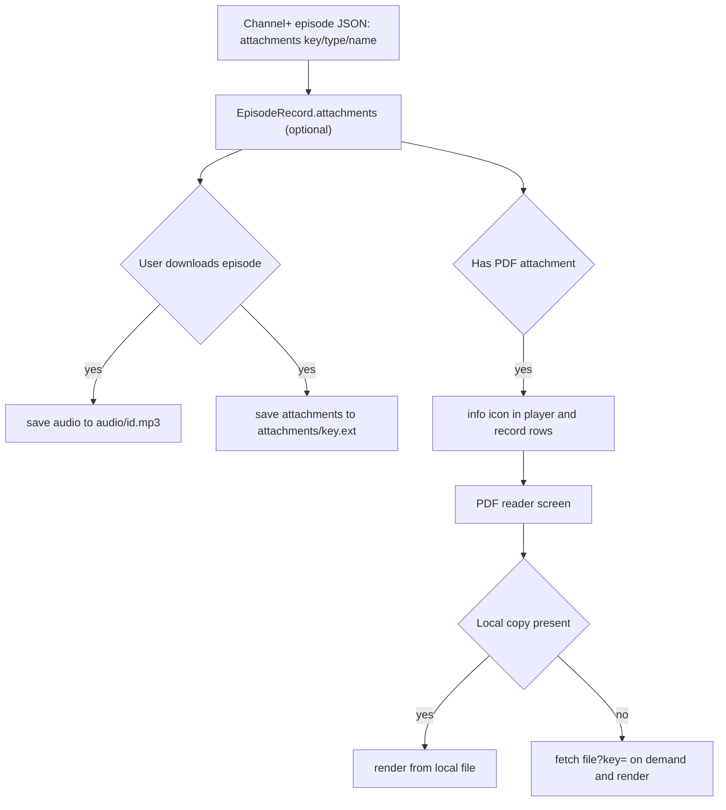

2026-06-13

# NerLan — PDF handout attachments: download alongside audio, read while listening

## Summary

NerLan episodes can carry attachments — almost always a PDF handout (講義) for
the lesson. Both the iOS app (`plateaukao/nerlan`) and the Android app
(`plateaukao/nerlan-android`) now:

- parse the episode's `attachments` (each has `originalName`, `fileType`,
  `attachmentKey`) and carry them on the `EpisodeRecord` snapshot,
- download every attachment **alongside the episode audio** when the user
  downloads an episode, so handouts are available offline,
- show an **info icon** wherever a record has a PDF — in the full player and in
  the downloads/favorites rows — that opens an in-app PDF reader, so the user
  can read the handout while the episode keeps playing.

The attachment file is served from the same Channel+ API as audio/images, via a
`file?key=<attachmentKey>` endpoint (returns `application/octet-stream`, a real
PDF). It was found by scanning programs for non-empty `attachments` arrays and
probing the endpoint pattern that mirrors `audio?key=` / `image?key=`.

## Approach

**One pivot type, optional field.** `EpisodeRecord` is the self-contained
snapshot that favorites, downloads, and the player queue all hold. Attachments
were added there as an **optional** list (`[Attachment]?` on iOS,
`List<Attachment>? = null` on Android) so that previously persisted
`favorites.json` / `downloads.json` — written before this feature — still
decode without migration. The same optionality covers the API: most episodes
return `"attachments": []`.

**Download rides along, silently.** The existing download path was widened so
attachments fetch on the same background session/scope as the audio, into a
sibling `attachments/` directory keyed by `attachmentKey`. They have no progress
UI (handouts are small) and are deleted when the episode is removed. On iOS the
download delegate gained a task-target enum (audio vs attachment) so progress
and the saved-record append stay tied to the audio task only; on Android a
`ConcurrentHashMap`-backed in-flight set prevents duplicate concurrent fetches.

**Viewer uses the platform PDF stack, offline-first.** Both readers prefer the
downloaded copy and otherwise fetch the PDF on demand, so a handout is viewable
even before the episode is downloaded. Audio is decoupled from the screen, so
playback continues while reading — the point of the feature.

- iOS: `AttachmentView` wraps PDFKit's `PDFView` (`UIViewRepresentable`),
  presented as a sheet over the player.
- Android: `AttachmentViewer` renders pages with the built-in
  `android.graphics.pdf.PdfRenderer` (no third-party dependency) into a
  full-screen `Dialog`. `PdfRenderer` is single-open-page and not thread-safe,
  so a small `Mutex`-guarded wrapper renders pages lazily in a `LazyColumn`.

**Icon placement.** The info icon is intentionally **not** on the program's
episode list (it's long and most rows have no handout) — only the player and the
downloads/favorites rows, where it's discoverable without clutter.

## Trade-offs

- **PDF-only inline viewing.** All attachment types are downloaded "for later
  use," but only PDFs get an in-app viewer — the only type both platforms render
  natively. Non-PDF types (none seen in practice yet) would currently download
  without a viewer.
- **Android renders eagerly per visible page, not text extraction.** We render
  page bitmaps rather than extract text, preserving the handout's layout/images.
  `PdfRenderer`'s one-page-at-a-time constraint is handled with a render mutex
  instead of pre-rasterizing the whole document, bounding memory for long PDFs.
- **No de-dup of identical attachments across episodes.** Files are keyed by
  `attachmentKey`, so a handout shared by two episodes is stored once anyway, but
  deletion only removes a file when the owning episode is deleted; a shared file
  would be removed with the first deletion. Not observed in the catalog.
- **Android player controls compacted.** Adding the 講義 button made the player's
  secondary row five items; it overflowed. Rather than a horizontal scroller, the
  row now spreads evenly across full width with compact button padding and
  smaller labels so all five fit one line.

## Key Files

iOS (`~/src/nerlan`):

- `NerLan/Sources/Models.swift` — `Attachment` type; `attachments` on `Episode`
  and `EpisodeRecord` (+ `pdfAttachments`).
- `NerLan/Sources/NERAPI.swift` — `fileURL(key:)` builder.
- `NerLan/Sources/DownloadManager.swift` — attachment download/cleanup, task-target enum.
- `NerLan/Sources/Views/AttachmentView.swift` — PDFKit reader (new).
- `NerLan/Sources/Views/PlayerView.swift`, `DownloadsView.swift` — info icon wiring.

Android (`~/src/nerlan-android`):

- `app/src/main/java/com/example/nerlan/data/Models.kt` — `Attachment`; record fields.
- `.../data/ChannelPlusApi.kt` — `fileUrl()` builder.
- `.../data/DownloadManager.kt` — attachment download/cleanup, in-flight set.
- `.../ui/AttachmentViewer.kt` — `PdfRenderer` reader (new).
- `.../ui/PlayerSheet.kt`, `FavoritesScreen.kt` — info icon wiring; player control compaction.
