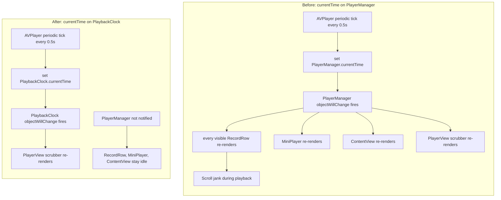

# NerLan — List scroll lag during audio playback

## Problem

When an episode was playing, scrolling any of the tab lists (Programs, Favorites, Downloads, AI) felt slow and laggy. With playback paused or stopped, the same lists scrolled smoothly. The jank scaled with how many rows were on screen.

## Root Cause

`PlayerManager` (the `@MainActor ObservableObject` singleton driving `AVPlayer`) exposed playback position as a `@Published var currentTime`. An `AVPlayer` periodic time observer fired every 0.5 seconds and wrote the new time into that property:

```swift
timeObserver = player.addPeriodicTimeObserver(forInterval: CMTime(seconds: 0.5, …)) { … in
    self.currentTime = time.seconds   // @Published → objectWillChange every 0.5s
    …
}
```

SwiftUI's `@EnvironmentObject` / `@ObservedObject` subscribe to an object's **single** `objectWillChange` publisher — they cannot subscribe to one property. Every view that injected the player (`@EnvironmentObject var player: PlayerManager`) therefore re-rendered on *every* `@Published` change, including the twice-a-second `currentTime` tick. That set was large: every visible `RecordRow`, the mini player bar/accessory, and `ContentView` — none of which display the time. Only the full-screen `PlayerView` scrubber actually reads `currentTime`/`duration`.

So during playback, the whole visible row hierarchy was being invalidated and re-evaluated 2×/second. Layered on top of the work UIKit/SwiftUI already does while a list is scrolling, those forced re-renders dropped frames.



## Solution

Split the high-frequency position off `PlayerManager` into its own observable, so a tick only invalidates views that genuinely depend on the position:

```swift
@MainActor
final class PlaybackClock: ObservableObject {
    @Published var currentTime: Double = 0
    @Published var duration: Double = 0
}
```

`PlayerManager` owns one as a **plain `let`**, not a `@Published`:

```swift
let clock = PlaybackClock()
```

The key is that a nested `ObservableObject` held by a plain stored property does **not** forward its child's `objectWillChange` to the parent. So ticking `clock.currentTime` fires only `PlaybackClock`'s publisher; `PlayerManager`'s publisher stays silent, and nothing observing the player for `current` / `isPlaying` (which change rarely) is touched.

The internal time observer, `seek`, `skip`, and the now-playing-info updates all read/write `clock.currentTime` / `clock.duration`. The one external consumer, `PlayerView`, observes the clock directly:

```swift
@ObservedObject private var clock = PlayerManager.shared.clock
```

Net effect: during playback the lists receive zero re-renders from position updates; only the open player sheet ticks.

## Key Files

- `NerLan/Sources/PlayerManager.swift` — added `PlaybackClock`; replaced `@Published currentTime`/`duration` with `clock.currentTime`/`clock.duration` throughout (time observer, `seek`, `skip`, `load`, now-playing info).
- `NerLan/Sources/Views/PlayerView.swift` — observes `PlayerManager.shared.clock` for the scrubber and time labels.

## Lessons Learned

- An `ObservableObject` is the unit of SwiftUI invalidation, not a property. A single hot `@Published` field forces a re-render on *every* subscriber of the object, regardless of which property they read. Put high-frequency state (playback position, scroll offset, per-byte progress) on its own small observable.
- A nested `ObservableObject` exposed as a plain `let` is a deliberate isolation boundary: the child's changes don't bubble up to the parent's `objectWillChange`. That is exactly what you want for "many observers of the stable object, few observers of the volatile one."
- This is the same shape as an earlier fix in this repo (`Throttle downloads: publish membership, not per-byte progress`) — frequent updates leaking into a widely-observed object is a recurring SwiftUI performance trap worth watching for.
