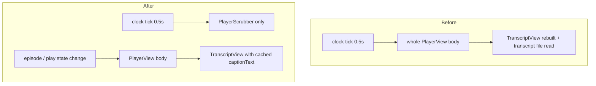

2026-07-07

# NerLan: player sheet stops re-rendering on every playback tick

## What was broken

The codebase already splits high-frequency playback position into a separate `PlaybackClock` observable precisely so the 0.5s ticks don't re-render lists and the mini player. But `PlayerView` — the full player sheet — observed the clock with `@ObservedObject` for its scrubber, so the *entire sheet body* re-evaluated twice a second.

Most of that is wasted layout work, but caption mode made it actively expensive: the sheet embeds `TranscriptView`, and

- the `onClose:` closure prop makes the view non-comparable, so SwiftUI can't skip its body — hundreds of transcript rows re-diffed per tick;
- the `text:` argument was `ai.transcriptText(record.id) ?? ""`, an unbuffered **file read on every body evaluation** — i.e. disk I/O twice a second while captions were on screen.

This defeated the exact per-tick-isolation design `TranscriptView` itself is built around (it reads the clock via `.onReceive`, not observation).

## Fix

- **`PlayerScrubber`**: the Slider, scrub state, and time labels moved into a private subview; it is the only thing observing `PlaybackClock`. `PlayerView` now re-renders only on real state changes (current episode, play/pause, favorites/downloads/AI publishes).
- **`captionText` cache**: the transcript snapshot for caption mode is loaded into `@State` by `refreshCaptionCues()` — which the existing `transcriptToken` `onChange` already calls exactly when the episode or its transcript actually changes — instead of being read from disk in `body`.
