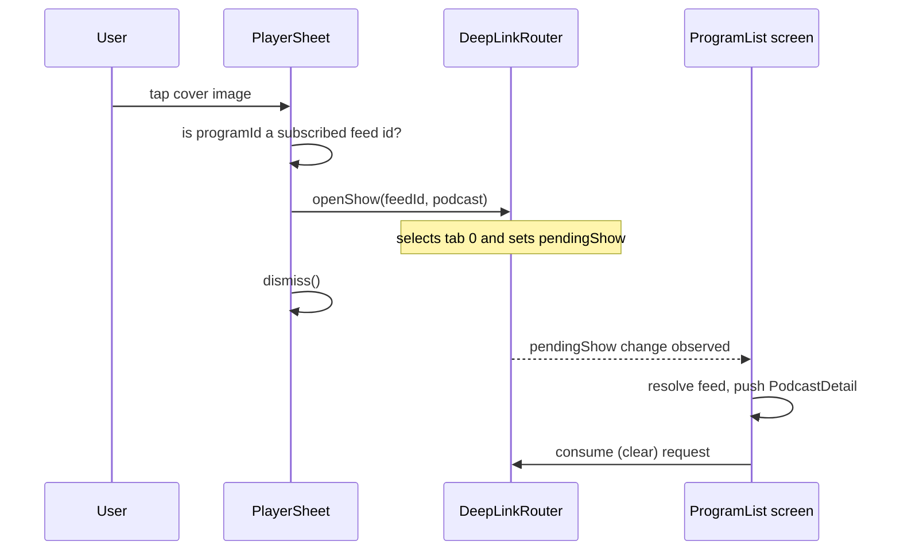

2026-08-25

# Podcast cover links to its episode list; language filter includes podcasts

Two small navigation/browsing features, landed in both apps the same day:
`nerlan-android` commit `e7c039e` and `nerlan` (iOS) commit `198fa1e`.

## What it does

1. **Player-sheet cover → podcast episode list.** Tapping the cover image in
   the full player sheet, when the playing episode belongs to a subscribed
   podcast, dismisses the sheet and opens that podcast's episode list. Covers
   of NER (National Education Radio) episodes stay inert.
2. **Language filter covers podcasts.** Subscribed podcasts already carry a
   language attribute (the RSS `language` code, mapped at parse time to the
   same Chinese labels the NER catalog uses — 英語/日語/韓語…). Selecting a
   language chip on the main page now also lists the subscribed podcasts of
   that language, pinned in the 我的 Podcast section *above* the NER catalog
   groups — previously podcasts appeared only in the unfiltered 全部 view.

## How it was built

### Cover tap: reuse the widget deep-link flow

Neither app models its navigation tree — each screen owns local state, and
home-screen widgets already navigate via a one-shot request object
(`DeepLinkRouter`) that the program-list screen consumes and clears. The cover
tap simply feeds that same flow from inside the app, via a new programmatic
`openShow` method (which the `nerlan://show` URI handler now also calls), so
no new navigation plumbing was needed:

A podcast episode is recognized by its `programId`: for podcasts it is the RSS
feed URL, so `PodcastStore.feed(id:)` returning non-nil both identifies a
podcast episode and guarantees the destination screen exists. An unsubscribed
show therefore leaves the cover inert instead of navigating nowhere.

### Language filter: podcasts join the chip and list derivations

On both platforms the change is the same three-part edit to the program list:

- `visibleFeeds` — feeds filtered by the selected language (all feeds when
  unfiltered); the pinned 我的 Podcast section now renders from this instead
  of being gated on "no filter selected".
- The chip list derives from catalog **plus** podcast languages, so a
  podcast-only language (a show whose feed declares a language NER doesn't
  teach, e.g. 德語) still gets a chip.
- The stale-filter reset (which clears a restored filter matching nothing)
  also considers podcast languages, so a podcast-only filter isn't wrongly
  wiped on launch.

No data-model change was needed: `PodcastFeed.language` existed on both
platforms from the start, mapped by `PodcastFeedParser` to the identical label
set the NER catalog uses, which is what makes plain string equality between a
chip and a feed correct.
