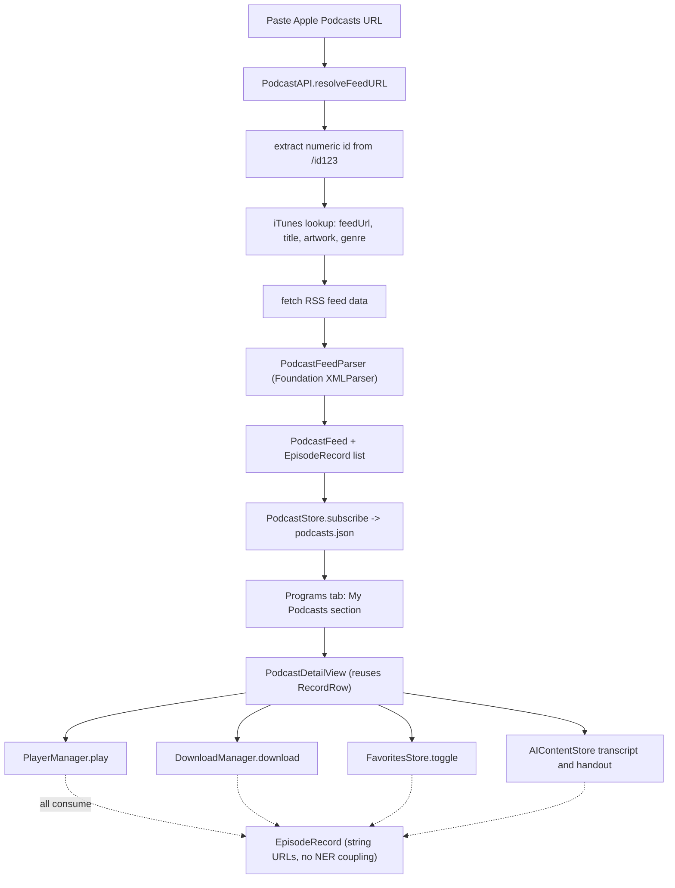

2026-06-16

# Plan: Add podcast support (Apple Podcasts URL) to NerLan

## Context

NerLan today only plays content from Taiwan's NER Channel+ catalog. The user
wants to paste a **common podcast URL** — starting with **Apple Podcasts share
links** (`https://podcasts.apple.com/.../id123456`) — subscribe to the show, and
then get the *same features* NER episodes already have: streaming, offline
download, favoriting, lock-screen/Control Center controls, listening stats, and
the OpenAI transcript + AI handout.

This is a clean fit because the app is already decoupled from the NER API at the
right seam: every downstream system (player, downloads, favorites, AI, stats,
iCloud sync) operates on **`EpisodeRecord`** (`Models.swift:144`), a
self-contained snapshot holding plain string URLs — not NER-specific handles. So
the entire "do the same features" half is **already generic**. The work is all
on the *front*: turn a pasted Apple Podcasts URL into a `PodcastFeed` + a list of
`EpisodeRecord`s, persist the subscription, and surface it in the 節目 tab.

## What carries over for free (no changes)

Verified by reading the managers — each consumes only `EpisodeRecord`:

- **Playback** — `PlayerManager.load` (`PlayerManager.swift:134`) streams
  `record.audio.flatMap(URL.init)` directly; lock-screen info reads
  `title`/`programName`/`coverURL` strings and fetches artwork from any URL.
- **Download** — `DownloadManager.download` (`DownloadManager.swift:135`)
  downloads whatever URL is in `record.audio`; never calls the NER API.
- **Favorites** — `FavoritesStore.toggle(_:)` keys off `record.id`.
- **AI transcript + handout** — `AIContentStore.audioFileURL(for:)`
  (`AIContentStore.swift:327`) uses the local download or `record.audio`; the
  whole pipeline runs off the record. (Caveat in *Limitations*.)
- **Cover images** — `CoverImage` (`ContentView.swift:207`) loads any URL string.
- **Listening stats / iCloud favorite + AI sync** — all record-keyed.

## Reuse targets (existing code to lean on)

- **`RecordRow`** (`DownloadsView.swift:122`) — already a record-based row with
  play/pause, cover, attachment-info button, and AI transcript/handout buttons
  (shown when `settings.hasAPIKey`). The podcast detail view reuses it; AI
  buttons appear automatically. We extend it with **optional** favorite + download
  affordances (default off, so Downloads/Favorites/AI tabs are unchanged).
- **`ChannelPlusAPI`** (`NERAPI.swift`) — the stateless-`enum` client pattern;
  `PodcastAPI` mirrors it.
- **`CatalogCache`** (`CatalogCache.swift`) — the "JSON in Caches, authoritative
  until refresh" pattern; podcast feeds cache the same way.
- **`ProgramListView`** (`ProgramListView.swift`) — the browse list + the
  floating top-trailing button (the gear) and `navigationDestination` pattern.
- **`EpisodeRecord`** — add a raw initializer alongside `init(episode:…)`.

## Data flow

Also accepts a raw RSS URL directly, or an `apple.co` short link (resolved via
redirect). One `EpisodeRecord` is built per feed `<item>`; play / download /
favorite / AI are all existing code.

## New files (flat under `NerLan/Sources/`, matching the existing layout)

1. **`PodcastFeed.swift`** — `PodcastFeed: Codable, Identifiable, Hashable`:
   `id` (feed URL, stable), `title`, `author`, `description`, `coverURL: String?`
   (raw), `feedURL: String`, `language: String`, `episodes: [EpisodeRecord]`.
   Conforms to `Hashable` so it can be a `navigationDestination` value.

2. **`PodcastAPI.swift`** — stateless `enum`, mirrors `ChannelPlusAPI`:
   - `resolveFeedURL(from pasted: URL) async throws -> URL`
     - If host is `podcasts.apple.com`: regex-extract `id(\d+)`, call
       `https://itunes.apple.com/lookup?id=<id>&entity=podcast`, read
       `results[0].feedUrl` (+ `collectionName`, `artistName`, `artworkUrl600`,
       `primaryGenreName`).
     - If host is `apple.co` (short link): follow redirect to the real URL first.
     - Otherwise treat the pasted URL as a raw RSS feed URL (free bonus path).
   - `fetchFeedData(_ url: URL) async throws -> Data` (plain `URLSession`,
     follows redirects, sets a desktop-ish `User-Agent` — some feed hosts 403 a
     missing UA).

3. **`PodcastFeedParser.swift`** — `XMLParser` (SAX) RSS/Atom reader →
   `(PodcastFeed, [EpisodeRecord])`. Channel-level: `title`, `description`,
   `itunes:author`, `itunes:image@href` or `image>url`, `language`. Per `<item>`:
   `title`, `enclosure@url`/`@type`, `guid`, `pubDate`, `itunes:duration`,
   `itunes:image@href`. Builds each record (see *Record construction* below).

4. **`Views/PodcastDetailView.swift`** — header (cover + title + author +
   description) + an episode `List` of `RecordRow(record:queue:showFavorite:true,
   showDownload:true)`. No pagination needed (a feed is a single file). Includes
   a subscribe/unsubscribe (heart) toolbar item backed by `PodcastStore`.

5. **`Views/AddPodcastView.swift`** — small sheet: a `TextField` (paste URL) +
   "新增" button, with inline progress + error. Calls `PodcastAPI.resolveFeedURL`
   → `PodcastFeedParser.parse` → `PodcastStore.subscribe`. (Alternatively a
   `.alert` with a text field; a sheet is cleaner for showing progress/errors.)

6. **`PodcastStore.swift`** — `ObservableObject` singleton (4th alongside
   `PlayerManager`/`DownloadManager`/`FavoritesStore`), injected in
   `NerLanApp.swift`. Holds `@Published feeds: [PodcastFeed]`, persisted to
   `Documents/podcasts.json`. API: `subscribe(_:)`, `unsubscribe(id:)`,
   `isSubscribed(id:)`, `refresh(_:) async` (re-fetch + re-parse + merge new
   episodes). iCloud KVS mirroring of subscriptions mirrors `FavoritesStore`'s
   pattern but is **deferred to a follow-up** (episode favorites/AI already sync).

## Modified files

- **`Models.swift`** — add to `EpisodeRecord`:
  - A raw `init(id:title:playDate:audio:programId:programName:language:coverURL:
    durationSeconds:audioExt:attachments:)` (the existing `init(episode:)` stays).
  - Two **optional** fields (old JSON must still decode — per CLAUDE.md):
    `durationSeconds: Int?` and `audioExt: String?` (audio file extension, e.g.
    `"mp3"`/`"m4a"`; nil ⇒ treat as `"mp3"`). Add a `durationText` computed
    helper mirroring `Episode`'s.

- **`DownloadManager.swift`** — make audio storage extension-aware so AAC/`.m4a`
  podcasts play reliably (AVFoundation can choke on a real-m4a-named-`.mp3`):
  - `download(_:)` names the file `{id}.{record.audioExt ?? "mp3"}`.
  - `localAssetURL(episodeId:)` / `cachedAssetURL(episodeId:)` glob for
    `{id}.*` in the dir instead of hardcoding `.mp3` (keeps the id-only
    signature; NER's `.mp3` still matches). Same for `delete(episodeId:)`.
  - `AIContentStore.audioFileURL` temp download keeps `.mp3` (transcoding step
    re-exports anyway) — no change needed there.

- **`DownloadsView.swift`** (`RecordRow`) — add `var showFavorite = false` and
  `var showDownload = false`. When on, render the same heart toggle
  (`FavoritesStore.toggle`) and the download button/spinner/checkmark block that
  `EpisodeRow` uses (`ProgramDetailView.swift:239`). Defaults keep existing
  call-sites identical.

- **`ProgramListView.swift`** — inject `PodcastStore`; add:
  - A "**+**" button in the top-trailing overlay next to the gear → presents
    `AddPodcastView` as a sheet.
  - A "**我的 Podcast**" `Section` at the top of `list` (above the language
    groups) when `podcastStore.feeds` is non-empty, each a
    `NavigationLink(value: feed)` with a podcast row (reuse `ProgramRow`'s
    layout via a tiny `PodcastRow`, or a generic row).
  - `.navigationDestination(for: PodcastFeed.self) { PodcastDetailView(feed:) }`.

- **`NerLanApp.swift`** — add `.environmentObject(PodcastStore.shared)`.

- **`project.yml`** → run **`xcodegen generate`** after adding files (per
  CLAUDE.md), then build.

## Record construction (the one subtle part)

Per `<item>`, build an `EpisodeRecord`:
- **`id`** — must be stable (download filename, favorite/AI dedup key) and
  filename-safe. Use `"pod-" + sha256Hex(guid ?? enclosureURL)` via **CryptoKit**
  (built-in, no dep). `pod-` namespace avoids colliding with numeric NER ids.
- **`audio`** — `enclosure@url`.
- **`audioExt`** — from `enclosure@type` (`audio/mp4`→`m4a`, `audio/mpeg`→`mp3`)
  or the URL's path extension; default `mp3`.
- **`title`** — item `<title>`.
- **`playDate`** — parse RFC-822 `pubDate` and **re-emit as ISO-8601** so it
  sorts/compares consistently with NER's `playDate` strings (used by
  `groupRecords` sort, `DownloadsView.swift:63`).
- **`durationSeconds`** — parse `itunes:duration` (seconds or `HH:MM:SS`).
- **`programId`** — the feed id (so favorites/downloads group under the show).
- **`programName`** — feed title.
- **`language`** — map feed `<language>` to a Chinese learning-language label
  when it matches one Whisper is primed for (`en`→`英語`, `ja`→`日語`, …, see
  `OpenAIService.transcriptionPrompt`); else the primary genre or `"Podcast"`.
- **`coverURL`** — item `itunes:image@href` ?? feed cover.
- **`attachments`** — `nil` (podcasts rarely ship PDF handouts; the info icon
  simply won't show). Podcasting-2.0 `<podcast:transcript>` mapping is future work.

## Edge cases & risks

- **Apple URL forms** — `/id123`, `/id123?i=456` (the `?i=` is a specific
  episode), country prefixes (`/us/`, `/tw/`), and `apple.co` short links. v1
  extracts the show id and opens the whole show; deep-linking the `?i=` episode
  is *out of scope* (noted below).
- **ATS / HTTP** — `itunes.apple.com` and modern feeds are HTTPS; a few old
  enclosure CDNs are HTTP and would be blocked by ATS. Acceptable for v1; if it
  bites, add a narrow `NSAppTransportSecurity` exception. Tracking-prefix
  redirects (podtrac/chartable) follow fine via `URLSession`.
- **Large feeds** — a single RSS file can hold hundreds of `<item>`s; SAX
  parsing + one list is fine, no pagination.
- **`.m4a` playback** — handled by the extension-aware download change above.
- **Duplicate subscribe** — `PodcastStore` dedups by feed `id`.

## Limitations (call out to user, not blockers)

- The **AI handout** prompt (`OpenAIService.generateHandout`) is written for
  *language-learning* material ("文法重點 / 例句 / 單字"). **Transcription works
  for any audio**, but the handout will be oddly framed for a general
  (non-language) podcast. A general-purpose "summary" handout variant is a clean
  follow-up. Mapping `language` (above) makes transcription accurate for
  single-language shows.

## Build sequence (incremental, each step verifiable)

1. **Model + parser core (no UI):** `EpisodeRecord` raw init + optional fields;
   `PodcastAPI.resolveFeedURL`; `PodcastFeedParser`. Sanity-check parsing against
   a couple of real feeds.
2. **Store + injection:** `PodcastStore` + `podcasts.json`; inject in app.
3. **Download extension-awareness:** `DownloadManager` glob + `audioExt` naming
   (verify NER downloads still work — regression-sensitive).
4. **`RecordRow` favorite/download affordances** (defaults off → no regressions).
5. **UI:** `AddPodcastView`, `PodcastDetailView`, 節目-tab section + "+" button +
   `navigationDestination`.
6. `xcodegen generate`, build, deploy to device.

## Verification (end-to-end, on device per CLAUDE.md)

After `xcodegen generate` + build + install (team `3WD42GF27D`; user verifies on
his own phone), confirm:
1. Paste an Apple Podcasts share URL in the "+" sheet → show appears under "我的
   Podcast" with correct cover/title/author.
2. Open it → episode list renders with dates/durations.
3. **Play** an episode → audio plays; lock-screen shows title/show/artwork; next/
   prev/scrub work.
4. **Download** an `.m4a` episode → appears in the 下載 tab, plays offline
   (validates the extension change). Confirm an NER `.mp3` download still works.
5. **Favorite** an episode → appears in 收藏 grouped under the show.
6. With an OpenAI key set, **transcript + handout** generate and open from the
   episode row and the AI tab.
7. Relaunch → subscription, downloads, favorites all persist.

## Out of scope (v1, easy follow-ups)

- Deep-linking the `?i=` specific episode from an Apple URL.
- iCloud KVS sync of the *subscription list* (episode favorites/AI already sync).
- A general-podcast "summary" AI handout variant.
- Podcasting-2.0 `<podcast:transcript>`/chapters as attachments.
- Auto-refresh of feeds for new episodes (manual pull-to-refresh in v1).
