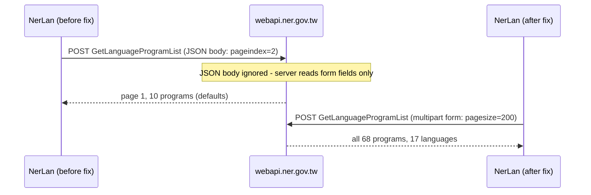

# NerLan — program list showed only 10 of 68 programs (JSON vs form-data)

## Problem

The app's program list showed just 10 programs in 9 languages, with no 阿拉伯語 (Arabic) program even though the language filter offered it. The "載入更多" pagination button also did nothing — every page request returned the identical 10 programs, and the `languageId` filter appeared to be ignored by the server.

## Root Cause

`NERAPI` POSTed the request body (`keyWords`, `languageId`, `levelId`, `pageindex`, `pagesize`) as JSON. The NER backend never reads JSON bodies: the website's axios wrapper (module `75689` in chunk `1174-*.js`) sets `Content-Type: multipart/form-data` for all POSTs and has a request interceptor that converts every plain-object body to `FormData`.

With an unreadable body, the server silently fell back to defaults — page 1, page size 10 — for every request. That produced three misleading symptoms that all looked like separate API quirks:

- pagination "broken" (every page identical, `totalPage: 8` looked bogus)
- `pagesize` "ignored"
- `languageId` filter "unreliable" (the first version of the app worked around this with client-side filtering)

In reality the API honors all three parameters when sent as form fields; `pagesize=200` returns the full catalog of 68 programs across 17 languages — including 阿拉伯語教學 — in one request.

## Solution

- `NERAPI.post` now hand-builds a `multipart/form-data` body (boundary + one part per field) instead of JSON.
- The program list fetches the entire catalog once (`pagesize=200`), so there is no pagination UI at all; the broken "載入更多" button was removed.
- Language filter chips are now derived from the loaded groups rather than the separate `GetLanguageCategory` endpoint. This guarantees every chip has at least one program (the category list includes languages with no current programs) and makes filtering instant and purely client-side.
- The earlier client-side-filter "safety net" comment and the dead `loadMore`/`totalPage` plumbing were removed.

## Key Files

- `NerLan/Sources/NERAPI.swift` — multipart encoder; `programList()` simplified to one full-catalog request
- `NerLan/Sources/Views/ProgramListView.swift` — chips from loaded data, no pagination

## Lessons Learned

- When reverse-engineering an API from a site's frontend, replicate the **transport encoding**, not just the endpoint and field names. The field names were right; the content type was the whole bug.
- A server that silently ignores an unreadable body produces *plausible-looking* responses — `success: true` with valid data — which masks the error as several unrelated "API quirks". If multiple parameters of one endpoint all seem ignored, suspect the request encoding before concluding the API is broken.
- The axios request interceptor (`a.interceptors.request.use` converting bodies to `FormData`) was the load-bearing discovery; it lives in the shared wrapper chunk, not in the page-specific code where the endpoint calls appear.
