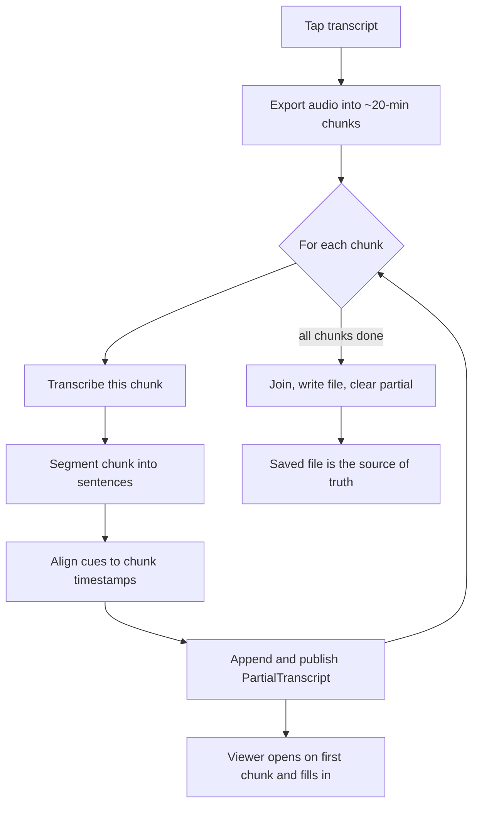

2026-06-22

# NerLan: stream transcript & translation progressively (iOS + Android)

Generating an AI transcript for an episode can take minutes — the audio is split
into chunks, each chunk transcribed by Whisper, then the whole thing re-segmented
into sentences by the chat model, and (for translation) every sentence translated
in batches. The old design did *all* of that and wrote a single file at the very
end, and the UI gated entirely on "does the file exist": `AIActionButton` only
opened the viewer once `hasTranscript` flipped true, and the viewer took its text
and cues as an immutable snapshot. So for a long episode the user stared at a
spinner for minutes with nothing to read, even though the first 20 minutes had
been transcribed long before the last chunk finished.

This change makes both transcript and translation **stream in progressively**, on
iOS (SwiftUI) and Android (Compose) alike, using the same mechanism.

## Transcript: a per-chunk pipeline

The transcription job was restructured from *transcribe-everything → segment-
everything → write-once* into a pipeline that completes one chunk end-to-end
before moving on, publishing as it goes:

Each chunk's sentences and timestamp cues are appended to an in-memory
`PartialTranscript` that the store publishes (`@Published` / `StateFlow`). The
action button opens the viewer the moment the first chunk's partial appears
(reacting to `hasPartialTranscript` / `partialTranscripts`), and the viewer —
which now sources its rendered content live from the store rather than from a
frozen snapshot — grows as later chunks land. A small footer with a spinner and
the job's progress note ("轉錄中…（2/3）") sits at the bottom while it runs, so a
partial never looks like the finished whole.

Segmentation moved from the joined transcript to per-chunk; the chat segmenter was
already internally chunked at about 4000 chars, and a chunk boundary lands on an audio
boundary the ASR already cut, so quality is unchanged. Cues are only attached when
they still line up 1:1 with the sentences, and the moment any chunk yields no
timestamps (a non-whisper model) the transcript falls back to rendering without
highlighting — never with cues that drift out of alignment.

Moving segmentation per-chunk raised the stakes on its fallback. The segmenter
already falls back to the raw ASR text when the chat call fails, and a weak model
can return a whole about 20-minute chunk as one unpunctuated line — a wall of
run-together sentences. Two guards were added: `segmentTranscript` retries once on a
transient error before keeping the raw piece (so a single hiccup can't collapse a
chunk), and `displaySentences` — the one splitter both the producer and the viewer
use — now splits each line on sentence-ending punctuation as well as newlines
(full-width 。！？ always; half-width `.!?` only before whitespace/end-of-line, so
`3.14` and ellipses survive), keeping trailing closers with their sentence. It is
idempotent on already-one-per-line text, so cue alignment stays 1:1.

## Translation: per batch

`translateSentences` already ran in about 40-sentence batches. It gained an `onPartial`
callback invoked after each batch with the cumulative result; the store publishes
that as a partial, and the transcript screen flips into the requested translate
mode on the first batch and fills top-down instead of showing one long spinner.

On iOS the callback is `@MainActor @Sendable` and is `await`-ed, so the partials
hop to the main actor and stay strictly in order. On Android the store simply
updates a `MutableStateFlow` (thread-safe), so no hop is needed.

## Why the file stays the source of truth

The partials are in-memory only — never persisted, never synced — and are cleared
the instant the final file is written. That keeps the existing contract intact:
"done" still means "the file exists", so the iCloud/Drive sync and the
regenerate/delete logic are untouched, and a job that fails midway leaves nothing
half-saved (the partial is dropped, the button shows the error). The viewer reads
the partial while a job runs, then the saved file, then the snapshot it was opened
with — so it shows live progress and the finished result without a blank frame in
between. On iOS the live cues are cached in `@State` so the per-0.5s highlight tick
never re-reads files; on Android a `revision` bump on completion refreshes the
file-based panel/caption views.

## Scope note

Transcript streaming only helps episodes longer than the 20-minute chunk size;
a single-chunk episode is the whole thing, so it still appears only when done.
Translation streaming helps every episode. The two together deliver the literal
goal — "show it when the first chunk is done" — for the least risk; token-level
streaming of the chat calls (which would help single-chunk episodes too) was
considered and deferred as a larger, separate change.

The iOS commit landed first; the Android port mirrors it file-for-file
(`AIContentStore`, `OpenAIService`, `AiActions`, `TranscriptDialog`).
