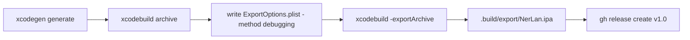

# NerLan: release build script, README, and v1.0 GitHub release

## Summary

Added `Scripts/build_release.sh` (modeled on whisperASR's release scripts) that builds a development-signed `NerLan.ipa`, wrote the public-facing `README.md`, gitignored `.build/`, and published the first GitHub release (`v1.0`) on the now-public `plateaukao/nerlan` repo with the ipa attached as `NerLan-v1.0.ipa`.

## Approach

The script does the whole pipeline in one shot:

- The project is XcodeGen-based and `NerLan.xcodeproj` is gitignored, so the script must run `xcodegen generate` first — it cannot assume a project exists.
- Archive uses `-destination 'generic/platform=iOS'` and `-allowProvisioningUpdates` so automatic signing can mint/refresh the team provisioning profile non-interactively.
- Export uses an `ExportOptions.plist` generated inline (heredoc, whisperASR style) into `.build/` rather than a checked-in plist — one less file to keep in sync. `method` is `debugging`, the modern Xcode name for what used to be called `development` export; `teamID` is `3WD42GF27D` with `signingStyle: automatic`.
- Without a paid distribution certificate, a development-signed ipa is the only export possible. The release notes and README both state plainly that the ipa installs only on devices registered to the author's team (via Xcode / Apple Configurator) and that building from source is the normal path for others.
- README covers features, an architecture section (ChannelPlusAPI URLSession client, PlayerManager singleton with MPNowPlayingInfoCenter/MPRemoteCommandCenter, DownloadManager background downloads, JSON-file persistence), build instructions for both Xcode and CLI, the unofficial-client disclaimer crediting 國立教育廣播電台, and a pointer to the matching Android app (`plateaukao/nerlan-android`). No license file, by choice.

## Trade-offs

- `TEAM_ID` is hard-coded in the script. Fine for a personal project; the README tells forkers to change it.
- Generating `ExportOptions.plist` at build time means it isn't visible in the repo tree, but keeps the release flow to a single self-contained script.
- Verified end-to-end: archive + export succeeded locally (556K ipa), release created at https://github.com/plateaukao/nerlan/releases/tag/v1.0.

## Key Files

- `/Users/maoyuankao/src/nerlan/Scripts/build_release.sh` — full build/export pipeline
- `/Users/maoyuankao/src/nerlan/README.md` — public project documentation
- `/Users/maoyuankao/src/nerlan/.gitignore` — added `.build/`
- Reference: `/Users/maoyuankao/src/whisperASR/Scripts/build_release.sh`, `Scripts/release.sh`
