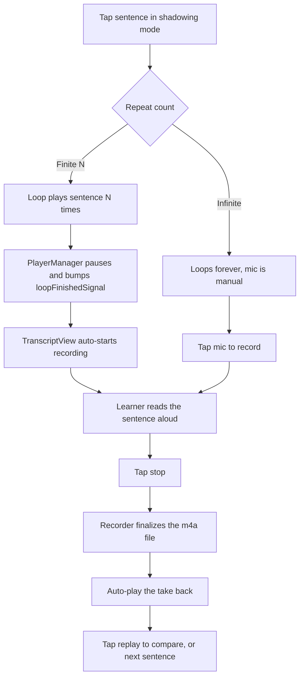

# NerLan — Shadowing practice mode with voice recording

## Summary

Added a "shadowing" practice mode to the NerLan iOS app. Shadowing is a
language-learning drill: listen to one short sentence, repeat it aloud
immediately matching pronunciation and rhythm, usually looping it a few times.
NerLan already produced timestamped, sentence-segmented transcripts (Whisper
cues) and a karaoke caption follow-along, so the foundation existed — it just
exposed whole-episode controls, not sentence-grained ones.

From the full player, a **跟讀** button opens the transcript (a sheet on iPhone,
the StudyPanel side panel on iPad) already in shadowing mode. There the learner
can loop a single sentence, step between sentences, choose a repeat count, then
record themselves and play it back to compare with the original. With a finite
repeat count the cycle is hands-free: the sentence plays N times, recording
auto-starts, and the take auto-plays when the learner stops.

## Approach

**Reuse the cue infrastructure.** A `TranscriptCue` carries only a `start` time,
so a sentence's span is `[cue[i].start, cue[i+1].start)` (the last ends at the
episode duration). All of this cue math lives in `TranscriptView`, which already
owned the active-sentence binary search; `PlayerManager` stays cue-agnostic.

**A generic loop primitive.** `PlayerManager.loopSegment(start:end:times:)` arms
an `AVPlayer` **boundary time observer** at the segment end. The existing 0.5 s
periodic observer is far too coarse to loop a sentence cleanly (up to half a
second of overshoot); a boundary observer fires exactly at the end and is
orthogonal to the end-of-episode `AVPlayerItemDidPlayToEndTime` path, so looping
was added without touching auto-advance. `times == nil` loops forever; a finite
count pauses on the sentence and bumps a `loopFinishedSignal`.

**Recording is a separate object.** `ShadowRecorder` (a new singleton) wraps
`AVAudioRecorder` and `AVAudioPlayer`, keeping one clip per (episode, sentence)
in Caches. The microphone needs `AVAudioSession` category `.playAndRecord`,
while the player runs `.playback`/`.spokenAudio`; rather than duplicate that
knowledge, `PlayerManager` owns the transition
(`beginRecordingSession`/`endRecordingSession`) and pauses the original first so
the mic never competes with playback.

**Closing the loop hands-free.** When a finite loop finishes, `PlayerManager`
bumps `loopFinishedSignal`; `TranscriptView` observes it (with Combine
`.dropFirst()` so entering the view never triggers a spurious recording) and
auto-starts recording the current sentence. On stop, the take is queued and
played back from the `AVAudioRecorder` finish delegate — the safe moment to read
the file, avoiding a read-before-finalize race.

**Loop control and interruption.** While a segment repeats, the replay control
becomes a pause that stops the loop (clears it and pauses). Stepping to another
sentence — tap, previous, or next — while recording abandons the take and plays
that segment, because `loopSentence` resets the recorder before arming the loop.

**Entry point routes like the transcript button.** 跟讀 reuses the same
presentation as the existing 逐字稿 button — a sheet on iPhone, a new
`StudyPanel.Item.shadow` side-panel case on iPad — passing `startShadowing:
true` so `TranscriptView.onAppear` flips into shadowing immediately. The
in-player 字幕 caption overlay and the loop toggle inside any transcript view
are unchanged and still available.

## Trade-offs

- **Gated on transcribed episodes.** Shadowing needs sentence timestamps, which
  only exist where the user generated a transcript. The 跟讀 button and loop
  toggle appear only there — same gate as the caption toggle. No manual A-B loop
  fallback for un-transcribed audio (deliberately out of scope).
- **Finite count now pauses instead of continuing.** Previously a finite loop
  resumed sequential playback; it now stops on the sentence so the learner can
  repeat/record. ∞ remains the "just keep looping" mode and is the escape hatch
  to avoid auto-recording.
- **No loop lead-in.** Loops start exactly at the cue's `start`. An earlier
  ~0.2 s lead-in (to avoid clipping the first syllable) was dropped on request;
  trailing silence into the next cue is left as a natural micro-pause.
- **Loop math in the view, not the player.** Keeps `PlayerManager` free of any
  cue/`AIContentStore` dependency. Cost: lock-screen prev/next stay
  whole-episode, not sentence-grained.
- **Practice clips are disposable.** Recordings live in Caches (last attempt per
  sentence, not synced) — they are practice scratch, not content to preserve.

## Key Files

- `NerLan/Sources/PlayerManager.swift` — `loopSegment`/`clearLoop` boundary-observer
  loop, `pause()`, `beginRecordingSession`/`endRecordingSession`, `loopFinishedSignal`.
- `NerLan/Sources/ShadowRecorder.swift` (new) — per-sentence record/playback,
  mic permission, auto-play-after-stop.
- `NerLan/Sources/Views/TranscriptView.swift` — shadowing toggle, cue→region math,
  tap-to-loop, transport bar, repeat-count, record controls, auto-record/auto-play wiring.
- `NerLan/Sources/Views/PlayerView.swift` — 跟讀 button routing to sheet/side panel.
- `NerLan/Sources/StudyPanel.swift` / `Views/StudyDetailView.swift` — `.shadow` side-panel item.
- `project.yml` / `NerLan/Resources/Info.plist` — `NSMicrophoneUsageDescription`.
