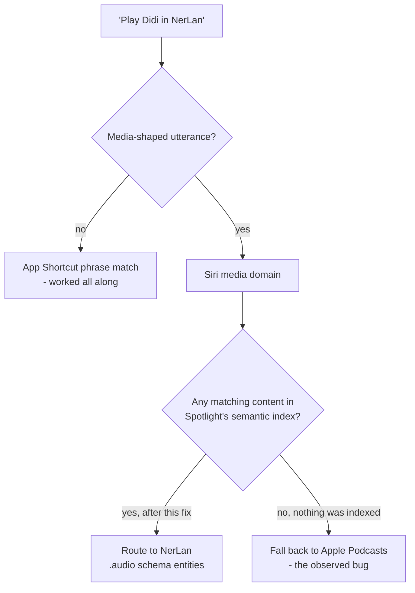

2026-08-16

# NerLan iOS: Siri kept playing podcasts in Apple Podcasts — the missing Spotlight index

## What was broken

The day after [Siri support shipped](nerlan-siri-support.md), saying "play *\<show\>* in NerLan"
played the show — in **Apple Podcasts**. Naming the app explicitly made no
difference. Every podcast tried behaved the same way.

## Ruling things out first

Two checks split the problem cleanly, and both came back positive, which killed
the comfortable explanations:

- **Apple Intelligence was enabled.** So the iOS 27 `.audio` schemas were not
  inert, which had been the leading theory — schema routing requires it.
- **A non-media phrase reached the app.** "How long did I listen in NerLan" made
  Siri speak back the minutes. That single result proves the App Shortcuts were
  registered, that `NerLan` was recognized as an app name, and that Siri could
  reach the app by voice.

So nothing was broken about registration. Only *media-shaped* utterances were
being lost — which narrowed it to a routing fight rather than a wiring failure.

## Root cause

Adopting the `.audio` schemas is step 3 of the five steps in Apple's
[Apple Intelligence and Siri AI](https://developer.apple.com/documentation/appintents/apple-intelligence-and-siri-ai)
checklist. Step 1 had been skipped entirely:

> Index entities to make them available in Spotlight. Apple Intelligence uses the
> semantic search capabilities of Spotlight to find your app's content, even when
> someone describes it vaguely.

Apple Intelligence does not interrogate entity queries out of nowhere. It finds
candidate content through **Spotlight's semantic index**, and only then routes.
NerLan indexed nothing, so a spoken show name had no NerLan content to match
against, and the media domain did the one thing left available to it.

The distinction that got conflated when the schemas were written: adopting a
schema makes an app **able to play** something. Indexing is what makes it
**findable**. The first without the second produces exactly this symptom — an app
that works perfectly from the Shortcuts app and loses every voice request.

## The fix

All four schema entities — `RadioShowEntity`, `RadioShowEpisodeEntity`,
`PodcastShowEntity`, `PodcastEpisodeEntity` — now conform to `IndexedEntity`,
which is a one-word change since the protocol defaults every requirement. They're
published into a **named** `CSSearchableIndex` (Apple is explicit that the default
index is for prototyping only), covering every show plus a bounded slice of
episodes — courses run to hundreds of episodes and shows are what people name out
loud.

The more durable half of the fix is that catalog publication is now a single
chokepoint. Every store that changes the set of shows calls `SiriCatalog.publish()`,
which refreshes *both* the App Shortcut parameter values Siri is allowed to hear
*and* the Spotlight index Apple Intelligence searches. Previously only the first
existed, scattered across six call sites — precisely the shape of mistake that let
half the contract go missing in the first place.

## Two contributing factors, both self-inflicted

**The word "podcast".** The language aliases added the day before let a user say
"play the Korean podcast in NerLan" — and *podcast* is exactly the token that
biases Siri's media classifier toward the built-in app. A feature intended to make
shows easier to name was actively strengthening the misroute. Shows now also
answer to `"<Language> lesson"`, which carries no media noun at all, and suits a
language-learning app better anyway.

**App name last.** The English phrase templates were `"Play <show> in NerLan"` —
the app named only at the end, by which point the media domain has already
classified the sentence. The Chinese templates already led with it
(`"\(.applicationName) 播放 …"`), which is likely why the asymmetry went unnoticed.
English now has `"NerLan play <show>"`, `"In NerLan play <show>"`, and
`"Ask NerLan to play <show>"` ahead of the trailing forms.

## What's still open

Step 5 of the checklist — **donations**, the behavioral cues that teach Apple
Intelligence to prefer a particular app for a particular person — is still not
implemented. If media-shaped phrasing still loses after indexing, that is the next
lever rather than more guessing.

Worth remembering too that this is iOS 27 beta 5 against a brand-new Siri
architecture, so some third-party media routing may simply be unfinished upstream.
The four phrases to test, in the order that isolates each change:

| Phrase | What it tests |
| --- | --- |
| "NerLan play *\<show\>*" | app-name-first routing, no Spotlight needed |
| "Ask NerLan to play *\<show\>*" | strongest app-directed construction |
| "NerLan play the Korean lesson" | alias path with no media noun |
| "Play *\<show\>* in NerLan" | the original failing phrase |

## The lesson worth keeping

A build that compiles, validates against the schema, and shows correct metadata in
`extract.actionsdata` can still be invisible to Siri. Schema conformance is a
necessary condition that reads like a sufficient one, and the compiler has nothing
to say about the four other steps. When adopting an Apple Intelligence domain,
work the whole checklist rather than the part with a macro attached to it.
