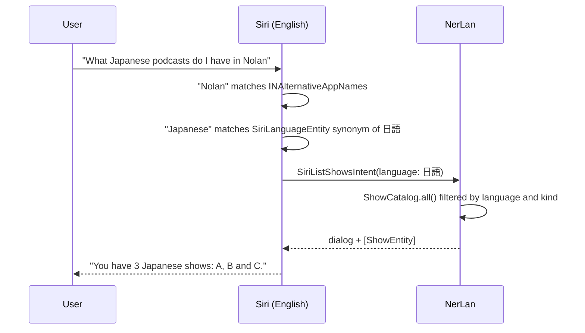

2026-08-30

# NerLan iOS: answer to "Nolan", and let Siri list the shows for a language

## What it does

Two additions to the Siri surface, both driven by one finding: the new Siri
(Siri AI, iOS 27) is **English-only at launch** — Apple's announcement says it
ships "for users with a supported device set to English". Apple Intelligence as a
whole handles Traditional Chinese, but the part that routes free-form media
requests does not, so a Chinese app name or Chinese phrases buy nothing today.

1. **"Nolan" is now an alternative app name.** English Siri snaps the coined
   word "NerLan" to a real name, and "Nolan" is what it hears. Rather than fight
   the recognizer with more pronunciation hints, the third (and last allowed)
   `INAlternativeAppNames` slot registers the mishearing itself, so "play X in
   Nolan" lands in NerLan.
2. **"What Japanese podcasts do I have in NerLan?"** — a new App Shortcut that
   reads the matching show names back, and returns them as a value so the
   Shortcuts app can chain the result straight into 播放節目.

## How

**`SiriLanguageEntity`** is an `AppEntity` whose id is the app's own language
label ("日語" — the value `Program.language` and `PodcastFeed.language` carry, so
filtering is an equality test). Its synonyms come from the existing
`SiriNaming.englishLanguages` table, so "Japanese" and "日語" both resolve. The
query's `suggestedEntities` is the set of *distinct languages actually present in
`ShowCatalog.all()`* — Siri only listens for languages the user has shows in,
rather than the twenty the table knows about. Because the entity is derived from
the catalog, the existing `SiriCatalog.publish()` chokepoint re-announces it
whenever shows change; nothing new had to be wired.

**`SiriListShowsIntent`** takes an optional language and a `SiriShowKind`
(all / podcast / course). App Shortcut phrases carry a single parameter, so the
language is the spoken one and the kind is a Shortcuts-app refinement that
defaults to "all". Phrases without the parameter ("What shows do I have in
NerLan") list everything. The dialog reads nicknames first — a nickname is, by
definition, the name the user can say and hear — and joins them with
`ListFormatter` so English gets "A, B and C" and Chinese gets 頓號.

**Localization.** Intent strings live in `Localizable.xcstrings` with English
values, as the existing intents do. The dialog's language name goes through the
same table (`String(localized:)` on the label), which exposed that about half the
language labels had no English entry; those were added so an English phone hears
"Japanese", not "日語" read by an English voice.

**Build 21.** iOS only re-reads `INAlternativeAppNames` on a higher build
number, so `CFBundleVersion` was bumped for both targets.

## Not done, on purpose

A Chinese `CFBundleDisplayName` was considered and dropped: with Siri set to
English it is never consulted, and the Home-Screen label would change for
nothing. A full rename to a real word (e.g. "Lantern") remains the strongest
option if "Nolan" proves unreliable, at the cost of the icon label and the App
Store listing.
