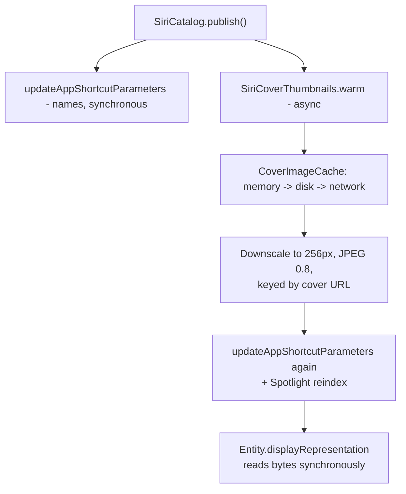

2026-08-16

# NerLan iOS: voice skip/rewind, and why Spotlight showed only the app icon

Two gaps in the Siri surface, found by using it rather than by reading the code.
Neither produced an error anywhere — both just quietly did nothing.

## Skip and rewind did nothing

"Hey Siri, skip forward 30 seconds" had no effect. `PlayerManager.setupRemoteCommands`
registered `playCommand`, `pauseCommand`, `togglePlayPauseCommand`,
`nextTrackCommand`, `previousTrackCommand` and `changePlaybackPositionCommand` —
a list complete enough to look finished, and missing the two that matter for
spoken time skips: `skipForwardCommand` and `skipBackwardCommand`. An unregistered
remote command isn't an error; it simply isn't offered.

Both are now handled. The handler honors `MPSkipIntervalCommandEvent.interval`
rather than a fixed value, because Siri can ask for any interval — "go back ten
seconds" should go back ten, not fifteen. `preferredIntervals` is set to 15 s to
match the full player's existing skip buttons, and is only the default the system
offers when the request names no interval.

The appealing property of this route is what it *avoids*. Remote commands go to
whichever app owns the now-playing session, so there is no app name in the phrase,
no `AppShortcut` template to match, and — unlike every other spoken request this
app handles — no contest with Siri's media domain. Making the existing widget
`SkipIntent` discoverable and giving it phrases would have been strictly worse.

One consequence to watch: `preferredIntervals` also drives the lock-screen glyphs,
so iOS may now draw ±15 s skip buttons where next/previous-episode used to be.
Which pair is more useful for a shadowing app is a real question, and it wasn't
settled here.

## Spotlight showed only the app icon

Other media apps' Spotlight results show the artwork with a small app-icon badge;
NerLan's showed the bare app icon. Spotlight draws a result's own thumbnail
whenever the indexed item has one, and the entities passed only `title` and
`subtitle` to `DisplayRepresentation`. There was nothing to draw. Apple's docs are
explicit that Spotlight prefers the image from the entity's display representation
— it was simply never supplied.

Two constraints decided the implementation:

- `displayRepresentation` is a plain **synchronous** computed property. It cannot
  await a cover download.
- A **file URL** into `CoverImageCache` would be fragile. That cache stores
  originals in Caches, which the OS may purge, leaving a dangling path inside
  Spotlight's index — a failure that would appear weeks later and look like
  nothing at all.

So the bytes are embedded, and the fetch is moved off the synchronous path
entirely:

Covers are shared across a whole program, so the unique set stays far smaller than
the roughly 800 indexed entities. All five entity types carry artwork now — Tier 1's
`ShowEntity` as well as the four `.audio` schema entities — so it reaches Siri's
cards and the Shortcuts picker, not only Spotlight.

## The ordering detail that isn't obvious

`SiriCatalog.publish()` announces show *names* synchronously, then warms artwork
and publishes a **second** time. Both halves are load-bearing:

- Publishing names first means Siri learns what to listen for without waiting on a
  network fetch. Voice recognition shouldn't be gated on cover art.
- Publishing again afterwards is what makes the art appear at all. The first pass
  serialized entities before any thumbnail existed, and the system doesn't re-query
  `suggestedEntities()` on its own — so without the second call, cards would stay
  bare until the next unrelated catalog change.

The second pass is cheap; the covers are cached by then.

## Pattern worth noticing

Both of these were silent. A missing remote command is not a crash, and a missing
thumbnail is not an error — the app compiled, the metadata validated, and the
integration looked complete from inside the code. Together with the
[Spotlight indexing miss](nerlan-siri-media-routing-spotlight.md) found the same
day, that's three defects in one feature whose only symptom was an absence. For
system integrations, "it builds and the metadata is right" is nowhere near
"it works" — the only real test is talking to the thing.
