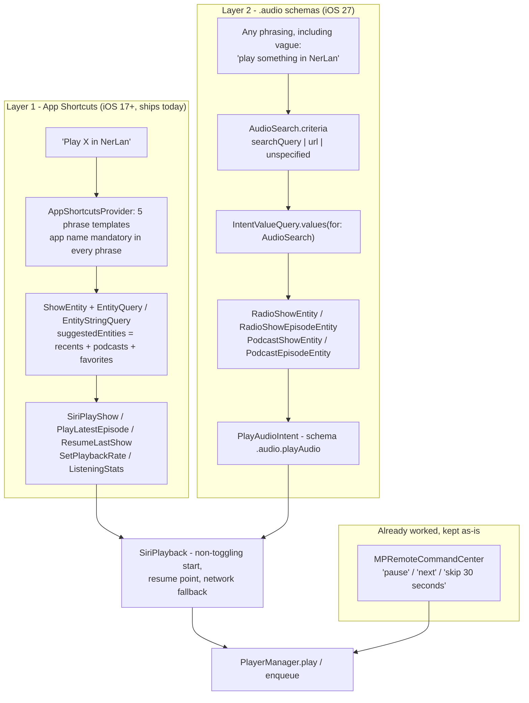
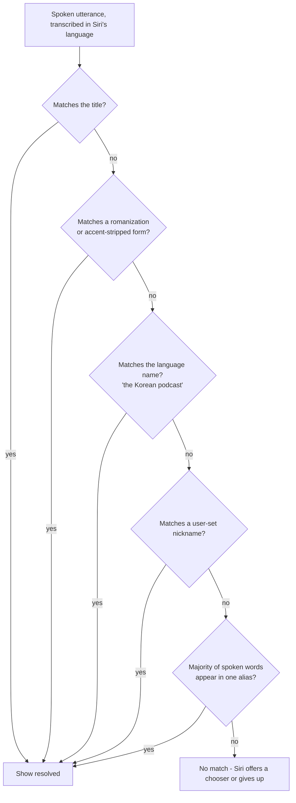

2026-08-16

# NerLan iOS: Siri support — App Shortcuts, iOS 27 audio schemas, and names Siri can actually hear

## What it does

You can now talk to NerLan:

- "Play the last program in NerLan" / 「在 NerLan 繼續上次的節目」
- "Play *\<show\>* in NerLan" / 「在 NerLan 播放 *\<節目\>*」
- "Play the latest episode of *\<show\>* in NerLan"
- "Set NerLan to 1.5 倍速"
- "How long did I listen in NerLan" — Siri speaks today's and this week's minutes plus the streak
- On iOS 27, phrasings nobody wrote down: "play something in NerLan", "play the latest episode of the Korean podcast"

Playback starts in the background without bringing the app forward, which is what
every other media app does and what `AudioPlaybackIntent` exists to allow.

## Why it was nearly free

The app was already most of the way there and nobody had noticed. `NerLan/Shared/WidgetPlaybackIntents.swift`
had defined five `AudioPlaybackIntent`s since the widgets shipped, `AppDelegate`
already registered `PlaybackBridge.handler = PlayerManager.shared` at launch
specifically so the system could run them in a background-launched process, and
`ShowLookup`/`EpisodeLookup` already resolved a show into a playable queue with a
resume point.

One line, repeated five times, was the entire blocker:

```swift
static var isDiscoverable: Bool { false }
```

Apple's documentation is explicit that "App Shortcuts require this property to be
`true` for the app intents they use." Those five intents stay `false` — they take
raw `showId: String` / `isPodcast: Bool` parameters that would render as bare text
fields in the Shortcuts app — and entity-typed siblings were written instead. What
was missing was never the plumbing; it was a vocabulary.

## The three layers

Research turned up three distinct mechanisms rather than one, at very different
maturity levels, and the app now uses all three.



Layer 3 — SiriKit's `INPlayMediaIntent` — was deliberately skipped. Blog posts
claim SiriKit is dead; Apple's own docs still show it as iOS 12+ with **no
deprecation annotation**, and it remains the only pre-iOS-27 route to free-form
"play X on NerLan". But it costs an Intents app extension and the Siri entitlement,
and iOS 27 supersedes it. Not worth the surface area for one OS cycle.

Generic transport control needed nothing at all. `PlayerManager` already registers
`MPRemoteCommandCenter` handlers, so "Hey Siri, pause" has always worked while
NerLan is the now-playing app. Adding intents that duplicated those would have been
noise.

## Two constraints that shape everything

**Every spoken phrase must contain `\(.applicationName)`.** Siri has no other way
to route an utterance to a specific app. "in NerLan" isn't politeness in the
example phrases — it's the API contract. Because "NerLan" is a coined word the
recognizer mangles, `INAlternativeAppNames` now carries two spellings with
sounds-like pronunciation hints (the key allows at most three entries).

**Siri can only hear parameter values published in advance.** Voice matching runs
against whatever `suggestedEntities()` returned, not against a live query — a show
missing from that list can be typed in the Shortcuts app but never spoken. So
`NerLanShortcuts.updateAppShortcutParameters()` is called from `PodcastStore.persist()`,
from `FavoritesStore` (toggle / reload / KVS adopt), at launch, and from
`RecentShowsStore.note()`. That last one runs on *every* episode load, so it only
re-announces when the id set actually changed rather than on a reorder.

## The interesting bug that didn't happen

`widgetPlayShow` toggles: if the show's resume episode is already loaded, it calls
`togglePlayPause()`. That's right for a widget button — tap it again to pause — and
completely wrong for a voice command. "Play the Korean podcast" landing on an
already-playing show would have *paused* it.

`SiriPlayback.start` therefore never toggles. It calls the explicit `play()` when
the target is already current, which resumes if paused and no-ops if already
rolling.

## What the iOS 27 docs get wrong

Four things had to be discovered by probing the SDK rather than reading the
documentation, all of them build-breaking:

- Apple's own `playAudio` sample declares `struct PlayAudioIntent: AudioStartingIntent`.
  `AudioStartingIntent` is marked `@available(*, deprecated, renamed: "AudioPlaybackIntent")`
  in the shipped SDK. The doc page is stale.
- `@AppEntity(schema:)` is `@attached(memberAttribute)` and rewrites every `var`
  into a `@Property`-backed **computed** property. The synthesized memberwise init
  therefore takes `EntityProperty<String>` values, not `String`, and `EntityProperty`
  has no public `init(wrappedValue:)`. Every schema entity needs an explicit `init`.
  Worse, plain stored `let`s must be assigned *before* the wrapped ones, since
  assigning a computed property requires a fully initialized `self`.
- `warmupAudioQueueResult` is **required** by the `playAudio` schema, though the
  template renders it optional. NerLan has nothing to warm up — loading an episode
  is a single `AVPlayerItem` swap — so it exists only to satisfy validation.
- That warm-up type must be a `TransientAppEntity`, which supplies `id` and
  `defaultQuery` for free. The metadata processor rejects a plain `AppEntity` there.

Schema conformance is validated by `appintentsmetadataprocessor` at build time, not
by the macro — the macro only stamps `__appSchemaEntity = "audio.podcastShow"`. So
the diagnostics arrive late but are precise, and the workflow is: write it, build,
read the error, repeat.

Verification came from the compiled `Metadata.appintents/extract.actionsdata`,
which confirms the phrase templates kept their `${show}` tokens and that each
schema query records `inputValueType: com.apple.siri.MediaIntents.AudioSearch` —
the free-form search path being genuinely wired, not merely compiling.

## Keeping Xcode 26.3 green

The `.audio` domain and the whole `MediaIntents` framework are iOS 27 only, and
`@available` doesn't help when the symbols are absent from the SDK entirely.
`SiriMediaSchemas.swift` is therefore wrapped in `#if canImport(MediaIntents)`,
which is false on the iOS 26 SDK. Both toolchains build green; layer 2 simply
doesn't exist in an Xcode 26.3 build. The Xcode 27 beta was installed alongside
26.3 and driven per-invocation with `DEVELOPER_DIR` rather than `xcodes select`,
so the default release path is untouched.

## Names Siri can actually hear

This turned out to be the substantive problem, and it is specific to what this app
is for. Siri transcribes in **its own** language. With Siri set to English, a
Korean title is never transcribed as 한국어, a French one arrives with the accents
stripped, and matching against the stored title fails for exactly the shows a
language-learning app exists to teach.



`DisplayRepresentation.synonyms` (iOS 17+) is the mechanism — it is precisely "other
things a person might call this" — so all of it works on both layers from one
`SiriNaming` module.

The ranking matters. Transliteration is the weakest link: `StringTransform.toLatin`
turns 김지윤의 into `gimjiyun-ui`, which is a plausible romanization but rarely what
English Siri produces when a person *says* it. It is genuinely reliable only for
Latin-script languages, where the real work is dropping diacritics
(français → francais).

**Language aliases are the quiet win.** Mapping the app's Chinese language labels
to English names (韓語→Korean, 法語→French, 台語→Taiwanese/Hokkien, ~20 more) means
"play the Korean podcast in NerLan" needs no romanization guesswork and no setup at
all — and it's the phrasing a learner reaches for anyway. When several shows share a
language, Siri disambiguates with a chooser, which is the correct outcome rather
than a failure.

**The nickname is the guarantee.** A new toolbar button on both detail screens opens
an editor whose sheet lists every phrase Siri will accept for that show, updating
live as you type, so there is no guessing about what worked. For Korean and Japanese
titles this is the answer, and the alias list makes that honest rather than
disappointing.

Matching also had to loosen. Exact substring comparison failed a realistic
transcription like "Journal on Francais Facile", so a match now also succeeds when a
majority of the spoken words appear in one alias. Checked against realistic
utterances:

| Spoken | Resolves to |
| --- | --- |
| "Korean podcast" | 김지윤의 지식Play |
| "Journal on Francais Facile" | Journal en français facile |
| "French program" | both French shows → Siri asks |
| "Didi" (nickname) | ニュースで学ぶ現代英語 |
| "gimjiyun" | 김지윤의 지식Play |
| "Spanish podcast" | nothing — correctly, there is no Spanish show |

## Loose end

`PlayerManager` gained `enqueue(_:playNext:)` so the schema's `queueLocation`
parameter ("play X next", "add X to the queue") does something real. Ignoring a
parameter the schema advertises would have been a lie to the system, and the
method is ten lines.
