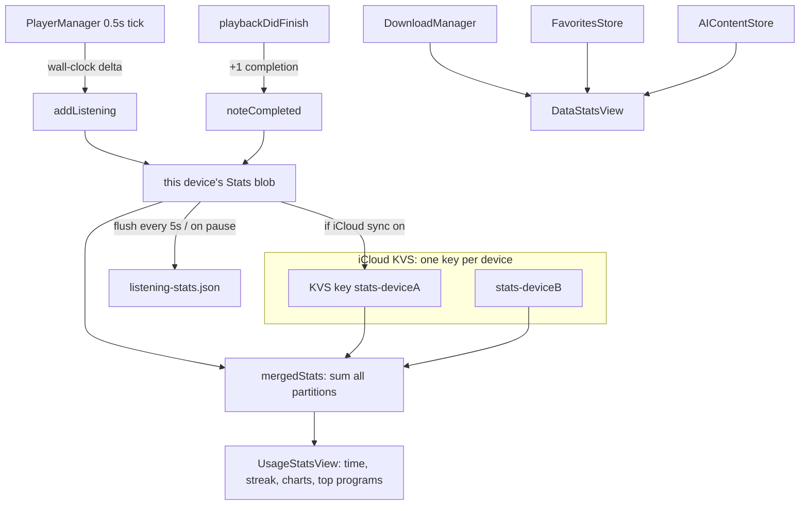

# NerLan — Usage & Data statistics screens

## Summary

Added two entries at the bottom of the Settings sheet, each opening its own screen,
deliberately kept **separate** rather than merged into one:

- **使用統計 (Usage)** — listening *behavior* over time: total listening time, completed
  episodes, current streak, today/this-week/this-month subtotals, a 日/週/月 bar chart,
  and the most-listened programs.
- **資料統計 (Data)** — an *inventory* of what's stored: favorites, downloads
  (count/size/attachments), streamed cache, AI content, and a language breakdown of
  downloads.

The defining constraint: the app had **never recorded anything about playback**
(`PlayerManager` tracked no time, counts, or dates). So the Data screen is fully
retroactive (it reads existing persisted state), but the Usage screen required new
tracking and its numbers accumulate **forward-only** from this release.

## Approach

**Tracking (`ListeningStatsStore` + `PlayerManager`).** Rather than add a timer, the new
store piggybacks on `PlayerManager`'s existing 0.5 s periodic time observer. Each tick
while playing credits the *wall-clock* delta since the last tick to the current
day/hour/program; deltas ≥ 5 s (pause, seek, backgrounding) are discarded as gaps.
Wall-clock — not rate-adjusted audio duration — is the engagement metric a learner cares
about and stays correct across playback-rate changes. Completions are counted in
`playbackDidFinish`. Local writes are throttled (every about 5 s of accumulated listening, and
on pause/finish) since the JSON file is small.

**Cross-device sync as a per-device G-counter.** Usage stats sync over the existing
`CloudKVStore` (NSUbiquitousKeyValueStore), reusing the app's「同步到 iCloud」toggle. A
single shared total can't merge — two devices listening offline would clobber each other
on sync. Instead each device only ever increments **its own** partition, written under a
`stats-<deviceId>` key, and the displayed numbers are the **sum across every device's
blob**. Summation is conflict-free because partitions never overlap. Daily buckets
(`yyyy-MM-dd → seconds`) drive the 週/月 charts, streak, and subtotals; a separate
hourly-for-today bucket drives the 日 chart; per-program seconds drive most-listened.

**Charts.** Swift Charts (iOS 17+, a system framework — no new dependency, honoring the
app's no-deps rule). A segmented picker switches 日 (today by hour) / 週 (last 7 days) /
月 (last 30 days); the Day view uses an Int hour axis, Week/Month a temporal day axis.

**Data screen.** Reads live from the existing singletons. Filesystem-derived values
(directory sizes, file counts) are computed once in `onAppear` rather than on every render
since they walk Documents/Caches; store-published arrays (favorites/downloads counts) are
read inline. New helpers were added to `DownloadManager`
(`downloadedAudioByteSize`/`attachmentCount`/`cachedEpisodeCount`, plus a shared
`directoryByteSize`/`fileCount`) and `AIContentStore` (`transcriptCount`/`handoutCount`).

## Trade-offs

- **Forward-only Usage data** is inherent — there's no historical playback to backfill. A
  first-run empty state ("開始聆聽後…") covers this.
- **G-counter cost** is one KVS key per device. Tiny (daily buckets are pruned to about 400
  days), well under the KVS 1 MB / 1024-key cap, and the correct minimal way to sum
  counters over a last-write-wins store.
- **Day boundaries use the device's local time zone.** For a single user this is fine;
  cross-time-zone devices could mis-bucket a day, which is acceptable for this metric.
- **`revision` bumps every tick** while playing, but SwiftUI only recomputes the stats
  views when they're actually on screen, so the cost is negligible in practice.

## Key Files

- `NerLan/Sources/ListeningStatsStore.swift` — new store: tracking model, throttled JSON
  persistence, per-device G-counter sync, and merged read accessors.
- `NerLan/Sources/PlayerManager.swift` — `accumulateListening()` on the existing tick;
  `lastTick` reset on pause/load; `noteCompleted` in `playbackDidFinish`.
- `NerLan/Sources/Views/UsageStatsView.swift` — Usage screen (summary, subtotals, streak,
  Swift Charts 日/週/月, top programs, empty state).
- `NerLan/Sources/Views/DataStatsView.swift` — Data inventory screen.
- `NerLan/Sources/Views/SettingsView.swift` — 統計 section with the two `NavigationLink`s.
- `NerLan/Sources/SettingsStore.swift` — enable/disable stats sync on the iCloud toggle.
- `NerLan/Sources/{DownloadManager,AIContentStore}.swift` — inventory helpers.
- `NerLan/Sources/NerLanApp.swift` — injects `ListeningStatsStore.shared`.
