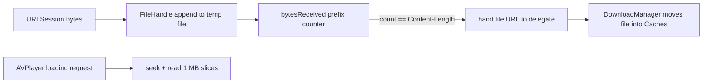

2026-07-07

# NerLan: cache-on-stream buffers to disk instead of RAM

## What it does and why

`CachingPlayerItem` (the opt-in "串流時自動快取" path) routes the audio stream through an `AVAssetResourceLoaderDelegate` so every received byte can be kept and, when complete, persisted as an offline copy. The keep-every-byte buffer was a `Data` in memory — fine for a 30-minute NER lesson (about 30 MB), but a two-hour podcast at 128 kbps holds **100+ MB resident for the whole playback**, plus a second full copy at the completion hand-off. That's jetsam territory in the background.

## How it works now

- **Write path**: bytes append to `tmp/stream-<uuid>.tmp` through a `FileHandle`; `bytesReceived` tracks the contiguous prefix (all mutation stays on the loader's serial queue, as before). A 200 response (initial request, or a server that ignored `Range`) truncates back to zero — same contiguity rule as the old `removeAll`.
- **Read path**: loading requests are served by `seek` + `read(upToCount:)` in 1 MB slices, looping until the request is satisfied or buffered data runs out. Slicing also fixes a latent issue the `Data` version had: a "rest of the file" request used to materialize the entire buffered range as one `subdata` copy.
- **Hand-off**: the delegate now receives the **file URL** (not `Data`); `DownloadManager.storeCachedAudio(fileAt:)` moves it into `Caches/audio/`. The move is a rename under the loader's still-open read descriptor — POSIX keeps the inode alive, so the player continues to be served without interruption.
- **Cleanup**: `invalidate()` (called when the player moves to another episode) closes the handles and deletes an unfinished buffer; a buffer file that can't be created at all fails the loading requests with `URLError(.cannotCreateFile)` rather than hanging AVPlayer silently.

Worth an on-device pass: play a streamed episode with 串流時自動快取 on, seek around, let it finish, then replay offline — this path can't be exercised meaningfully in the simulator-only build check.
