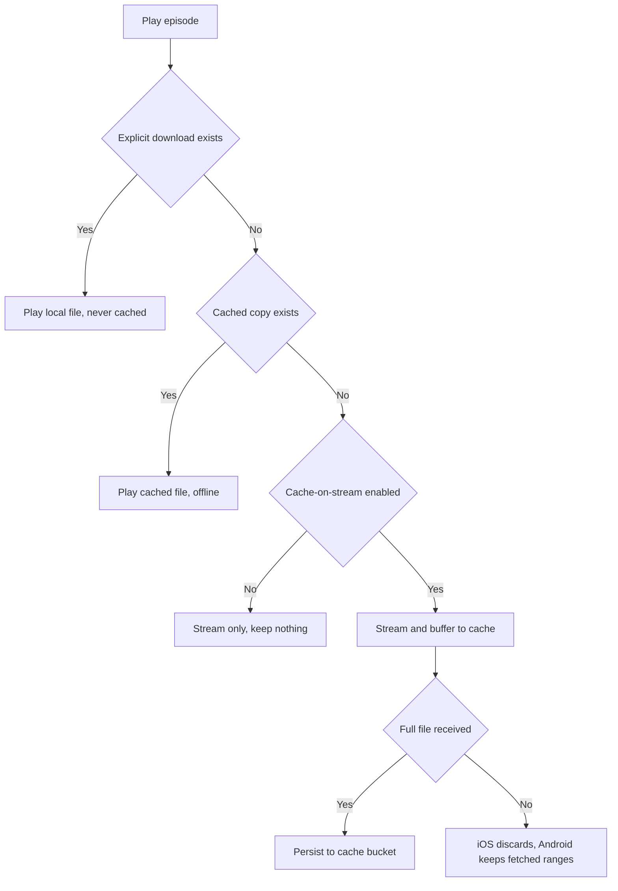

# NerLan — Opt-in caching of streamed audio

## Summary

Playing a non-downloaded episode streamed from the network and kept nothing, so
every replay re-fetched the file. Added an **opt-in "cache while streaming"** mode
on both the iOS and Android apps: when enabled, the bytes pulled during playback
are captured to disk so a fully-played episode replays offline, plus a Settings
toggle and a "clear cached audio" control. Off by default, and kept deliberately
separate from explicit downloads.

The playback load decision is shared across platforms — prefer an explicit
download, then a cached copy, then stream (caching only when the toggle is on):

## Approach

**Two storage tiers, kept distinct.** Explicit downloads remain the user's
deliberate, visible offline copies (Documents/`filesDir` `audio/`, listed in the
Downloads tab). The streamed cache is a separate, automatic, invisible tier in the
OS-purgeable caches area (iOS `Caches/audio`, Android `cacheDir/audio`), never
shown in Downloads and wiped as a unit. This is what makes "clear cached audio" an
unambiguous action — it can't touch downloads the user chose to keep. An explicit
download of an episode supersedes and removes any cache copy.

**iOS — `CachingPlayerItem` (AVAssetResourceLoaderDelegate).** AVPlayer exposes no
API to read its own buffer, so the load is routed through a resource-loader
delegate: the asset is built from a URL with a masked scheme AVPlayer can't play,
forcing it to ask the delegate for the bytes. The delegate runs the real network
request, feeds the bytes back to the player, and accumulates them. The cache is
written **only when the received byte count matches `Content-Length`**, so a
paused, aborted, or seek-fragmented stream persists nothing. A dropped connection
is resumed via a `Range` request up to 5 times. Because bytes are fetched
sequentially from offset 0, this is the reason the feature is opt-in (see
Trade-offs).

**Android — ExoPlayer `CacheDataSource` + `SimpleCache`.** Media3 has first-class
cache-while-streaming, so no custom byte plumbing is needed. A `SimpleCache`
(process-wide singleton, `NoOpCacheEvictor`) backs a `CacheDataSource.Factory`
whose write sink is enabled or nulled per episode load based on the toggle. A small
`SchemeRoutingDataSource` sends `file://` URIs (downloads) straight to a
`FileDataSource` so they are never re-cached, and `http(s)` through the cache. The
write flag is read via a lambda at each `createDataSource()`, so toggling takes
effect on the next track without rebuilding the player.

## Trade-offs

- **Bandwidth vs. robustness (iOS).** The resource-loader approach reuses the
  *same* streamed bytes for both playback and caching (no double download), but
  taking over the load means seeking far *ahead* of what has downloaded waits for
  the sequential fill to reach that point, and a hard network failure can stall
  playback where native streaming would silently retry. Acceptable because the
  feature is opt-in and the typical use is sequential course listening; explicit
  Download remains the robust choice for heavy seeking.

- **All-or-nothing (iOS) vs. per-range (Android).** iOS persists only the complete
  file, so a partially-played episode caches nothing. Android's `CacheDataSource`
  caches per byte-range, so a partial listen keeps the ranges it fetched (nicer,
  but a partially-cached episode has gaps offline). A deliberate
  platform-idiomatic divergence rather than forcing identical semantics.

- **No app-imposed size cap.** Both rely on the OS purging the caches directory
  under storage pressure (mirroring each other) plus the manual clear button,
  rather than an LRU evictor that could silently drop episodes a learner wants to
  re-hear.

- **Invisible cache tier.** A streamed-then-cached episode plays offline but shows
  *no* download badge. Intentional: the cache is the automatic tier, Downloads the
  explicit one. Users who want a visible, permanent copy still tap Download.

## Key Files

**iOS (`~/src/nerlan`)**
- `NerLan/Sources/CachingPlayerItem.swift` — new; the resource-loader streaming/buffering item.
- `NerLan/Sources/DownloadManager.swift` — cache bucket: `cachedAssetURL`, `storeCachedAudio`, `clearAudioCache`, `cachedAudioByteSize`; download supersedes cache.
- `NerLan/Sources/PlayerManager.swift` — `load()` download→cache→stream; `CachingPlayerItemDelegate` saves the finished buffer.
- `NerLan/Sources/SettingsStore.swift` — `cacheStreamedAudio` flag.
- `NerLan/Sources/Views/SettingsView.swift` — 串流快取 toggle + clear-cache with size.

**Android (`~/src/nerlan-android`)**
- `app/src/main/java/com/example/nerlan/player/AudioCache.kt` — new; `SimpleCache`, the caching `DataSource.Factory`, `SchemeRoutingDataSource`, size/clear.
- `app/src/main/java/com/example/nerlan/player/PlaybackService.kt` — ExoPlayer built with the caching media source factory.
- `app/src/main/java/com/example/nerlan/data/SettingsStore.kt` — `cacheStreamedAudio` pref.
- `app/src/main/java/com/example/nerlan/ui/SettingsScreen.kt` — 串流快取 toggle + clear-cache with size.
- `gradle/libs.versions.toml`, `app/build.gradle.kts` — `media3-datasource` dependency.
