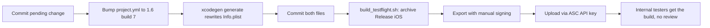

2026-07-10

# NerLan iOS: TestFlight release 1.6 (build 7)

Version bump `1.5 (6)` → `1.6 (7)` in `project.yml` (the source of truth; `xcodegen generate` rewrites the tracked `Info.plist`, and both are committed together). Built and uploaded with the one-shot `Scripts/build_testflight.sh` — manual signing with the user-managed Apple Distribution cert (`XRP3T4TN7B`, valid to 2027-06-20) and the "NerLan App Store" profile, uploaded via the App Store Connect API key for internal testing (no Beta App Review).

## What's in this release

Thirty-one commits since 1.5 — a performance and robustness pass over the whole app rather than new features.

**Performance**

- Player sheet no longer re-renders the whole view on every playback clock tick, and now-playing info is no longer pushed to the system every 0.5 s.
- Cover images downsample on decode and the in-memory cover cache is bounded; lock-screen artwork goes through the same cache.
- Episode list builds its play queue once per render (was once per row); favorites/downloads lists use in-memory id sets instead of per-render filesystem stats.
- Stream cache buffers to a temp file instead of holding whole audio files in RAM.
- iCloud bulk mirror-up scans the container once (was once per artifact); KVS synchronizes once per bulk push; Drive sync pages through the full file listing; stats cache peer blobs instead of re-reading them per accessor.
- FlowLayout measures chips once per layout pass via the Layout cache.

**Robustness / bug fixes**

- Favorites survive an iCloud account change and a mid-loop delete; Drive sync skips undecodable files instead of merging them as empty, and stops reshuffling the user's favorites order on merge.
- Downloads survive app termination during a background download.
- Remote play/pause has explicit semantics (headset taps work; play at end-of-episode restarts it).
- AI features: one in-flight transcription shared across concurrent callers, retry button actually re-runs, in-flight jobs cancel on delete/clear-all; transcode no longer strands temp chunk files on failure; shadowing handles recorder failure and seeks sentence loops with zero tolerance.
- Drive sign-in fails cleanly when the auth sheet can't present.

**Refactoring** — shared HTML-strip helper, shared multipart builder, single source of truth for AI content kinds and episode-id checks, download-state button extraction.

Plus the transcript line-spacing improvement committed with this release (see [nerlan-transcript-line-spacing-scales-with-font](nerlan-transcript-line-spacing-scales-with-font.md)).

## Release flow

As before, the build stays **internal-testing only** — external TestFlight would require Beta App Review, which is risky for an unofficial client of a reverse-engineered government API serving third-party copyrighted audio.
