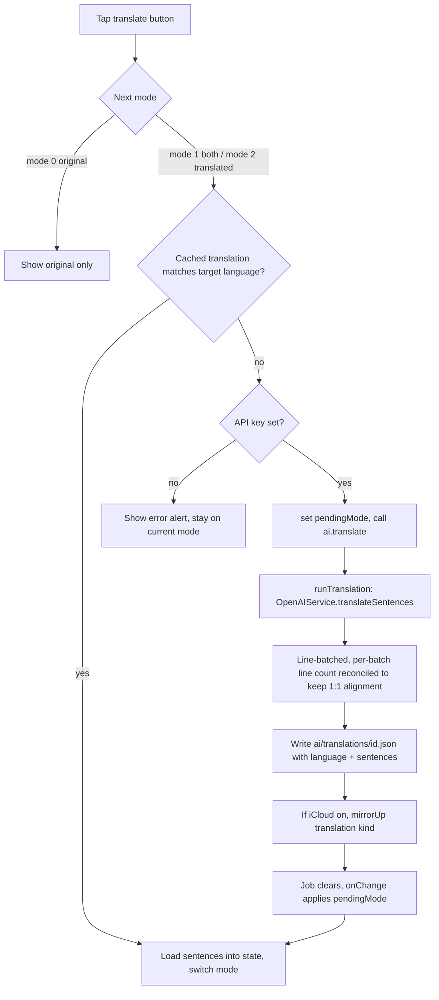

# NerLan — Transcript font sizing & on-demand translation

## Summary

The iOS transcript reader (`TranscriptView`) gained two reading controls and the
study sheets lost their redundant titles:

1. **No header titles** on the 逐字稿 (transcript) and AI 講義 (handout) sheets —
   the user already knows what they opened, so the bar is now just the close +
   action buttons.
2. **Font-size button** — loops through three sizes (17 / 21 / 26 pt) and
   remembers the choice across every transcript opened afterwards.
3. **Translate button** — loops the view through three modes: *original* →
   *original + translation (per sentence)* → *translation only*. Translation is
   produced on demand by the OpenAI chat model into a target language chosen in
   Settings (default 繁體中文), cached per episode, and mirrored to iCloud like
   transcripts and handouts.

This was a pure additive feature — no incident, no migration. The pivot
constraint was keeping each translated sentence aligned 1:1 with the transcript
rows so the "both" mode can interleave original and translation per sentence.

## Approach

### Implementation plan (as approved before coding)

- **Headers:** drop `.navigationTitle` from `HandoutView` and `TranscriptView`
  (keep `.inline` so the bar stays slim); remove the now-unused `title` params and
  update the two call sites each (`StudyDetailView`, `AIActions`).
- **Settings:** add `translationLanguage` (+ options/default) to `SettingsStore`
  and a 翻譯 picker section to `SettingsView`.
- **Storage + sync:** add a `StoredTranslation` model, a `.translation` case to
  `ICloudSync.Kind`, and translation directory/methods/job-state/`runTranslation`
  + sync wiring to `AIContentStore`; add `OpenAIService.translateSentences`.
- **TranscriptView:** new signature (`record`/`text`/`cues`/`onClose`), font-size
  button via `@AppStorage`, translate button cycling three modes, per-mode row
  rendering, error handling. Translate-mode resets to original on each open; font
  size persists.

The two decisions taken to the user: default translate target = **繁體中文** (via a
picker), and translate-mode **resets to original each open** (so opening a
transcript never silently starts a paid job — only the font size is remembered).

### How it actually came together

**Font size** is a single `@AppStorage("transcriptFontScale")` Int (0/1/2) read by
`TranscriptView`. The button does `fontScale = (fontScale + 1) % 3`; the value
maps to explicit point sizes `[17, 21, 26]` so the three steps are deterministic.
The sentence-number column and the secondary translation line scale off the same
base size. `@AppStorage` gives free persistence and cross-instance propagation
(the iPad side panel reuses the same view), so no `SettingsStore` plumbing was
needed for it.

**Translation generation** lives in `OpenAIService.translateSentences`, which
reuses the existing private `chat(...)` helper at `temperature: 0`. The hard part
is alignment: the chat model must return exactly one translated line per input
sentence. It batches whole sentences (≤40 lines / ≤3000 chars per batch so a
batch is never split mid-sentence), and **reconciles each batch's returned line
count to its input count** (truncate extras, pad shortfalls with empty strings),
so a single dropped/added line can never shift the alignment of everything after
it within the batch.

**Storage** is a per-episode `ai/translations/{id}.json` holding
`StoredTranslation { language, sentences }`. The `sentences` array aligns 1:1 with
`AIContentStore.displaySentences(text)` — the same indexing the timestamp cues
use — so `TranscriptView` pairs each rendered row with `translation[line.id]`. The
`language` tag is what lets a device tell whether its cache matches the current
target; on mismatch it regenerates and overwrites.

**iCloud sync** needed almost no new code: `ICloudSync` is generic over its
`Kind` enum (the `NSMetadataQuery` predicate, `parseCloudURL`, and push/pull all
iterate `Kind.allCases`), so adding `.translation` (`translations/` ⇄
`translation.json`) wired it into the existing file-mirroring path. `AIContentStore`
mirrors translations up on generation, in the enable-sync bulk upload, and tears
them down in `delete(.transcript)` / `clearAll` (a translation is invalid once its
transcript is gone or regenerated).

**The translate button** is a small state machine over `translateMode` 0/1/2 and a
`pendingMode`. Tapping computes `next = (mode+1) % 3`. If the cache matches the
target language it loads and switches synchronously; otherwise it stores
`pendingMode`, starts `ai.translate(record)`, and an `onChange(of:
ai.translationJob(id))` applies the pending switch when the job clears (or surfaces
the failure and reverts). A `ProgressView` replaces the button while the job runs.

## Trade-offs

- **Local-wins cross-device sync, not propagation.** Each `translation.json`
  carries its language; a device whose cache doesn't match the current setting
  regenerates and re-uploads as transcripts are opened, rather than one device
  pushing a language change to the others. This matches the app's existing
  write-once, local-wins philosophy for transcripts/handouts and avoids a
  conflict-resolution layer — at the cost of paying the translation a second time
  per device after a language change.
- **Translate-mode resets per open; font size persists.** Deliberate: a persisted
  "translated-only" mode would auto-trigger a paid OpenAI job every time a
  transcript without a cached translation is opened.
- **Translation lives in its own published job map**, not a third
  `AIContentStore.Kind`. Translation is triggered from inside the transcript
  screen (not the shared AI action buttons), so threading a new `Kind` through
  every `switch` in `AIContentStore`/`AIActionButton` would have been churn for no
  benefit.
- **Batch line-count reconciliation can mis-pair within a single batch** if the
  model both drops and adds lines in the same batch. Small batches + temperature 0
  make this rare; the cost of absolute safety (one API call per sentence) wasn't
  worth it for a personal app.
- **Font scale uses fixed point sizes**, trading Dynamic Type responsiveness for
  the deterministic "three sizes" loop the feature calls for.

## Key Files

- `NerLan/Sources/Views/TranscriptView.swift` — rewritten: new signature, font &
  translate toolbar controls, three-mode row rendering, translate state machine.
- `NerLan/Sources/OpenAIService.swift` — `translateSentences` + `lineBatches`.
- `NerLan/Sources/AIContentStore.swift` — translations dir, `translation(_:)`,
  `translationJobs`/`translate`/`runTranslation`, sync + delete/clear wiring,
  `translationCount`.
- `NerLan/Sources/ICloudSync.swift` — `.translation` `Kind` case.
- `NerLan/Sources/Models.swift` — `StoredTranslation`.
- `NerLan/Sources/SettingsStore.swift` + `Views/SettingsView.swift` —
  `translationLanguage` setting + 翻譯 picker.
- `NerLan/Sources/Views/HandoutView.swift`, `StudyDetailView.swift`,
  `AIActions.swift` — title removal + call-site updates.
- `NerLan/Sources/Views/DataStatsView.swift` — 翻譯 count row.

There is a matching Android app (`plateaukao/nerlan-android`); this feature is a
candidate to mirror there.
