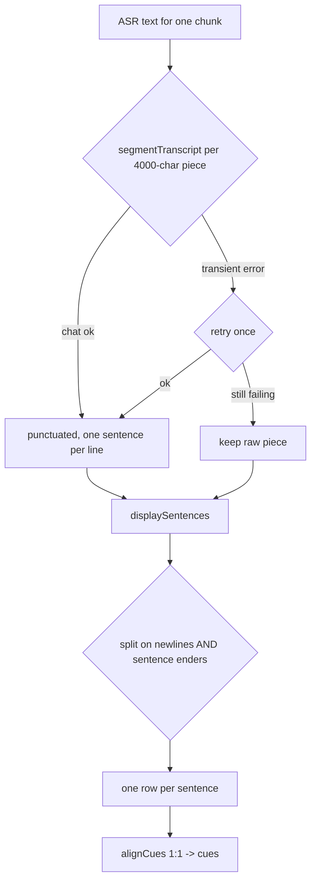

2026-06-22

# NerLan: hardening per-chunk transcript segmentation against run-on fallback

## What was broken

After transcripts started streaming per about 20-minute chunk, the viewer would
*sometimes* show a wall of run-together sentences — a whole chunk's worth of text
as a single undifferentiated line — while neighbouring chunks looked fine.

## Root cause

A transcript row's text is split into sentences purely by newlines. A chunk
collapses into one giant line whenever its text arrives without newlines, and the
per-chunk pipeline created two ways for that to happen — both intermittent, which
is why it was "sometimes":

1. **Segmentation fell back to raw ASR text for one chunk.** Each chunk is
   sentence-segmented independently by the chat model; on any error the code used
   `(try? segmentTranscript(...)) ?? result.text`. A single transient failure
   (timeout, rate-limit, a local-model hiccup) dumped that chunk's *raw* ASR text,
   which for Mandarin carries little punctuation and no line breaks — one blob.
   Before streaming, segmentation ran once over the whole transcript, so this was
   all-or-nothing; the per-chunk loop made it strike one chunk at a time.
2. **The model returned a punctuated paragraph with no line breaks.** More common
   with weaker / local models. `displaySentences` split on `\n` only, so it became
   one row.

When cues exist the viewer renders each cue's text, and the blob gets baked into
the cue at generation time — so the bad split survives into the saved sidecar too.

## The fix

Two complementary changes, so the splitting is robust *and* the fallback is rarer:

- **`displaySentences` now splits on sentence-ending punctuation as well as
  newlines.** Full-width `。！？` always end a sentence; half-width `.!?` only when
  followed by whitespace or end-of-line, so `3.14`, `wait...` and the like stay
  intact. Trailing closers (`」』”）`) ride along with the sentence they close. It
  is idempotent on already-one-per-line text, so cue alignment stays 1:1.
- **`segmentTranscript` retries each 4000-char piece once, then keeps the raw
  piece instead of throwing.** A single hiccup can no longer collapse a whole
  chunk — at worst one piece stays unpunctuated, and `displaySentences` still
  breaks it on whatever ASR punctuation is present.
- **`TranscriptView.sentences` routes through `displaySentences`** so the
  no-cues fallback split matches the generation split exactly.

## Caveat

Transcripts already saved with a blob have it baked into their cue sidecar, so
they do not fix retroactively — re-generate those to pick up the new splitting.
Transcripts without a cues file improve on reload, since the viewer re-splits the
saved text through the updated `displaySentences`.

Commit: `b559b7b`.
