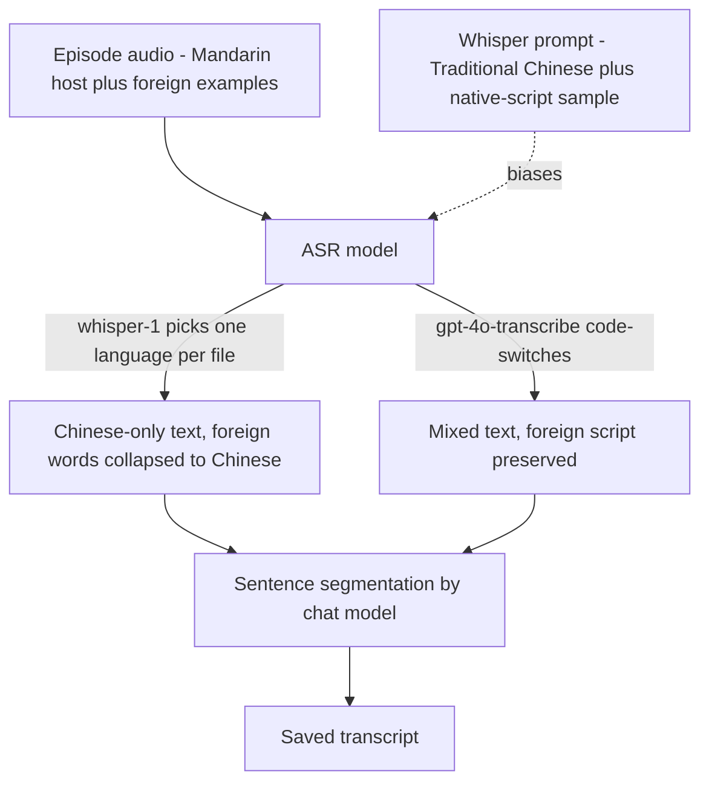

# NerLan — Transcriptions collapsing foreign languages into Chinese

## Problem

The OpenAI-powered transcripts of the language-learning episodes came out
*entirely* in Traditional Chinese, even though the programs are bilingual — a
Mandarin host teaching English / Japanese / Korean / etc. The foreign-language
examples (the whole point of the lesson) were missing from the transcript,
rewritten as Chinese characters instead of their own script.

## Root Cause

The ASR step, not the post-processing. `OpenAIService.transcribe` called
`whisper-1` with no `prompt` and no `language`. **whisper-1 decides on a single
dominant language for the entire file** at the acoustic stage; for these
Mandarin-dominant programs it locks onto Chinese and renders the foreign speech as
Chinese characters *before any text exists*. By the time the transcript returns,
the foreign-language information is already gone.

This also exonerated the sentence-segmentation step (a chat-model pass that
re-punctuates the raw ASR output): it is explicitly told to preserve foreign text,
and in any case it only ever receives Chinese — the loss happened upstream.

## Solution

Two complementary changes:

1. **Language-aware Whisper prompt.** `transcribe` now accepts a `prompt`
   (multipart field). `transcriptionPrompt(for:)` builds one from the program's
   `language`: a Traditional-Chinese teaching sentence plus a short **native-script
   sample** of the target language (かな for 日語, 한글 for 韓語, Latin for English/
   French/…, ไทย for 泰語, …). Whisper treats the prompt as preceding context rather
   than an instruction, so feeding it real mixed-script text biases the decoder to
   keep 正體中文 for the host and the original script for the foreign words. Unknown
   languages fall back to a Traditional-Chinese prompt naming the language.

2. **Selectable transcription model.** The real fix is model choice — `whisper-1`
   (2022) has weak code-switching, while the `gpt-4o-transcribe` family handles
   mixed-language audio far better and actually follows the prompt (same
   `/v1/audio/transcriptions` endpoint, same `response_format=text`, so it's a
   drop-in). The transcription model is now a 3-option dropdown
   (`whisper-1`, `gpt-4o-mini-transcribe`, `gpt-4o-transcribe`) instead of a
   free-text field, so the user can switch without typing an exact id. The user
   confirmed correct output after switching to a gpt-4o-transcribe model.

The default remains `whisper-1` (the stored preference and the reset target were
left unchanged); the dropdown makes the better models one tap away.

## Key Files

**iOS (`~/src/nerlan`)** — commit `b8c83f7`
- `NerLan/Sources/OpenAIService.swift` — `transcribe(prompt:)` + `transcriptionPrompt(for:)`.
- `NerLan/Sources/AIContentStore.swift` — passes the prompt per episode.
- `NerLan/Sources/SettingsStore.swift` — `transcriptionModelOptions`.
- `NerLan/Sources/Views/SettingsView.swift` — `Picker` instead of `TextField`.

**Android (`~/src/nerlan-android`)** — commit `56c3c31`
- `app/src/main/java/com/example/nerlan/data/OpenAIService.kt` — `transcribe(prompt)` + `transcriptionPrompt(language)`.
- `app/src/main/java/com/example/nerlan/data/AIContentStore.kt` — passes the prompt.
- `app/src/main/java/com/example/nerlan/data/SettingsStore.kt` — `TRANSCRIPTION_MODELS`.
- `app/src/main/java/com/example/nerlan/ui/SettingsScreen.kt` — `ExposedDropdownMenuBox`.

## Lessons Learned

- **Diagnose the pipeline stage before tuning a knob.** A Whisper `prompt` is the
  obvious lever, but for a model that has already collapsed the audio to one
  language, no prompt can recover what was never transcribed. The fix that
  mattered was changing the model, not refining the prompt.
- **Whisper's `prompt` is context, not an instruction.** Priming it with example
  text in the desired scripts works; writing "keep foreign words in their own
  script" as a directive does not. Newer LLM-based ASR models (`gpt-4o-transcribe`)
  invert this — they do follow instruction-style prompts.
- **Make the model configurable and capped to known-good values.** Exposing the
  model as a dropdown (rather than free text) turns "the output is wrong" into a
  one-tap user fix and prevents typos in model ids.
- Android Material3 `1.5.0-alpha15`: `ExposedDropdownMenu` is a scope member of
  `ExposedDropdownMenuBox` (not a top-level import), and the anchor uses
  `Modifier.menuAnchor(MenuAnchorType.PrimaryNotEditable)`.
