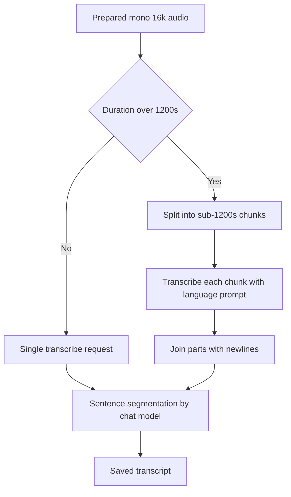

# NerLan — Long episodes failing transcription on the 1400 s model limit

## Problem

After switching the transcription model away from `whisper-1` (to fix foreign
languages collapsing into Chinese — see
[nerlan-transcription-language-handling](nerlan-transcription-language-handling.md)),
transcribing a normal-length episode started failing with:

> 處理失敗 — audio duration 1425.084 seconds is longer than 1400 seconds which is
> the maximum for this model

The episodes are ~24 min, so this hit most of them.

## Root Cause

A hard input limit of the new models, not the audio file. The
`gpt-4o-transcribe` / `gpt-4o-mini-transcribe` models cap a single
`/v1/audio/transcriptions` request at **1400 seconds (~23.3 min)**. `whisper-1`
has no duration cap (only a 25 MB size limit), so the app had always sent the
whole episode in one request and never hit a duration ceiling — the limit only
surfaced once the model changed. The transcoded audio is mono 16 kHz at 32 kbps
(~5–6 MB for a full episode), so size was never the issue.

## Solution

Split long audio into sub-limit chunks, transcribe each, and concatenate; the
existing sentence-segmentation pass re-punctuates across the joins. Chunk size is
**1200 s** — comfortably under 1400 with margin for transcode rounding. A short
episode still produces a single chunk, so nothing changes for those. Chunking is
applied uniformly (whisper-1 included) to keep one code path; the extra request
for a long whisper-1 episode is harmless.

Per-chunk audio extraction differs by platform but is equivalent:

- **iOS** — `AVAssetReader.timeRange` per chunk, with the `AVAssetWriter` session
  started at the chunk's source time. Only in-range samples are appended, so each
  file holds exactly its segment (no leading silence).
- **Android** — media3 `Transformer` with a `MediaItem.ClippingConfiguration`
  (start/end ms) per chunk; duration read via `MediaMetadataRetriever`.

The UI shows `轉錄中…（1/2）`-style progress across chunks, and all chunk temp
files are cleaned up (in a `finally` / `defer`) whether or not a request fails.

## Key Files

**iOS (`~/src/nerlan`)** — commit `8d0051d`
- `NerLan/Sources/SpeechAudioExporter.swift` — `exportChunks`, `transcode(timeRange:)`, `maxChunkSeconds`.
- `NerLan/Sources/AIContentStore.swift` — per-chunk transcribe loop + `cleanupChunks`.

**Android (`~/src/nerlan-android`)** — commit `298e307`
- `app/src/main/java/com/example/nerlan/data/AudioTranscoder.kt` — `transcodeChunks`, `durationMs`, clipped `toMono16k`, `MAX_CHUNK_SECONDS`.
- `app/src/main/java/com/example/nerlan/data/AIContentStore.kt` — per-chunk transcribe loop + `cleanupChunks`.

## Lessons Learned

- **A model swap can move the constraints, not just the quality.** `whisper-1` and
  `gpt-4o-transcribe` share an endpoint and request shape but differ on a hard
  limit (duration vs. size). Switching the default/selected model needs a check of
  *all* its limits, not just the behavior you were chasing.
- **Chunk at a fixed margin under the limit, uniformly.** 1200 s vs. 1400 s costs
  one extra request on a long episode but removes any reliance on exact transcode
  duration, and a single code path (no per-model branching) is easier to keep
  correct.
- **Trim by source time, append only in-range samples.** Starting the writer
  session at the chunk start (rather than zero) and never appending out-of-range
  samples yields a clean per-segment file with no leading silence — the same
  result media3's `ClippingConfiguration` gives on Android.
