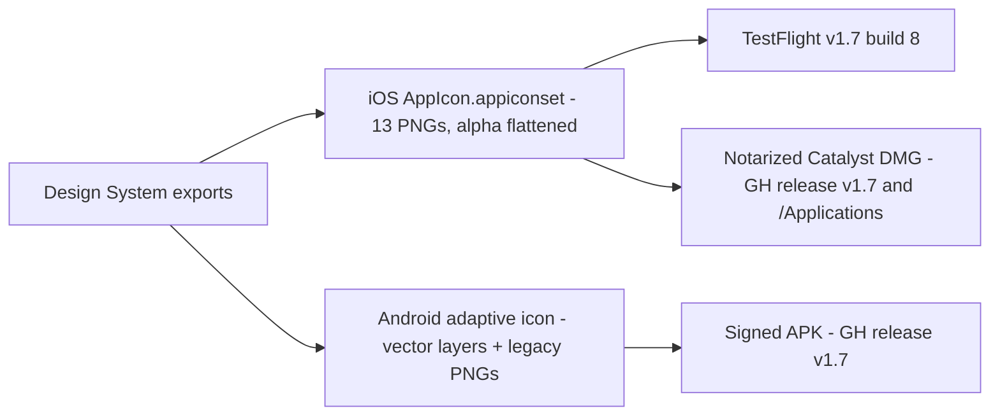

2026-07-12

# NerLan: "Tune In" app icon across iOS, macOS, and Android — v1.7 releases

NerLan got a new app icon on every platform: the "Tune In" mark — white headphones with a smile/mic curve on the orange gradient — replacing the earlier design that squeezed an "A文" badge between the earcups. The icon came from two designer zip exports (one per platform), and shipping it became the occasion to cut v1.7 everywhere: TestFlight build 8 for iOS, a notarized Mac Catalyst DMG, and a signed Android APK, the latter two published as GitHub releases.

## iOS: a drop-in set, plus alpha flattening

The iOS export was a complete `AppIcon.appiconset` whose filenames and `Contents.json` matched the existing catalog exactly, so the swap was a straight file copy. One correction was needed: every exported PNG carried an alpha channel, and App Store Connect rejects a 1024 marketing icon with alpha (ITMS-90717). All 13 PNGs were flattened before copying — visually lossless since the art is full-bleed opaque. The first export also had the mark sitting visibly off-center; a corrected second export replaced it after an on-device check.

## Android: adaptive layers, and a fixed API 24 gap

The Android export redraws both adaptive-icon vector layers: the foreground holds the new mark inset into the safe zone (and doubles as the Android 13+ themed/monochrome layer), and the background updates the gradient end stop to `#FF9E00` to match iOS. Unlike iOS, the raster fallbacks keep their alpha — round launcher icons need transparent corners.

The export also fixed a real gap: the app declares `minSdk 24`, but the repo only had `mipmap-anydpi-v26` resources, so API 24–25 devices had no launcher icon resource at all. The legacy density PNGs (48–192 px, mdpi–xxxhdpi) now cover that, and a 512 px `ic_launcher-playstore.png` sits in `app/src/main/` as the repo-only listing asset.

## Releases

Both apps were at 1.6 and move in lockstep, so everything bumped to 1.7:

- **iOS TestFlight**: `project.yml` → 1.7 (build 8), `xcodegen generate`, then `Scripts/build_testflight.sh` archived, exported with manual signing, and uploaded in one shot (no ASC 500 retry needed this time).
- **macOS**: `Scripts/release_mac.sh` produced the notarized, stapled Catalyst DMG; notarization was accepted on the first pass. The exported `.app` replaced `/Applications/NerLan.app` locally, and the DMG shipped as `NerLan-v1.7-macOS.dmg` on the `plateaukao/nerlan` v1.7 release — the first Mac release since v1.5, so its notes also carry the v1.6 changes (shadowing loop precision, transcript line spacing, the July performance and sync-safety batch).
- **Android**: signed release APK (browser.keystore injected-signing flags) attached to the `plateaukao/nerlan-android` v1.7 release. Besides the icon, v1.7 carries the Podcast dialog and the foldable language chips.
