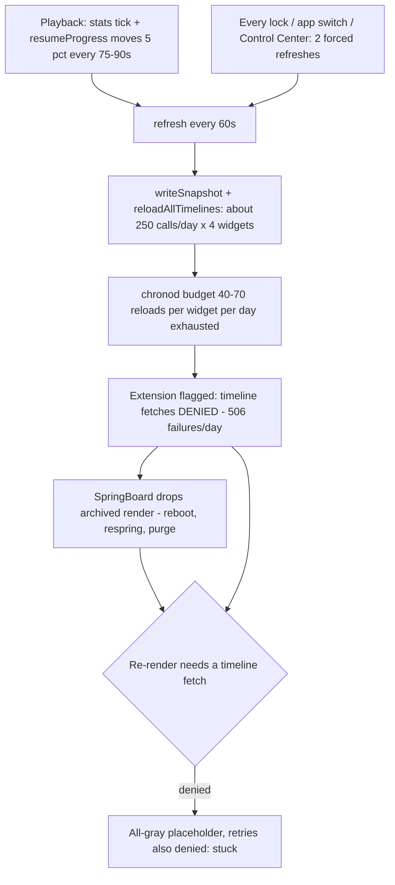
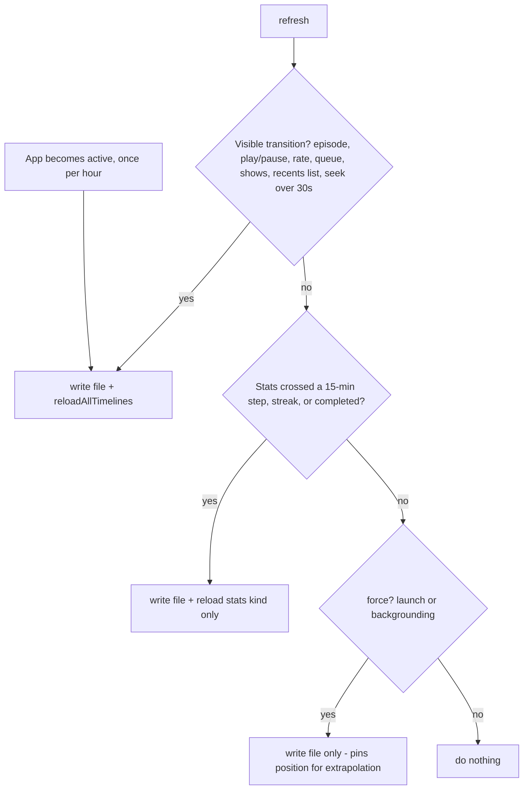

2026-08-14

# NerLan iOS: widget reload storm left widgets stuck on a gray placeholder

## What was broken

Home Screen widgets would sometimes render as bare gray placeholders — no
artwork, no text — and stay that way for hours. Opening the app didn't reliably
restore them.

The widget extension itself was healthy: the phone had no crash reports and no
jetsam (memory) kills for `com.danielkao.NerLan.Widgets`. The evidence came
from the device's daily Core Analytics report instead, and it told a different
story:

- `widgetRefresh refreshed_notDAS` (app-requested reloads): **986 in one day**,
  versus only 44 system-scheduled ones — about 250 `reloadAllTimelines()` calls
  multiplied by 4 placed widgets.
- `WidgetTimelineFailures` for the extension: **506 in one day** (218 on
  我的節目, 145 on 繼續收聽, 143 on 學習紀錄).
- chronod's limitation histogram had the widget at `limitationsValue: 2` in 22
  of 29 samples, and 77 `viewed_stale` events showed content hours old.

## Root cause

WidgetKit budgets roughly 40–70 reloads per widget per day. `WidgetBridge`
burned that budget many times over, because every snapshot write also called
`WidgetCenter.reloadAllTimelines()`, and the change signature that gated writes
was far too fine-grained:

- It included each recent show's `resumeProgress` in 5% steps — for a ~25-minute
  episode that steps every 75–90 seconds of playback — and `minutesToday / 5`,
  which steps every 5 listening minutes. The 60-second stats throttle re-ran
  `refresh()` each minute, so hours of daily listening produced a reload every
  minute or two, all day.
- Both `willResignActive` and `didEnterBackground` called `refresh(force: true)`,
  which skipped the signature gate entirely — two unconditional write+reloads on
  every lock, app switch, and Control Center pull.
- Each finished cover export added another `reloadAllTimelines()`.

Once over budget, chronod doesn't merely defer reloads — it flags the extension
and starts **denying timeline fetches outright**. That's what turns "over
budget" into "gray and stuck": when SpringBoard drops its archived render of a
widget (reboot, respring, memory purge), redrawing requires a timeline fetch;
with fetches denied there is nothing to draw, so the widget renders as the
redacted gray placeholder — and every retry is denied too, so it stays gray
until the budget window resets.

## The fix

The key observation: writing the snapshot file is free — only the
`reloadTimelines` poke spends budget, and the widgets re-read the file on their
own schedule anyway (a playing timeline refetches every 30 minutes via
`.atEnd`; everything else has an hourly `.after` backstop). The moving progress
bar never needed reloads at all, because the widget extrapolates position
locally from `position`/`positionAt`/`rate`.

So `WidgetBridge.refresh()` now decides the write and the reload separately:

- **Write** the file whenever anything moved (and unconditionally on launch and
  backgrounding, to pin an accurate position for extrapolation).
- **Reload all widgets** only on a visible transition: a different episode,
  play/pause, a rate change (it steers the extrapolation), or the queue /
  shows / recents lists changing what they display. Resume percentages and
  listening stats left this signature entirely.
- **Reload just the stats kind** on a separate, coarser stats signature:
  15-minute listening steps, streak, completed count.
- **Seeks** (a position jump over 30 seconds that extrapolation can't follow)
  still trigger a reload, but at most one per 5 minutes — widget ±15 s replay
  taps arrive in bursts, and a slightly-off bar is cosmetic.
- **Self-healing**: when the app comes to the foreground it repaints everything
  at most once an hour regardless of change. Foreground reload requests are
  honored immediately and don't count against the budget, so opening the app
  now reliably un-sticks a widget the system had given up on.

Net effect: from ~250 reload calls a day to roughly a dozen or two — well
inside budget — so chronod stops denying fetches and the gray state loses both
its trigger and its "stuck" behavior. Note that chronod's penalty state decays
over about a day, so scheduling returns to normal the day after the fixed
build starts running, not instantly.

## How it was diagnosed

Worth keeping: the whole diagnosis came from files already on the phone, pulled
with `xcrun devicectl device copy from --domain-type systemCrashLogs`. The
absence of `NerLanWidgets` crash/jetsam `.ips` files ruled out extension bugs,
and the 16 MB daily `Analytics-*.ips.ca.synced` report contained chronod's own
counters (`widgetRefresh`, `WidgetTimelineFailures_ByExtensionBundleIdentifier`,
`limitationDistribution`) that both quantified the storm and identified the
penalty mechanism.
