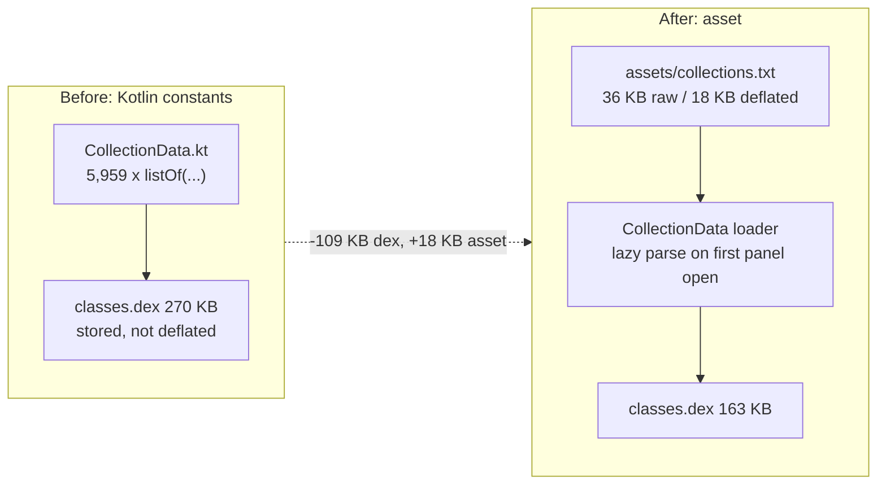

2026-08-22

# OhMyBias Android：release APK 888 → 767 KB — 面板資料改讀 asset

## 做了什麼

Release APK 從 888 KB 減到 767 KB（−121 KB，−13.7%），三項改動：

| 改動 | 省下 | 機制 |
|---|---|---|
| `CollectionData` 常數表 → `assets/collections.txt` | dex 270 → 163 KB，加 18 KB asset，淨省約 90 KB | 見下 |
| 刪除 `mipmap-*/ic_launcher.png` ×5 | 約 20 KB | minSdk 29 一律用 adaptive icon，點陣 fallback 從未載入 |
| `packaging.resources.excludes` 排除 `kotlin/**`、`META-INF` 版本檔 | 約 11 KB | builtins 中繼資料只有 kotlin-reflect 會讀，本專案無反射 |

## 為什麼 dex 裡有 110 KB 是符號表

先量再動：解開 release APK 列大小，dex 佔 270 KB（31%），資料 bin 佔 58% 且已 deflate、
格式與 iOS 共用，不值得動。dex 裡 string table 有 7,434 筆，其中絕大多數是
`CollectionData.kt` 的符號／emoji／顏文字——5,959 個字串寫成 Kotlin `listOf("😀", …)`。
每一項在 dex 裡的成本不只字串本身：一筆 string_id（4 B）＋ string_data（長度 uleb ＋ UTF-8
＋ null）＋ 建 list 的位元組碼 `const-string` / `const` / `aput-object`（約 12 B）。
把三個 list 暫時換成空表重建一次：dex 270 → 161 KB，實測 109 KB。
而 AGP 在 APK 裡把 dex 以 Stored 方式放（不壓縮），這 109 KB 是實打實的 APK 位元組；
同一批字串寫成純文字 asset 只有 36 KB，deflate 後 18 KB。

## 怎麼做

**檔案格式**（UTF-8、LF）：`#symbols` / `#emojis` / `#kaomojis` 一行標示所屬面板，
其餘每行一個分類「分類名 TAB 項目 TAB 項目 …」。解析時**不 trim**——顏文字「臉頰」分類
第一項是單一 U+200A hair space，原以為是 ASCII 空格，測試一跑才發現；這種資料正是
手寫轉檔容易弄丟的東西。

**轉檔不用 regex 解析 Kotlin 原始碼**：原檔有 `\\`、`\"`、`${'$'}` 這些跳脫，
emoji 裡還有 ZWJ 序列（🙂‍↕️）。寫一支用完即丟的 JVM 測試，直接 `import CollectionData`
把三個 list 依上述格式寫出，跳脫與組合字元由 Kotlin 編譯器處理，零風險；
轉完刪掉測試。留下的 `CollectionDataTest` 直接讀 `src/main/assets/collections.txt`
驗證 51/13/16 段、5,959 筆，並抽查反斜線、雙引號、錢號、ZWJ emoji、hair space。

**載入器**：`CollectionData` 仍是 object、`symbols`/`emojis`/`kaomojis` 三個屬性簽名不變，
`KeyboardView` 零改動。`OhMyBiasApp.onCreate` 呼叫 `CollectionData.install(assets)` 只存
AssetManager，實際讀檔在 `by lazy` 裡等第一次開面板——和原本 object 的 class-init 時機相同。
`parse(InputStream)` 獨立出來讓 JVM 測試不需要 AssetManager。

**舊版啟動圖示**：`shrinkResources` 拿不掉它們，因為 manifest 的 `@mipmap/ic_launcher`
是按名稱引用，所有密度變體都算「有用到」；但 API ≥ 26 時 `mipmap-anydpi-v26/ic_launcher.xml`
永遠優先，minSdk 29 之下五張 PNG 是死資源。`ic_launcher_foreground.png` 仍被 adaptive icon 引用，保留。

## 沒做的與後續選項

- `t2s.json`/`s2t.json`（32 KB）可改走 ICU `Transliterator`（`ClipboardProcessor` 已在用），
  但 ICU 的單字簡繁對應與現有 JSON 有差，會影響 `CandidateRanker` 的簡繁過濾；要先 diff 再決定。
- 資料 bin（58%）只剩產品面修剪（詞長／詞頻門檻）一途，格式與 iOS 共用不動。
- 安裝後 assets 會複製到 `filesDir/shared/` 再 mmap，裝置上存兩份；若在意安裝體積可改
  `noCompress` ＋ 直接從 APK 的 `AssetFileDescriptor` offset/length mmap，代價是 APK 檔變大。

驗證：41 個 JVM 測試全過；`Pixel_7_API_34` 模擬器裝 debug 版，符號面板點 `@` 正常上屏、
emoji 面板各分類正常顯示。
