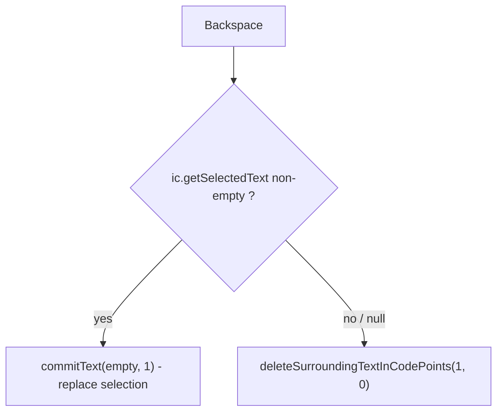

2026-08-23

# OhMyBias Android：Backspace 對選取範圍無效

## 什麼壞了

使用者把輸入框內容全選後按鍵盤的 ⌫，文字原封不動；部分選取時更怪 —— 反白的字留著，
反白**前面**那個字被刪掉。

## 根本原因

`OhMyBiasImeService.deleteBackward()` 只做一件事：`ic.deleteSurroundingTextInCodePoints(1, 0)`。
這個 API 的語意是「刪除游標（或選取範圍）**之前** n 個 code point」，選取內容本身永遠
不在它的作用範圍內。全選時選取起點在 0，前面沒有字，整個呼叫就是 no-op。

所有刪除路徑最後都匯到這裡：英文模式 `handleBackspaceKey` 直接呼叫；米模式沒組字時
`engine.handleBackspace()` → `engineDidDeleteBack()` → `deleteBackward()`；長按連刪的
Runnable 也是每 50ms 送一次同樣的 `KeyAction.Backspace`。所以不管哪種模式、點按或連刪，
選取範圍都碰不到。

iOS 版不會有這個問題不是因為邏輯不同，而是 `textDocumentProxy.deleteBackward()` 本身
就會先吃掉選取範圍 —— Android 的 `InputConnection` 沒有對應的一站式 API，移植時沿用
「刪一個 code point」的語意就漏了選取這個情況。

## 怎麼修

先 `getSelectedText(0)`，有內容就 `commitText("", 1)` 用空字串把選取範圍換掉 ——
這是系統鍵盤（LatinIME）處理選取刪除的做法，不依賴 `sendKeyEvent`，在 WebView／Compose
欄位也成立。`getSelectedText` 在部分編輯器會回 `null`，視同沒有選取，退回原本的逐字刪除，
行為與修正前完全一致。

## 驗證

API 28 模擬器、走真實 IME：英文模式打 `abc` → 長按全選 → ⌫ 一次清空；切回米模式再做一次
部分選取 → ⌫ 同樣只刪反白內容。
