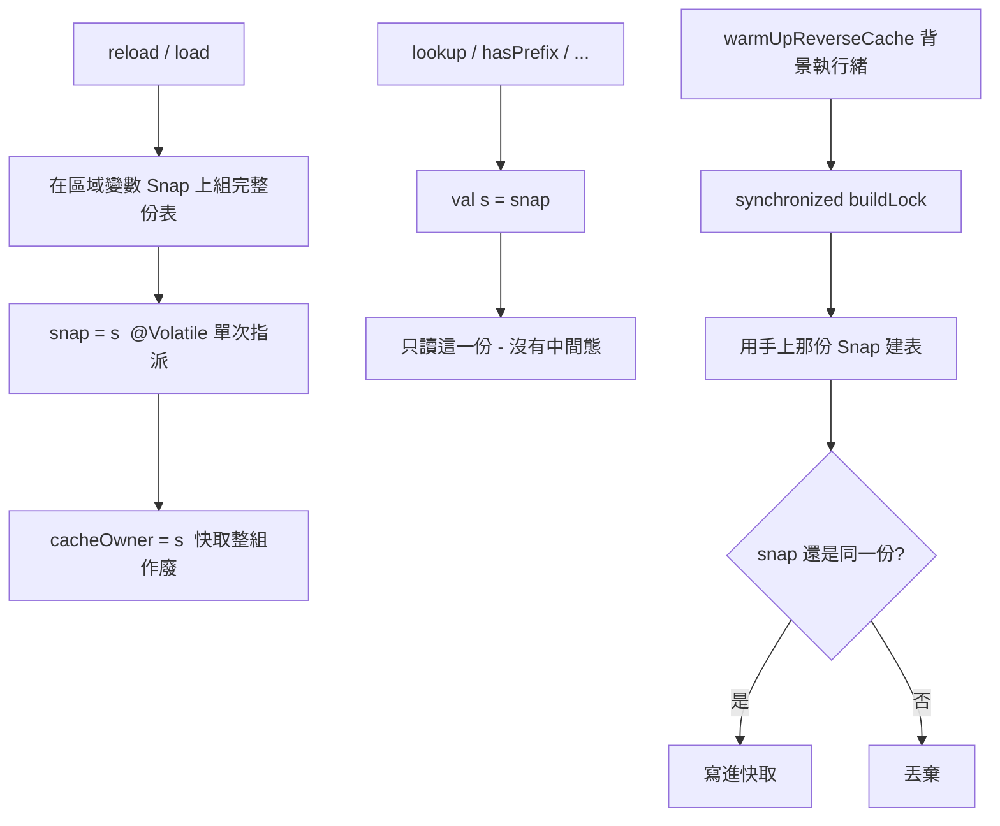

2026-08-21

# Android 版 CINTable 的同一條競態 — 預熱執行緒 vs. 主執行緒重載

macOS 版查出「切輸入法偶爾靜默失敗」是 `CINTable` 無鎖競態寫壞 heap
（見 `ohmybias-cintable-race-switch-fail.md`）。同一份字表在三個平台各有一份實作，
所以把另外兩個也查了一遍：iOS 沒事，Android 有同樣的病、症狀不同。

## iOS 為什麼沒事

`CINTable` 只有主執行緒碰得到。`KeyboardViewController` 那幾個 `releaseOptionalCaches()`
呼叫全在 UIKit callback 上（`viewWillDisappear`、`didReceiveMemoryWarning`、面板的
`onPanelMemoryRelief`），而 `FreqTracker.bgQueue` 與 `RecentEmojis.writeQueue` 是各自
獨立的 SQLite／檔案佇列，不碰字表。沒有第二條執行緒就沒有競態，維持原樣不動。

## Android 壞在哪

`OhMyBiasImeService` 有兩處會在主執行緒重載字表，兩處都緊接著再開一條預熱執行緒：

- `onCreate()` → `engine.loadTable()` 然後 `warmUpReverseCache()`
- `onStartInputView()` 偵測到 `CINTable.generation` 變了（設定頁匯入了新表）→ 同樣兩步

Android 版看起來已經防過了 —— 有 `@Volatile`、有 `cacheLock`、有 `loadGeneration`
確認「算完之後字表沒被換掉才發佈」。但那把鎖**只罩住建表那一段，罩不到載入端**：

```kotlin
fun reload() {
    loadGeneration += 1
    binData = null; entryCount = 0; overlay = HashMap()   // <- 就地清空，沒有 cacheLock
    ...
    loadExtras()                                          // <- 再一筆一筆填回 overlay
}
```

前一輪還沒跑完的 `warmUpReverseCache` 執行緒此刻正握著 `cacheLock` 走同一批欄位：

- 讀到 `binData` 還在、`entryCount` 已歸零 → 反查表建成空的
- 讀到位移是新表的、buffer 是舊表的 → 字根提示給錯字，`readChars` 可能越界
- `overlay` 邊填邊走 → `ConcurrentModificationException`

JVM 是 managed memory，不會像 macOS 那樣壞掉 malloc 的 free list 而 SIGTRAP，
但錯字與例外都是真的。

## 改法

比照 macOS：字表狀態全收進私有的 `Snap` 類別，載入端在區域變數上組好一整份才發佈
（`@Volatile` 單次指派），讀取端一開始就把 `snap` 抓成區域變數、之後只讀那一份。
所有二進位讀取與查詢方法（`readCode`、`binSearch`、`lookup`、`wildcardLookup`⋯）
都搬進 `Snap`，成為只讀不可變資料的純函式，任何執行緒呼叫都安全。

快取不再用整數世代，改成以「當時那份 `Snap` 的參考」認親（`cacheOwner === snap`）：
字表換掉就整組作廢，慢一步算完的舊結果寫進的是已經被丟掉的那組，不會被讀到。



一個 Android 特有的取捨：建表**不能**握著發佈端也要用的鎖。若 `publish()` 和建表共用
一把鎖，主執行緒的 `reload()` 就會卡在背景預熱後面，而 IME 主執行緒卡住就是 ANR。
所以 `buildLock` 只序列化「建表」這件事，`publish()` 完全不碰它 —— 靠的是 `Snap`
不可變、指派是單一 `@Volatile` 寫入，本來就不需要互斥。

## 沒有跟著 macOS 做的事

macOS 那邊順手把「切輸入法就在背景預建反查表」整個拿掉了 —— 反查表只有注音／同音、
簡碼／長碼、字碼提示會用到，一般打字完全不碰，卻是 peak footprint 207 MB 的來源。

Android 的預熱保留。兩邊情況不一樣：Android 是 `onCreate` 開一條
`THREAD_PRIORITY_BACKGROUND` 的執行緒，本來就不與主執行緒搶，也不再與重載共用鎖；
而 macOS 那份是每次從別的輸入法切進來就重來一次，且正好與主執行緒的重載對撞。
Android 版要不要也改成 lazy 是獨立的記憶體議題，留待實測 IME process 的 footprint
再決定。
