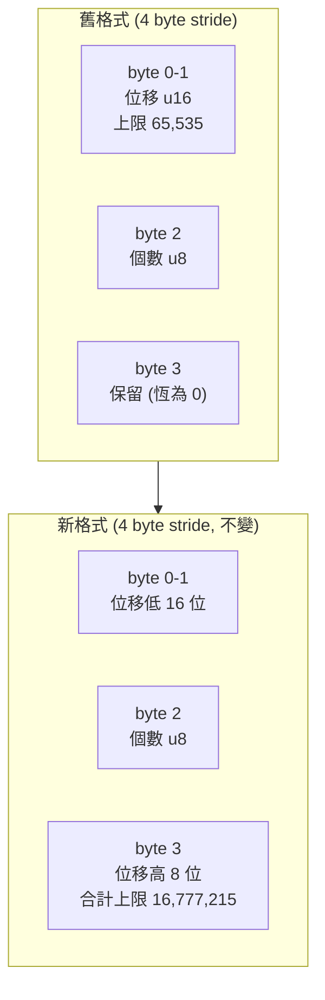
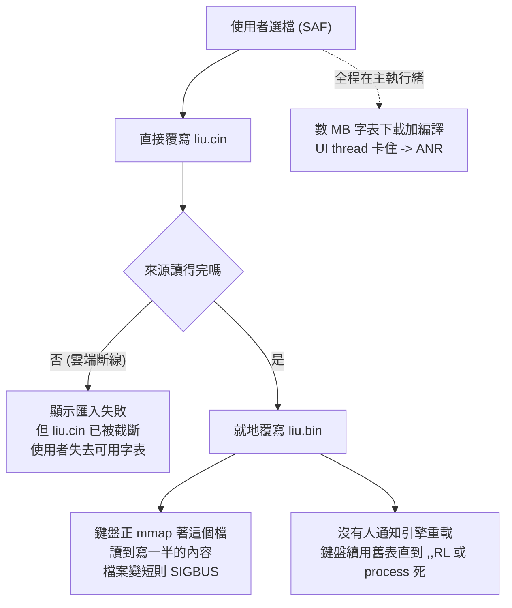
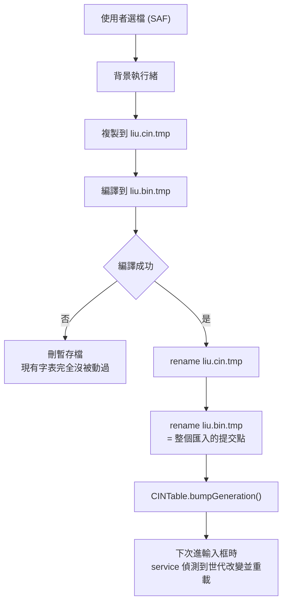

2026-08-19

# OhMyBias Android：程式碼審查十項修正

對 `app/src/main/java` 跑了一輪 `/code-review high`。8 組尋找代理產出 44 個候選，
去重後 20 個交由 8 組驗證代理 adversarial 複覈，最後 10 項判定 CONFIRMED。
本次把這 10 項全部修掉，並補上 15 項回歸測試（全專案 35 項，全綠）。

原始問題是「有沒有效能或記憶體吃太兇的地方」。結論是**記憶體沒問題**——
字表與語料全走 mmap，堆上不放大結構；真正的效能病灶是**主執行緒被擋**
（`flushAll` 最久 2 秒、匯入在 UI thread 編譯）。但同一輪審查翻出兩個更嚴重的
正確性缺陷，剛好都落在「匯入真正的嘸蝦米字表」這條主線上。

## 一、最嚴重：CINM 字碼位移只有 u16，真字表必定溢位

`liu.bin` 的 val index 是 4 byte 一筆：`u16 位移 + u8 個數 + u8 保留`。
位移指向 chars 區的第幾個 code point。問題是**真正的嘸蝦米字表 chars 區有數十萬個
code point**，遠超過 u16 的 65,535。舊碼遇到溢位是這樣處理的：

```kotlin
if (off > 0xFFFF) { writeU16(valIdx, 0xFFFF); ... continue }
```

寫進 `0xFFFF` 當哨兵，但**讀取端 `readChars` 根本沒有檢查哨兵**——它照樣拿 65535
去索引，讀回來是合法但完全不相干的字。於是：

- 字表尾端一大段（超過 65,535 之後的所有 entry）打出來都是錯字；
- 反查表、字根提示連帶被污染；
- 設定頁還是顯示「已編譯 N 個字碼」，**完全沒有任何錯誤跡象**。

而且 `6116f0d` 移除 DebugLog 時，連這條分支僅存的警告都一起拿掉了。

### 修法：把保留的第 4 byte 當高位元組（u24）



這個做法的好處是**兩個方向都不會比現況更差**：

- stride 不變、其他區段位移不變，檔案結構完全相同；
- 舊檔的第 4 byte 恆為 0，新讀取器算出的 u24 等於原本的 u16 —— 讀值完全一致；
- 新檔被舊讀取器讀，只有「舊讀取器本來就存不下」的那些 entry 會錯，
  也就是它原本就已經錯的部分。

另外把「超出 u24 上限」從靜默截斷改成**編譯失敗**——寧可讓使用者看到錯誤訊息，
也不要無聲產出一份會打出錯字的字表。

> 同一個格式缺陷原封不動存在於 `ohmybias-ios/Shared/CINCompiler.swift`
> （`valIdx.appendU16(UInt16.max)`）。這是上游 bug，不是移植錯誤，iOS 端要一併修。

### 驗證

`CINCompilerTest` 造一份 800 entry × 100 字 = 80,000 code point 的字表，
比對頭、中、尾三段的 lookup 結果。**先確認還原修正後這個測試會失敗**，才算數。
另外 `smallTableUnchanged`（存得下 u16 的小表）在修正前後都通過，證明相容性沒破。

模擬器上再做一次端對端：合成 70,002 code point 的字表，頭端探針 `aa` 打出「日」、
尾端探針 `zz` 打出「龘」——尾端正是舊格式會讀到錯字的區段。

## 二、匯入流程會毀掉現有字表，還可能 SIGBUS

`handleCinImport` 的舊流程有四個獨立問題疊在一起：



新流程改成「暫存檔 + 成功才 rename」：



rename 是同檔案系統內的原子操作，而且**不影響鍵盤已經 mmap 的舊 inode**——
舊檔活到鍵盤重載為止，既不會讀到寫一半的內容，檔案變短也不會 SIGBUS。

`CINTable.generation` 沿用 `SkinSettings.generation` 既有的做法：設定頁與鍵盤同
process，service 在 `onStartInputView` 比對世代，變了就 `loadTable()` 並重新預熱反查表。

模擬器實測：匯入一份 `aa` 對應「月」的新表後，**不重開鍵盤**直接打 `aa`，
輸出從舊表的「日」變成「月」。

## 三、跨輸入框殘留狀態

引擎沒有任何生命週期掛勾會清組字狀態。在 A app 打了碼沒送出就切到 B app，
`_composing` 與 `_currentCandidates` 原封不動活著；B 的第一個空白鍵通不過
`composing.isEmpty()` 的 guard，直接走 `handleSpace()` 把**上一個 app 遺留的候選字
送進新輸入框**，還把它記成新欄位的字頻／bigram 樣本。

修法是新增 `InputEngine.resetSession()`，由 `onFinishInput()` 呼叫，清掉組字、候選、
所有查詢模式旗標與語境（`_lastCommitted` / `_recentCommitted`）；中英模式與已學到的
字頻不動。實測：在設定頁測試框留一個未送出的碼，切到系統設定搜尋框按空白 ——
輸出空白，不再吐出殘留候選。

## 四、其餘七項

| 缺陷 | 根因 | 修法 |
|---|---|---|
| autoCommit 後下一個字的空白鍵送不出候選（要按兩下） | `_eatNextSpace` 檢查排在「組字為空」guard 之後，永遠吃不到該吃的那下，反而吃掉下一次的送出空白 | 移到 service 的組字為空路徑（`consumeEatNextSpace()`），`handleLetter` 清旗標 |
| 聯想鏈走到底後候選列點了沒反應 | 聯想顯示中 `engineDidUpdateCandidates` 一律 return，吞掉送字時的清空回呼 | 清空時收掉聯想列；隨即有新聯想會在同一呼叫堆疊補上，畫面不閃 |
| 注音模式下符號／emoji／常用語／123 面板打不開 | 注音是黏著旗標，`handleKey` 結尾無條件 `syncPageWithEngine()` 每次都把面板搶回注音頁 | 工具列面板開啟時（`isShowingToolbarPage`）跳過同步 |
| 匯入 .cskin 後工具列停在舊皮膚 | `CandidateBar` 只在建構時讀 `toolbarButtons` 與配色，沒有重建入口，而 `KeyboardView` 會重建 | 皮膚世代變動時重建整個 input view |
| 游標亂跳、emoji 被切壞、成對標點游標位置錯 | `moveCursor` 把視窗座標的 `selectionStart` 當絕對位置、以 UTF-16 為單位、取不到 ExtractedText 就 return | `startOffset` + code point 位移；取不到則退回送方向鍵 |
| 收鍵盤時前景 app 凍住最久 2 秒 | `flushAll` 在主執行緒 `.get(2s)`，佇列前面可能排著 decayDb 整表掃描 | 排入即返回（executor 非 daemon，佇列照跑完）；查詢路徑的 `awaitLoaded` 一併移除 |
| 多字／非 BMP 的固定排序重開就失效 | `pinned.chars` 無分隔串接，讀回來逐 UTF-16 unit 切 | 改用 U+001F 分隔（新格式以分隔符開頭）；舊資料仍以 code point 切正確讀出 |

另外順手補了一個審查時被列為「已驗證但因篇幅裁掉」的競態：反查表背景預熱走遍整表
要一段時間，期間字表若被換掉（匯入、`,,RL`），舊表算出的結果會被發佈上去，之後一直
給錯的字根提示。改為發佈前確認載入世代未變——這次的「匯入即重載」讓這個窗口變得
比以前容易踩到，所以一併處理。

## 驗證方式

- **單元測試**：新增 15 項，全專案 35 項全綠。u16 溢位與吃空白兩項特地確認
  「還原修正即失敗」，避免寫出永遠會過的測試。
- **模擬器實機操作**（全程用軟鍵盤點按，不用 `adb shell input text`）：
  合成 70,002 code point 字表的頭尾探針、SAF 匯入後熱重載、跨 app 切換的空白鍵、
  聯想鏈走到底、注音模式開 emoji 面板、皮膚熱套用（工具列與底列 123 鍵同步變化）、
  空白鍵拖曳游標跨越 emoji 不切壞 surrogate pair。

## 後續

- iOS 端 `Shared/CINCompiler.swift` 有同一個 u16 缺陷，要移植這次的 u24 修正。
- 工具列的 Material Symbols 圖示是 `98ff381` 才加的，尚未發版；0.3.1／0.3.2 都還是
  文字字樣。手機上看到文字工具列是版本落後，不是 bug。
