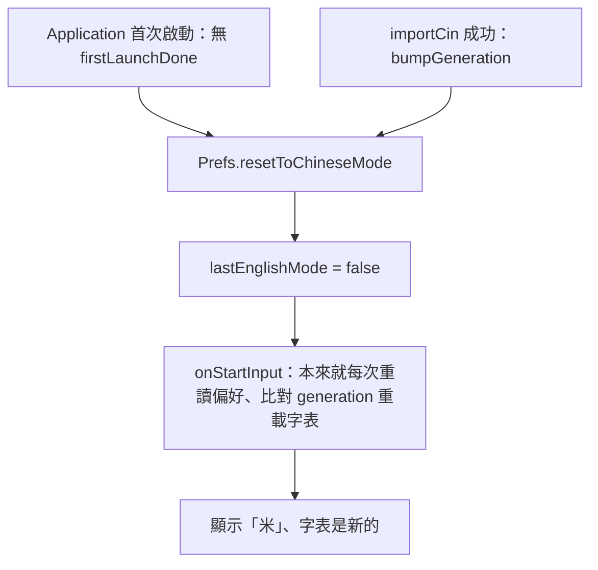

2026-09-03

# OhMyBias Android：首次啟動／匯入 liu.cin 後預設輸入法回到嘸蝦米（米）

iOS 版同日修的同一個 bug（見 `ohmybias-ios-default-chinese-mode-on-install-import.md`），
Android 版檢查後確認有一樣的問題，這裡只記 Android 不同的部分。

## 壞掉的行為與根因

`Prefs.lastEnglishMode` 預設 false，只有工具列中英切換會寫它，從來沒有地方歸零。
新裝的鍵盤還沒 liu.cin、中文打不出來，使用者切到英文先用，這個「沒字表時的權宜狀態」
就被當成偏好永久保留 — 匯入字表之後鍵盤仍然是英文。

## Android 跟 iOS 差在哪

iOS 那次修了五個檔，Android 只要三個歸零點，因為 Android 的 IME 與設定頁在同一個 process，
兩件 iOS 需要額外處理的事本來就有：

- `onStartInput` 每次進輸入框都重讀 `Prefs.lastEnglishMode`（iOS 只在 `viewDidLoad` 讀一次，
  這次才補上 `viewWillAppear` 重套）。
- 匯入成功後 `CINTable.bumpGeneration()`，`onStartInput` 比對 generation 就重載字表
  （iOS 這次才加 `reloadIfBinChanged()` 比對 liu.bin mtime）。

所以 Android 只加：

- `Prefs.resetToChineseMode()` 與 `firstLaunchDone` 標記。
- `OhMyBiasApp.onCreate`：`Prefs.install` 之後，沒有標記就歸零並立標記
  （SharedPreferences 會跟著 Android 自動備份還原，舊裝置的英文狀態不該變成新裝置的預設）。
- `MainActivity.importCin`：`bumpGeneration()` 之後歸零。下次進輸入框 `onStartInput` 就套到。

## 驗證

- `./gradlew assembleDebug testDebugUnitTest`：52 個 JVM 測試過。
- Pixel API 34 模擬器：乾淨安裝後、首次啟動前用 `run-as` 寫入 `lastEnglishMode=true` 的
  `shared_prefs/OhMyBiasPrefs.xml`，啟動 MainActivity 後讀回 `false` 且 `firstLaunchDone=true`。
- 完整流程：Chrome 文字欄叫出鍵盤（預設「米」）→ 點「米」切英文（偏好變 true）→ 設定頁匯入
  Download/liu.cin（偏好變 false、liu.bin 就位）→ 回 Chrome：同一個 process（pid 不變）顯示「米」，
  打 `a` 出候選「對」。

## 模擬器測試的坑

- SAF 檔案選擇器在搜尋框有焦點、鍵盤蓋著時，sim-use 的 tap 點不到列表項；先 `input keyevent 4`
  收鍵盤再 `adb shell input tap` 列的中心才有反應。
- `adb push` 保留來源 mtime，剛推進 Download 的檔案在選擇器裡不會排在最上面 — 用選擇器的搜尋找。
- 既有安裝升上這個 build 會被歸零一次成中文（之前沒有 `firstLaunchDone` 標記），與 iOS 同。
