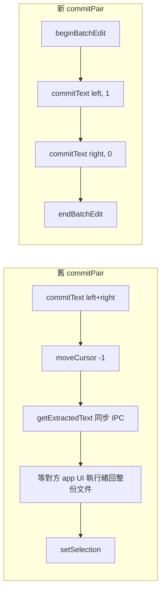

2026-08-22

# 電子紙手機上的按鍵剖析：兩處主執行緒開銷，與「不順」的真正來源

使用者在 HNR320T（海信電子紙手機，Android 10，40 fps 面板）上覺得送字、候選列切換
「不太順」。這次用探針版 release（同 keystore 蓋裝）在跨 process 的欄位實測，找到兩處
可修的主執行緒開銷並修掉；更重要的是量出了「不順」的本體不在 CPU，而在電子紙每幀一次
的面板刷新。

## 量測方法

- `handleKey` / `selectCandidate` 外圍包 `System.nanoTime()`，`CandidateBar.setCandidates`
  與引擎的字頻紀錄、聯想查詢各自累計進一個暫時的 `PerfProbe` object，以 `Log.w`
  輸出（release 有 R8，`Log.d` 會被壓掉、類名也被混淆 — 看 tag 不看類名）。
- `dumpsys gfxinfo <pkg> framestats` 看每幀各階段（input / layout / draw / issueDraw /
  swap）；`dumpsys gfxinfo <pkg>` 看 jank 百分比。
- 真手指要用 `input swipe x y x y 120`（按住 120 ms）模擬；`input tap` 的 down/up
  同一瞬間，按下與放開的兩次重繪會被合進同一幀，幀數會少算一半。
- 模擬器數字不可信：arm64 模擬器每幀被主機端 GPU swap 釘在 17 ms，看起來 42% jank，
  其實 UI thread 只有 0.3–5 ms。
- 在同 process 的設定頁測試欄位測不到 binder 成本（`getExtractedText` 只要 50–100 µs）；
  要測 IPC 得用別的 app 的欄位（這次用 Settings 搜尋欄）。
- 這支手機 API 29，sim-use 的 device bridge APK 是 minSdk 30，退回 adb + screencap。

## 數據（手機，聯想詞開啟）

| 路徑 | 主執行緒 | 其中聯想 | 其中候選列 |
|---|---|---|---|
| 字母鍵 | 1.0–4.5 ms | — | 0.2–2.2 ms |
| 空白送字 → 出 5 個聯想 | 2.8–7 ms，**冷啟動首次 12 ms** | 0.9–3.6 ms | 0.5–2.2 ms，**首次 6.6 ms** |
| 點聯想詞 → 下一輪聯想 | 2.6–3.0 ms | 0.7–1.1 ms | 1.0–1.4 ms |
| 成對標點（舊 `moveCursor`） | 3–4.3 ms | — | **`getExtractedText` 阻塞 2–3.3 ms** |

每幀：UI thread < 1.3 ms、issueDraw 1.3–8.9 ms、總計 6–26 ms，jank 0–1 幀。40 fps
的預算是 25 ms，幾乎全在內 — 同步處理、候選比對、按下重繪都不是瓶頸。

## 修了什麼

**成對標點零往返。** `commitText(text, newCursorPosition)` 的 `newCursorPosition <= 0`
是相對插入文字起點的位置，`0` 正好把游標放在右半之前 = 兩半中間。全程單向 binder，
對方 app 忙不忙、文件多長都與 IME 主執行緒無關。`moveCursor` 保留給游標左右鍵。

**候選列預建 11 格。** 聯想列最多 ✕ + 10 個詞；原本第一次送字才 `new TextView` × 11，
之後才重用。改在 `CandidateBar` 建構時 `obtainStackView` 預建並 `GONE`，冷啟動首次
送字 12 ms → 4.9 ms。LCD 上無感，電子紙上那一次停頓是看得見的。

## 「不順」的真正來源：幀數 = 面板刷新次數

按住 120 ms 再放開 × 12 鍵 → 29–31 幀，**每鍵約 2.4 幀**：

1. 按下 → 鍵帽 highlight 重繪（一幀）
2. 放開 → 取消 highlight ＋ 送字 ＋ 候選列切換（一幀）
3. 對方 app 的文字欄更新（對方的 surface）

LCD 上兩幀無感；電子紙每幀就是一次局部刷新（百餘 ms、會排隊），連打時面板追不上。
只要按住時要亮、放開時要送字，兩幀就是下限 — 使用者明確要保留 highlight 好知道按到
哪顆，所以這條路不動。可動的是每次刷新對面板的成本（純黑白避開 16 階波形、
去反鋸齒灰階像素），這次沒做，留待使用者決定。

工具列顯示／隱藏用的是 `GONE`（會觸發 layout pass）而非 `INVISIBLE`；實測 layout
0.1–0.2 ms，而且兩者幀數相同，對電子紙沒有差別。

## 探針用完要拆乾淨

`PerfProbe` object 與 `handleKeyImpl` 拆分全是暫時的，量完以 scratchpad 備份還原，
`grep -rl PerfProbe app/src/main/java` 確認為空後才建 clean release 裝回手機。
