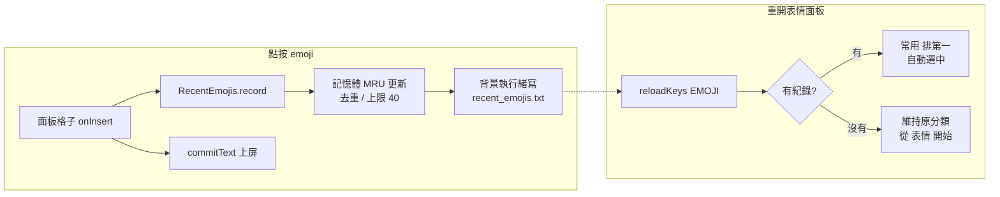

2026-08-15

# 表情面板「常用」分類 — 最近使用的 emoji

## 這是什麼

OhMyBias 米 Android 的表情面板新增「常用」分類，排在「表情」之前：記錄使用者最近點過的
emoji（MRU 順序、去重、上限 40 個），下次打開面板時第一個分類就是自己常用的表情。
沒有任何紀錄時不顯示（第一次用維持原樣，從「表情」開始）。

`CollectionData.kt` 的註解原本寫著：「常用」分類在 Hamster 為動態使用紀錄，不移植。
這次把這個概念補上 — 但只在表情面板，符號／顏文字／常用語面板不記錄也不顯示。

## 怎麼做的

新增 `keyboard/RecentEmojis.kt` singleton：

- 存檔格式與 `UserPhrases` 同一套路 — `filesDir/shared/recent_emojis.txt` 純文字一行一個，
  最新在前。
- **點按路徑零 I/O**：`record()` 先改記憶體（移到最前、去重、砍尾），寫檔丟到單執行緒
  background executor。這是延續前一個 perf commit（鍵擊路徑零 SQLite）的原則。
- 放 `keyboard/` 不放 `shared/`：iOS 版沒有對應物，`shared/` 必須與 iOS `Shared/` 一對一，
  所以這是 Android 專屬的 UI 層功能。

`KeyboardView.reloadKeys()` 的 EMOJI 分支在靜態分類前面接上動態分類；`installPanel` 加了
`recordRecent` 旗標，只有表情面板的點按會記錄。面板每次開啟都整個重建，所以「常用」
內容只在重開時刷新 — 不會在使用者點按當下重排、把格子從手指底下抽走。

## 測試與驗證

- JVM 測試 `RecentEmojisTest`：MRU 排序／去重／上限、重啟後從檔案還原。測試 hook
  （`resetForTest`／`awaitWrites`）處理了背景寫檔的時序 — 第一版測試因為兩個測試共用
  singleton 檔案而互相污染，`resetForTest` 改為先 drain executor 再刪檔。
- 模擬器實測：空狀態無「常用」→ 點 😂 😀 → 重開面板出現「常用」且順序最新在前，
  裝置上 `recent_emojis.txt` 內容正確。

## 取捨

IME process 被強殺時，還在佇列裡的最後一筆寫檔可能遺失 — 換取點按路徑完全不碰 I/O，
對「常用表情紀錄」這種資料可接受。
