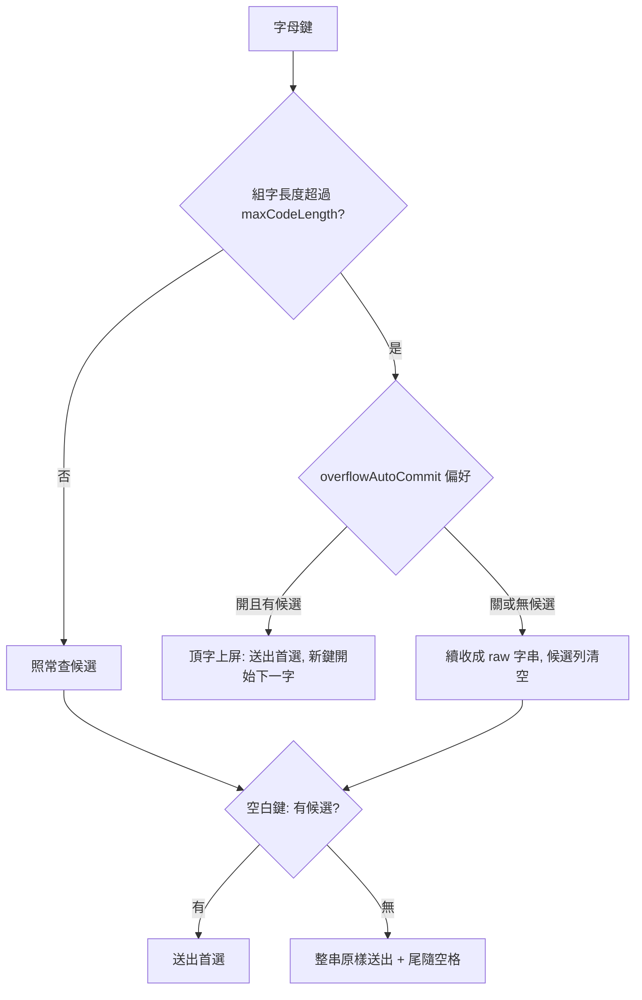

2026-08-16

# ohmybias-android：英文直通 — 中文模式直接打英文，空白鍵原樣送出＋尾隨空格

## 這是什麼

自 iOS 版移植（`3ea816c` + `c181f38`）：在中文（嘸蝦米）模式下直接打英文單字，
不必先切到英文模式。打的字串查無候選時引擎不再清空 composing，讓使用者一路
打完整個英文字；按空白鍵把整串**原樣送出，並附上尾隨空格**（空白鍵本身也上屏，
和英文模式打字的手感一致），不記入字頻。

Android 版原本完全沒有這個功能：查無候選就清空、超過 maxCodeLength 強制重置，
打英文只能靠 Enter 送出 raw 字串或切換到英文模式。

## 滿碼頂字上屏為何變成偏好（預設關）

iOS 實測發現：打 `weekly` 時第五鍵送出「斷」— 因為 `week` 恰好是有效字根
（首選＝斷），觸發了原本的「滿碼頂字上屏」（滿碼且有候選時，下一鍵自動送出
首選、開始下一字）。引擎無法分辨「英文字的第五個字母」和「下一個中文字的第
一碼」，只能交給使用者選：

- 新偏好 `overflowAutoCommit`「滿碼頂字上屏」，設定頁輸入區、**預設關** —
  關閉時第五鍵起續打成 raw 字串、候選列清空，空白鍵整串原樣送出；
- 開啟時恢復滿碼自動送出首選的連打行為（代價是 weekly 這類前四碼恰為
  字根的英文字無法直通）。

## 其他隨行變更

- 移除連按兩次空白＝逃脫（`_lastWasEmptySpace`）— 與「無候選時空白送出
  raw 字串」直接衝突，且有 Esc／退格可用，已無必要。與 iOS 同步移除。
- 偏好佈線：`IMEPreferences` 介面 + `DefaultPreferences`（JVM 測試預設）+
  `android/Prefs.kt`（SharedPreferences）+ MainActivity 設定頁開關與說明footnote。
- 測試（移植 iOS `Tests/main.swift` 同名案例）：fixture 新增四碼字根
  `zzzz=龘`；`hello` 直通驗證含尾隨空格送出、`zzzzz` 驗證偏好開關兩種行為。

引擎層維持與 iOS `Shared/InputEngine.swift` 一對一 — 註解文字也照搬，
之後從上游同步修正時可直接比對。
