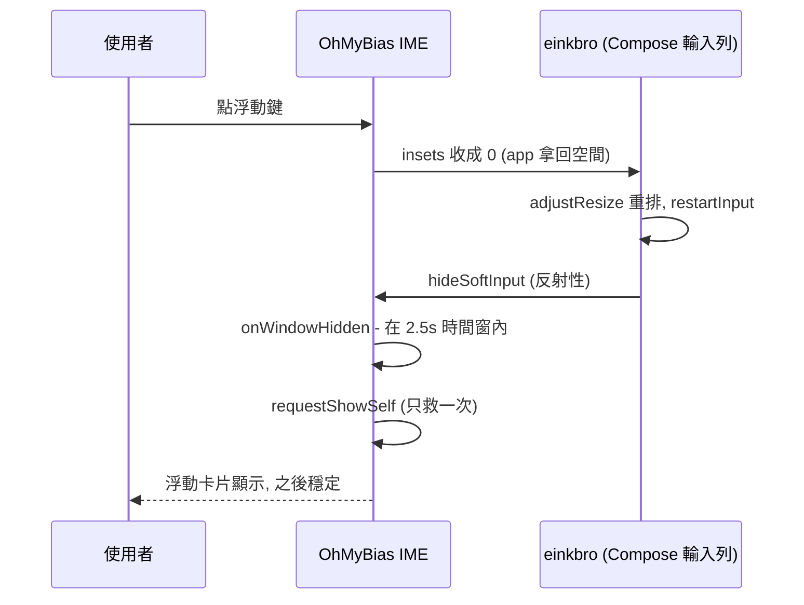

2026-08-31

# OhMyBias Android：浮動鍵盤切換被 app 反射性藏掉＋Android 10 底部白帶

兩個症狀都由使用者在 A7（HNR320T，Android 10）的 einkbro 網址輸入列回報，
直接在連著的 A7 上重現、定位、修好、驗證。

## 症狀一：點浮動鍵，鍵盤整個消失，要再點一次輸入框才出現

**重現**：einkbro 點「輸入網址」開輸入列（Compose 欄位）→ 鍵盤貼底顯示 →
點工具列浮動鍵 → `mInputShown=false`，畫面上什麼都沒有。同一台裝置在
X.com 網頁欄位（WebView）做同樣操作卻正常 — 只有 einkbro 自家的 Compose 輸入列會。

**根因**（logcat 決定性證據）：

```
InputMethodManagerService: calling uid = 10290（einkbro）… hideSoftInput
InputMethodManagerService: startInputOrWindowGainedFocus reason=APP_CALLED_RESTART_INPUT_API
                           softInputMode=STATE_ALWAYS_HIDDEN|ADJUST_RESIZE
```

不是我們沒畫出來，是**被 einkbro 藏掉的**：浮動模式把回報給 app 的鍵盤高度
從 660px 收成 0，einkbro 視窗 `adjust=resize` 整個重排，Compose 輸入列的
text input session 因此 restartInput，並反射性呼叫 `hideSoftInput`（einkbro 視窗
本來就是 `STATE_ALWAYS_HIDDEN`，鍵盤全靠明確 showSoftInput）。第二次點輸入框
時偏好已是浮動、直接以浮動樣子顯示，高度不再驟變，所以就正常了。

**修法**（IME 側，不動 einkbro — 任何有「鍵盤高度=0 ⇒ 鍵盤關了」heuristic 的
app 都可能這樣反應）：切換浮動時記 `floatingToggleGuardUntil = now + 2.5s`；
`onWindowHidden()` 落在時間窗內就 `requestShowSelf(0)` 重新顯示一次。
一次性 — 猜錯（app 真的要藏）也只多顯示一次，不會對打。



## 症狀二：浮動時螢幕底部一條不透明白帶蓋住 app

第一版修法（IME 視窗背景設透明）**沒有用** — 使用者回報白帶仍在。在 A7 上把 IME
decor 樹整棵傾印出來（TEMP log）才找到真兇，而且有**兩個**：

1. **DecorView 的導覽列 scrim**：decor 直屬子視圖裡有一條
   `View y=1747..1800 h=53 bg=#FFFFFFFF` — DecorView 用裸 View 畫
   navigationBarColor 的底。只設 `navigationBarColor = TRANSPARENT` 會被框架在
   顯示流程蓋回白色，於是三管齊下（`suppressNavScrim`，onCreate 與每次
   onWindowShown＋post 再跑一次）：透明色、清 `FLAG_DRAWS_SYSTEM_BAR_BACKGROUNDS`、
   **把 decor 直屬裸 View 的 alpha 歸零** — `updateColorViews` 重畫時會重設底色與
   visibility，但不碰 alpha，歸零後怎麼重畫都看不見。

2. **回報的 insets 短了 53px**：`onComputeInsets` 原以「根視圖底」
   （`loc[1] + root.height`）當內容起點，但 Android 10 的 IME content frame 在底部
   保留導覽列高度（A7 為 53px），根視圖到不了視窗底 — `mGivenContentInsets` 停在
   1747 而非 1800，所有 app 永遠留著 53px 底部 inset：`adjustResize` 的 app
   （einkbro、設定頁自己）就在畫面底部露出一條**自家底色**的空白帶 — scrim 排除後
   剩下的白就是它。改用 **decor 高度**（視窗真正的底）當內容起點；實體鍵盤覆蓋模式
   「面板收起」分支同修。

一條白帶、兩層成因疊在同個位置：scrim 蓋在上面、inset 讓 app 自己也讓出同一塊。
只修任何一個都看不出差別，這也是第一版誤判「已修好」的原因 — 當時的驗證場景
（einkbro 輸入列）底部本來就是 app 的白色背景，量不出來。

## 驗證

A7 實機：einkbro 輸入列 → 貼底 → 點浮動鍵 → `mInputShown` 保持 true、浮動卡片直接
出現；`mGivenContentInsets` = 視窗全高、einkbro `visible frame` 回到滿版 1800、
網址列與歷史縮圖延伸到螢幕最底（截圖量測 y1747–1800 有內容），白帶消失。
驗證場景要挑「底部有深色 app 內容」的畫面 — 白 app 配白帶量不出來，
這次靠這個教訓多繞了三輪。模擬器（API 36）迴歸不受影響。
