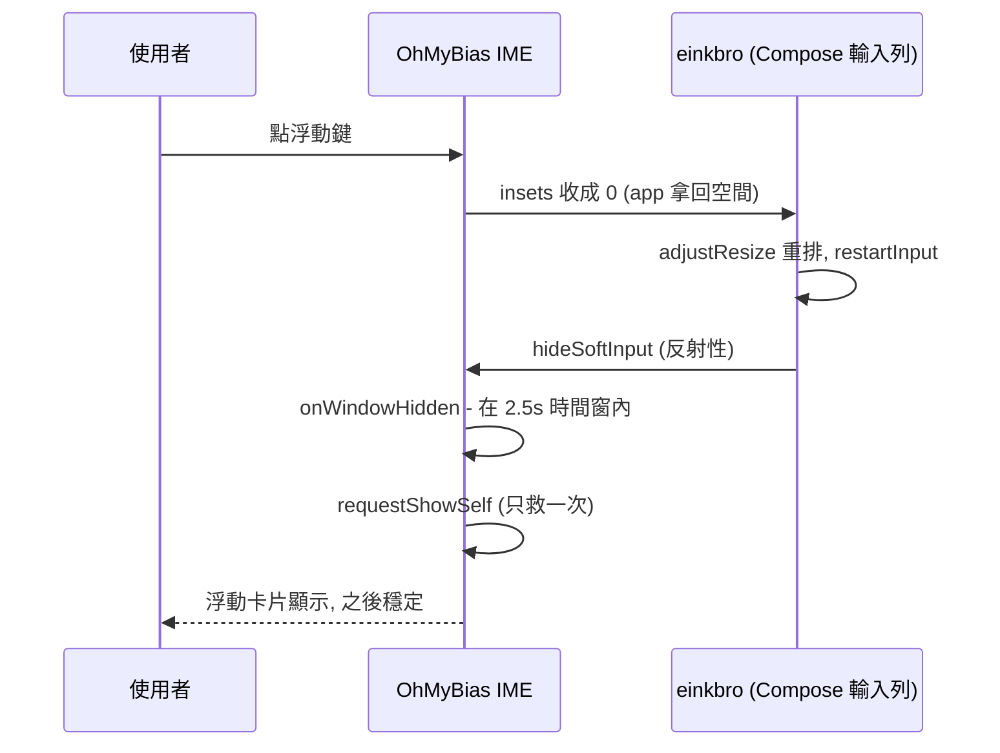

2026-08-31

# OhMyBias Android：浮動鍵盤切換被 app 反射性藏掉＋Android 10 底部白帶

兩個症狀都由使用者在 A7（HNR320T，Android 10）的 einkbro 網址輸入列回報，
直接在連著的 A7 上重現、定位、修好、驗證。

## 症狀一：點浮動鍵，鍵盤整個消失，要再點一次輸入框才出現

**重現**：einkbro 點「輸入網址」開輸入列（Compose 欄位）→ 鍵盤貼底顯示 →
點工具列浮動鍵 → `mInputShown=false`，畫面上什麼都沒有。同一台裝置在
X.com 網頁欄位（WebView）做同樣操作卻正常 — 只有 einkbro 自家的 Compose 輸入列會。

**根因**（logcat 決定性證據）：

```
InputMethodManagerService: calling uid = 10290（einkbro）… hideSoftInput
InputMethodManagerService: startInputOrWindowGainedFocus reason=APP_CALLED_RESTART_INPUT_API
                           softInputMode=STATE_ALWAYS_HIDDEN|ADJUST_RESIZE
```

不是我們沒畫出來，是**被 einkbro 藏掉的**：浮動模式把回報給 app 的鍵盤高度
從 660px 收成 0，einkbro 視窗 `adjust=resize` 整個重排，Compose 輸入列的
text input session 因此 restartInput，並反射性呼叫 `hideSoftInput`（einkbro 視窗
本來就是 `STATE_ALWAYS_HIDDEN`，鍵盤全靠明確 showSoftInput）。第二次點輸入框
時偏好已是浮動、直接以浮動樣子顯示，高度不再驟變，所以就正常了。

**修法**（IME 側，不動 einkbro — 任何有「鍵盤高度=0 ⇒ 鍵盤關了」heuristic 的
app 都可能這樣反應）：切換浮動時記 `floatingToggleGuardUntil = now + 2.5s`；
`onWindowHidden()` 落在時間窗內就 `requestShowSelf(0)` 重新顯示一次。
一次性 — 猜錯（app 真的要藏）也只多顯示一次，不會對打。



## 症狀二：浮動時螢幕底部一條不透明白帶蓋住 app

**證據鏈**：浮動時 IME 視窗 `Requested h=1800`，但
`mGivenContentInsets=[0,1747]` — 根視圖只到 y=1747，不是 1800。Android 10 的
IME 視窗 decor 在根視圖沒蓋到的底部 53px 自己畫了不透明底色；截圖量測該帶
純白（mean 255），把 einkbro 底部工具列的下半截整條蓋掉。API 36 模擬器上
同一套碼沒這條帶（新版 decor 不畫）。

**修法**：`onCreate` 把 IME 視窗背景明確設為透明
（`window.window?.setBackgroundDrawable(ColorDrawable(TRANSPARENT))`）。
53px 的幾何缺口仍在（decor 對舊版系統 insets 的處理），但透明後 app 內容
直接透出來，視覺上完全正常；卡片的可觸區與夾範圍本來就以實際根視圖尺寸算，
不受影響。

## 驗證

A7 實機：einkbro 輸入列 → 貼底 → 點浮動鍵 → `mInputShown` 保持 true、
浮動卡片直接出現；底部網址列文字透出、白帶消失。X.com 欄位與模擬器
（API 36）迴歸路徑不受影響。
