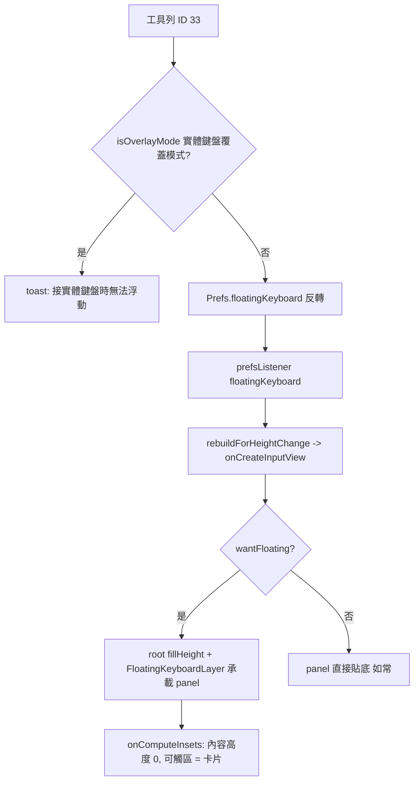

2026-08-31

# OhMyBias Android：浮動鍵盤 — 工具列「浮動鍵盤」鍵，可拖曳移動、四角縮放

## 這是什麼

工具列新增按鈕 ID 33「浮動鍵盤」（設定頁「自訂工具列」按鈕表裡也選得到）。點一下，
鍵盤從貼底變成一張浮在畫面上的卡片：候選列＋鍵盤本體＋底部一條拖曳把手，四個角落的圓角弧
加粗，提示可以拖曳縮放。app 內容不再被鍵盤推上去 — 想看被擋住的欄位就把卡片拖開。再按一次
（浮動中圖示換成「停回底部」）就回到貼底鍵盤。位置與大小記在偏好裡，下次浮出直接還原。

## 怎麼做的

### 沿用實體鍵盤覆蓋模式的「透明整片層」手法

實體鍵盤的「游標旁浮動」／「底列」模式已經證明一套作法可行：IME 根視圖 `fillHeight`
撐滿整個視窗、根視圖透明，`onComputeInsets` 回報「內容高度」與「可觸區」，其餘觸控穿透
到 app。浮動鍵盤照抄：`contentTopInsets`／`visibleTopInsets` 設在視窗最底（= app 完全不
被推），`touchableRegion` 只有卡片矩形（`FloatingKeyboardLayer.cardRectInWindow`）。
拖曳／縮放每一步 `requestLayout` → 框架每輪 traversal 重算 insets，可觸區自動跟著卡片走。

### `FloatingKeyboardLayer`

新的 `FrameLayout`，鋪滿視窗，只有一個子視圖 `card`（圓角 14dp、1dp 邊框、10dp 陰影、
`clipToOutline`）。卡片內是直向 `content`：service 建好的面板（候選列＋本體）`attach`
進來吃掉剩餘高度、底下固定 22dp 的 `DragBar`；四個 `CornerHandle`（28dp 觸控框）以 gravity 疊在四角 —
第一版畫 L 形角標被打回，改成沿卡片本身的 14dp 圓角畫一段 4dp 粗的 90° 弧（邊框色），
用「角變粗」當提示，不另加記號。

幾何統一在 `onMeasure` 的 `resolveRect` 解析：矩形為空（第一次、沒有偏好）就給預設 —
寬 = min(視窗寬 − 40dp, 420dp)、高 = 候選列 + 貼底本體高 × 0.9 + 把手，置中、離底 24dp；
然後不論來源一律夾進可用範圍（最小 240dp 寬、214dp 高；底邊扣掉導覽列 padding）。
轉向或換裝置時偏好裡的矩形超出視窗也會被夾回來。

鍵盤本體在貼底模式是固定高度（`builtBodyHeight`），浮動時改成 `weight 1` — 卡片一縮，
`KeyboardView.onLayout` 自己按新尺寸重排（它本來就是純算術排版）。

### 拖曳與縮放

把手都用 `rawX/rawY` 記 DOWN 時的位置與當時矩形（`start`），MOVE 算位移套回矩形：
拖曳把手整個平移後夾進範圍；角落把手只動自己那一角（對角固定），寬高不得小於最小值。
UP 時把矩形以 **dp** 寫進 `Prefs.floatingRectDp`；縮放的 UP 另外觸發 `onResizeEnd` —
service 依卡片寬度／視窗寬度的比例重算 `KeyboardTheme.keyFontScale`（下限 0.7）並
`reloadKeys()`，窄卡片字才不會擠爆鍵帽（KeyButton 繪製時讀 KeyboardTheme，重建即套用）。

### 與其他模式的關係

- 接實體鍵盤的浮動／底列模式本來就沒有鍵盤本體可浮，`wantFloating` 只在
  `HwMode.NONE`／`KEYPAD` 時成立；覆蓋模式下按鍵只 toast「接實體鍵盤時無法浮動」。
- 導覽列 padding（Android 15+ edge-to-edge）原本墊在面板上；浮動時改墊在整片層
  （`applyNavBarPadding` 的目標 = `floatingLayer ?: panelView`），卡片就夾在導覽列之上。

## 順手修到的 bug：顯示中重建 view 時導覽列 padding 沒吃到

浮動 → 貼底切換是 `setInputView(onCreateInputView())` 在鍵盤顯示中重建。實測貼回底部後
最下排被導覽列蓋住：log 顯示 `applyNavBarPadding` 確實把 padding 設成 126px，但面板量出來
的高度是 708px（= 270dp，沒含 padding）— 這輪 traversal 的 insets 派發落在量測之後，
`setPadding` 內部的 `requestLayout` 被吞掉，面板就以 0 padding 定案。首次顯示走
`onWindowShown` 會多要一次 insets 派發所以沒事。修法：padding 有變且視圖尚未 layout 時
`post { requestLayout() }` 補排一輪；修後重新貼底的視窗高度回到 834px（270dp + 126px）。

## 驗證

Pixel_7_API_36 模擬器：自訂工具列把第 9 格設成「浮動鍵盤」→ 測試輸入框開鍵盤 → 點浮動鍵
→ 卡片浮出（圖示變「停回底部」，app 內容不動）→ 底部把手拖到畫面中段（偏好寫入
`floatingRectDp`）→ 左上角把手往內拖，卡片縮到 246×214dp、鍵面字級跟著縮 → 在卡片上
點 a、a、空白 → 欄位出現「月」→ 點「停回底部」→ 鍵盤貼回底部，IME 視窗高 834px。
