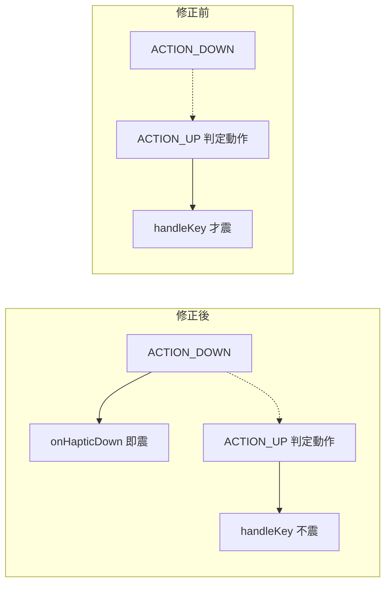

2026-09-02

# 觸覺回饋改按下瞬間震動，不再等手指放開（issue #4）

## 壞掉的行為

Issue #4 第一點：按鍵震動「卡卡的有 lag 感」，追問後確認「手指離開按鍵才震動」
— 對照官蝦、萊姆等鍵盤按下即震，體感差很多。

## 根因

全鍵盤唯一的 `haptic()` 呼叫在 service 的 `handleKey()`，而一般鍵是
**ACTION_UP 才派發 `onKey`**（要先判斷是點按、滑動還是長按），所以震動
永遠跟著放開手指。唯一例外是退格 — 它在 ACTION_DOWN 就觸發（連刪起點），
所以退格其實一直是即時震的，反而印證了這個結構。

## 修法：震動跟觸點走，不跟動作走

`KeyboardView` 新增 `onHapticDown` callback，service 掛上 `haptic()`；
震動時機全部移到觸覺上該震的瞬間：

- `KeyButton` ACTION_DOWN 瞬間震（所有鍵面按壓；間隙點擊導向最近鍵的
  轉送路徑也經過同一個 `onTouchEvent`，一樣涵蓋）
- 退格連刪每字一震、空白鍵拖游標每步一震 — 保留原本的節奏回饋
- 長按選單放開送出時補一震（確認感）、符號/emoji 面板點擊照震
- `handleKey()` 的 up 端震動移除 — 否則一按（down 震）一放（up 又震）雙震
- 工具列等 click 路徑（`onToolbarKey`）自行呼叫 `haptic()`，候選字點選
  （`didSelectCandidate`）原本就有自己的震動，都不變

## 驗證

模擬器沒有馬達，但 `dumpsys vibrator_manager` 會記錄每筆震動的 createTime：
按住按鍵 2 秒 — 震動時間戳落在**落指瞬間**（17:58:49.630，放開在 ~51.3；
51.642 那筆是長按選單送出的確認震）；快速點擊恰好產生一筆震動，無雙震。
`testDebugUnitTest` 全過。

後續：issue #4 還提到震動偏弱無法調強弱 — 另行加設定頁「震動強度」滑桿
（`KEYBOARD_TAP` 跟隨系統強度，可調強度要改走 `VibrationEffect`）。
